# Interactive Tools

<div class="grid cards" markdown>

-   :material-tools:{ .lg .middle } **Experience Digital Physics**

    ---

    Hands-on applications that bring the concepts of trust, telemetry, and governance to life.

</div>

---

## The Data Compass

!!! tip "Navigate Your Security Journey"
    Chart your organization's security journey through 27 unique operational archetypes—from reactive monitoring to strategic leadership.

<div class="grid cards" markdown>

-   :material-compass:{ .lg .middle } **Choose Your Own Adventure**

    ---

    The Data Compass is an interactive tool for security teams and CISOs to assess and evolve their operational maturity.

    **Features:**
    
    - 🏥 Healthcare, 🏛️ Government, 🏢 Enterprise sectors
    - Defensive and attack-response scenarios
    - 27 operational archetypes across 3 maturity levels
    - AI-ready prompts for strategic planning

    **The Journey:**
    
    ```
    People → Process → Governance → Technology → Data → Digital Resilience
    ```

    [:material-rocket-launch: Launch Data Compass](https://datacompass.odam.community){ .md-button .md-button--primary }

</div>

### How It Works

=== "1. Choose Sector"

    Select your organization type:
    
    - **Healthcare** — Academic medical centers, hospitals, clinics
    - **Government** — Federal, state, local agencies
    - **Enterprise** — Commercial organizations

=== "2. Select Scenario"

    Choose your path:
    
    - **Defensive** — Build proactive security posture
    - **Attack Response** — Handle compromised endpoints or agentic attacks

=== "3. Navigate Chapters"

    Progress through maturity levels:
    
    | Level | Archetype | Characteristics |
    |-------|-----------|-----------------|
    | 1 | Reactive Monitor | Raw alerts, no context |
    | 2 | Proactive Defender | Enriched analytics, orchestration |
    | 3 | Strategic Leader | Predictive, business-aligned |

### Connection to KTP

The Data Compass operationalizes KTP concepts:

| Data Compass | KTP Equivalent |
|--------------|----------------|
| Maturity Journey | Trust Tier progression |
| Sector Context | Zone configuration |
| Attack Scenarios | Threat model responses |
| Archetypes | Policy enforcement patterns |

---

## Web of Data

!!! info "Indigenous Data Sovereignty Explorer"
    Explore the threads of privacy, identity, knowledge, and sovereignty across centuries of history.

<div class="grid cards" markdown>

-   :material-spider-web:{ .lg .middle } **Interactive History**

    ---

    The Web of Data is a companion to the Medium article "Web of Data: From Telegraph to AI." It brings the metaphor of interconnected threads to life through interactive visualization.

    **Features:**
    
    - 📅 **Timeline** — Events from 1000 CE to 2100 CE
    - 🕸️ **Force Graph** — Explore concept relationships
    - 🖼️ **Gallery** — Data sovereignty frameworks
    - 📖 **Narrative** — Chapter-by-chapter exploration

    **Key Concepts:**
    
    - OCAP Principles (Ownership, Control, Access, Possession)
    - CARE Principles (Collective Benefit, Authority, Responsibility, Ethics)
    - FAIR Principles (Findable, Accessible, Interoperable, Reusable)
    - Contextual Integrity

    [:material-rocket-launch: Explore Web of Data](https://webofdata.odam.community){ .md-button .md-button--primary }

</div>

### The Five Threads

```mermaid
graph LR
    subgraph THREADS["The Web of Data"]
        I[🪶 Identity]
        K[📚 Knowledge]
        P[🔒 Privacy]
        S[👑 Sovereignty]
        D[📊 Data]
    end
    
    I <--> K
    K <--> P
    P <--> S
    S <--> D
    D <--> I
    
    style THREADS fill:#1a1a2e,stroke:#87CEEB
```



### Connection to KTP

| Web of Data Concept | KTP Implementation |
|---------------------|-------------------|
| Data Sovereignty | [KTP-Governance](../../rfcs/ktp-governance.md) |
| Contextual Integrity | [KTP-Privacy](../../rfcs/ktp-privacy.md) |
| Identity Threads | [KTP-Identity](../../rfcs/ktp-identity.md) |
| Knowledge Systems | [KTP-Provenance](../../rfcs/ktp-provenance.md) |

---

## Digital Physics Viewer

!!! abstract "Trust Flow Visualization"
    Visualize how trust flows from raw telemetry to executive decisions through the three-layer Digital Physics model.

<div class="grid cards" markdown>

-   :material-chart-sankey:{ .lg .middle } **Micro → Meso → Macro**

    ---

    The Digital Physics Viewer is built into this documentation site. It provides an interactive diagram of the KTP trust calculation pipeline.

    **Layers:**
    
    - 🔬 **Micro** — Packets, logs, real-time metrics
    - ⚗️ **Meso** — Aggregation, ARQ calculation, risk deflation
    - 🌌 **Macro** — Global context, Experience Score, executive actions

    [:material-rocket-launch: Open Viewer](../../implement/digital-physics-viewer.md){ .md-button .md-button--primary }

</div>

---

## Tool Ecosystem


---

## What's Next?

<div class="grid cards" markdown>

-   :material-map:{ .lg .middle } **Development Roadmap**

    ---

    See what's coming in Q1 2026, Q2 2026, and beyond—from Trust Simulators to REST APIs.

    [:material-arrow-right: View Roadmap](../roadmap.md){ .md-button }
