# Digital Physics Viewer

<div class="grid cards" markdown>

-   :material-molecule:{ .lg .middle } **Micro → Meso → Macro**

    ---

    Visualize how trust flows from raw telemetry at the quantum level to executive decisions at the cosmic scale.

-   :material-cursor-default-click:{ .lg .middle } **Interactive Exploration**

    ---

    Click any node to inspect metrics, schemas, and AI prompts that power the trust calculation pipeline.

</div>

---

## The Three-Layer Architecture

The Digital Physics Viewer reveals the KTP model as a **three-layer system** where data transforms from chaotic particles into gravitational force:

```mermaid
flowchart TB
    subgraph MICRO["🔬 MICRO LAYER — Quantum Telemetry"]
        direction LR
        PKT[📦 Raw Packets<br/><small>Throughput • Loss • Jitter</small>]
        LOG[📋 Logs & Events<br/><small>Errors • Volume • Patterns</small>]
        MET[📊 Real-time Metrics<br/><small>CPU • Memory • I/O</small>]
    end
    
    subgraph MESO["⚗️ MESO LAYER — Statistical Mechanics"]
        direction LR
        AGG[🔄 Aggregation Engine<br/><small>Reduce cardinality, preserve signal</small>]
        ARQ[📐 ARQ Calculation<br/><small>Accessibility • Retainability • Quality</small>]
        RISK[⚠️ Risk Deflation<br/><small>Security • Compliance • Threats</small>]
    end
    
    subgraph MACRO["🌌 MACRO LAYER — Celestial Mechanics"]
        direction LR
        CTX[🌍 Global Context<br/><small>Market • Regional • Competitive</small>]
        ESCORE[⭐ Experience Score<br/><small>E = 0-100 composite</small>]
        ACTION[🚀 Executive Actions<br/><small>Remediate • Alert • Scale</small>]
    end
    
    PKT --> AGG
    LOG --> AGG
    MET --> AGG
    AGG --> ARQ
    ARQ --> RISK
    RISK --> ESCORE
    CTX --> ESCORE
    ESCORE --> ACTION
    
    style ESCORE fill:#87CEEB,stroke:#333,stroke-width:3px,color:#000
    style MICRO fill:#1a1a2e,stroke:#87CEEB
    style MESO fill:#16213e,stroke:#87CEEB
    style MACRO fill:#0f3460,stroke:#87CEEB
```



---

## Layer 1: Micro — The Quantum Foundation

!!! info "Physics Analogy: Particles in Motion"
    Individual telemetry events are like particles—discrete, high-velocity, meaningless in isolation but forming the foundation of all higher-order understanding.

<div class="grid cards" markdown>

-   :material-package-variant:{ .lg .middle } **Raw Packets**

    ---

    The photons of the digital universe. Network-level data capturing the fundamental substrate of all interactions.

    | Metric | Description | Unit |
    |--------|-------------|------|
    | Throughput | Data transfer rate | Gbps |
    | Packet Loss | Failed transmissions | % |
    | Jitter | Arrival time variance | ms |
    | Latency | Round-trip time | ms |

    ??? example "Schema: `packet_telemetry`"
        ```json
        {
          "timestamp": "2026-01-02T12:00:00.000Z",
          "source_ip": "10.0.1.15",
          "dest_ip": "10.0.2.42",
          "protocol": "TCP",
          "port": 443,
          "payload_bytes": 1420,
          "flags": ["SYN", "ACK"],
          "latency_ms": 12.4
        }
        ```

    ??? tip "AI Prompt Example"
        *"Identify packet loss anomalies in the last hour that correlate with E-score degradation."*

-   :material-file-document-outline:{ .lg .middle } **Logs & Events**

    ---

    The semantic layer—structured text describing *what* is happening inside applications and systems.

    | Metric | Description | Unit |
    |--------|-------------|------|
    | Log Volume | Data ingestion rate | GB/hr |
    | Error Rate | ERROR-level entries | % |
    | Unique Sources | Distinct emitters | count |
    | Event Clusters | Temporal patterns | groups |

    ??? example "Schema: `log_event`"
        ```json
        {
          "timestamp": "2026-01-02T12:00:01.234Z",
          "level": "ERROR",
          "service": "auth-service",
          "message": "Token validation failed",
          "trace_id": "abc123def456",
          "user_id": "usr_789",
          "error_code": "AUTH_401"
        }
        ```

    ??? tip "AI Prompt Example"
        *"What error patterns preceded the 14:00 UTC E-score drop?"*

-   :material-speedometer:{ .lg .middle } **Real-time Metrics**

    ---

    Field measurements of operational health—the temperature and pressure gauges of the digital system.

    | Metric | Description | Unit |
    |--------|-------------|------|
    | CPU Usage | Processor utilization | % |
    | Memory Pressure | RAM consumption | % |
    | Disk I/O | Read/write throughput | MB/s |
    | Request Rate | Incoming traffic | req/s |

    ??? example "Schema: `infrastructure_metric`"
        ```json
        {
          "timestamp": "2026-01-02T12:00:00.000Z",
          "host": "prod-web-01",
          "metrics": {
            "cpu_percent": 67.2,
            "memory_percent": 78.5,
            "disk_io_mbps": 145.3,
            "network_mbps": 892.1
          }
        }
        ```

    ??? tip "AI Prompt Example"
        *"Forecast infrastructure capacity needs for the next 4 hours based on current E-score trajectory."*

</div>

---

## Layer 2: Meso — Statistical Mechanics

!!! info "Physics Analogy: Thermodynamics"
    Just as temperature emerges from the average kinetic energy of particles, the ARQ dimensions emerge from the statistical properties of millions of telemetry events.

### Aggregation Engine

The aggregation engine reduces cardinality while preserving signal. Millions of packet records become per-user, per-service statistics:

=== "Aggregation Functions"

    | Function | Purpose | Example |
    |----------|---------|---------|
    | `SUM` | Total volume | Total bytes transferred |
    | `AVG` | Central tendency | Mean latency |
    | `PERCENTILE` | Distribution tails | P99 response time |
    | `COUNT_DISTINCT` | Cardinality | Unique users affected |
    | `STDDEV` | Variance | Latency consistency |

=== "Aggregation Windows"

    | Window | Use Case | Latency |
    |--------|----------|---------|
    | 1 minute | Real-time alerting | < 5s |
    | 5 minutes | Operational dashboards | < 30s |
    | 1 hour | Trend analysis | < 5m |
    | 1 day | Historical reporting | < 1hr |

### ARQ Dimension Calculation

<div class="grid cards" markdown>

-   :material-door-open:{ .lg .middle } **Accessibility (A)**

    ---

    *Can users reach the service?*

    - Uptime percentage
    - DNS resolution time
    - Connection success rate
    - Geographic availability

    **Formula:** `A = (uptime × dns_success × conn_rate) ^ (1/3)`

-   :material-link-variant:{ .lg .middle } **Retainability (R)**

    ---

    *Can the service maintain engagement?*

    - Session duration
    - Transaction completion rate
    - Error recovery success
    - User return rate

    **Formula:** `R = (session_dur × completion × recovery) ^ (1/3)`

-   :material-star:{ .lg .middle } **Quality (Q)**

    ---

    *Is the experience satisfying?*

    - Response time (P50, P95, P99)
    - Throughput consistency
    - Visual rendering performance
    - Functional correctness

    **Formula:** `Q = (response × throughput × render) ^ (1/3)`

</div>

### Risk Deflation

!!! warning "Friction in the System"
    Risk acts as **friction**—it opposes the positive effects of good performance. A fast but insecure service is not truly trustworthy.

```
Risk Deflation Factor = 1 - (risk_score / 100)
```

| Risk Factor | Source | Impact |
|-------------|--------|--------|
| Active CVEs | Vulnerability scanners | High |
| Anomalous Behavior | ML detection | Medium |
| Compliance Violations | Policy engine | High |
| Certificate Issues | TLS monitoring | Medium |
| Data Exposure | DLP systems | Critical |

---

## Layer 3: Macro — Celestial Mechanics

!!! info "Physics Analogy: Gravity"
    The Experience Score represents the **gravitational pull** of a digital experience—attracting or repelling users based on its strength.

### Global Context Integration

The E-score doesn't exist in a vacuum. External factors modulate its interpretation:

| Context | Source | Effect |
|---------|--------|--------|
| Market Sentiment | Social/news analysis | ±5% weight adjustment |
| Regional Events | Event calendars | Traffic pattern baseline |
| Competitor Status | Industry monitoring | Relative benchmarking |
| Seasonal Patterns | Historical data | Expected variance |

### The Experience Score Formula

$$
E = \left( A \cdot w_A + R \cdot w_R + Q \cdot w_Q \right) \times \left(1 - \frac{risk}{100}\right) \times context
$$

Where:

- $A, R, Q$ = ARQ dimension values (0-1)
- $w_A, w_R, w_Q$ = Dynamic weights based on user segment
- $risk$ = Risk score (0-100)
- $context$ = Global context multiplier (0.8-1.2)

??? example "Example Calculation"
    ```
    Given:
      A = 0.95, R = 0.92, Q = 0.88
      weights = [0.35, 0.35, 0.30]
      risk = 15
      context = 1.05 (favorable market)
    
    E = (0.95×0.35 + 0.92×0.35 + 0.88×0.30) × (1 - 0.15) × 1.05
    E = (0.3325 + 0.322 + 0.264) × 0.85 × 1.05
    E = 0.9185 × 0.85 × 1.05
    E = 0.82 × 100 = 82.0
    ```

### Executive Actions

When the E-score crosses thresholds, automated responses trigger:

```mermaid
flowchart LR
    E[E-Score] --> C{Threshold?}
    C -->|E < 50| CRITICAL[🚨 Critical<br/>Page on-call, halt deploys]
    C -->|E < 70| WARNING[⚠️ Warning<br/>Alert ops, scale resources]
    C -->|E < 85| MONITOR[👀 Monitor<br/>Increase sampling, prepare remediation]
    C -->|E ≥ 85| HEALTHY[✅ Healthy<br/>Normal operations]
    
    style CRITICAL fill:#ff4444,color:#fff
    style WARNING fill:#ffaa00,color:#000
    style MONITOR fill:#87CEEB,color:#000
    style HEALTHY fill:#44ff44,color:#000
```



---

## Physics Metaphor Reference

| Physics Concept | KTP Analog | Description |
|-----------------|------------|-------------|
| **Velocity** | E-score rate of change | How fast trust is improving or degrading |
| **Mass** | User/system significance | High-value customers have greater "mass" |
| **Gravity** | Experience attraction | High E-scores create gravitational wells that retain users |
| **Friction** | Risk deflation | Factors that slow or degrade the experience |
| **Energy** | Operational resources | Computational/human effort to maintain trust |
| **Entropy** | Experience variance | Wide percentile spreads indicate disorder |
| **Momentum** | E-score × velocity | High-trust + improving = market dominance |

---

## Node Reference

Click to expand detailed specifications for each node in the trust pipeline:

??? abstract "📦 Raw Packets Node"
    **Purpose:** Capture network-level telemetry
    
    **Metrics:**
    
    | Metric | Current | Trend |
    |--------|---------|-------|
    | Throughput | 2.4 Gbps | ↗️ +3% |
    | Packet Loss | 0.001% | ✅ Stable |
    | Jitter | 2.1 ms | ✅ Stable |
    | Latency (P99) | 45 ms | ↗️ +5% |
    
    **AI Prompts:**
    
    - "Show packet loss hotspots by geographic region"
    - "Correlate jitter spikes with E-score movements"
    - "Predict network capacity needs for next week"

??? abstract "📐 ARQ Calculation Node"
    **Purpose:** Transform aggregated metrics into trust dimensions
    
    **Metrics:**
    
    | Dimension | Value | Weight |
    |-----------|-------|--------|
    | Accessibility | 0.95 | 35% |
    | Retainability | 0.92 | 35% |
    | Quality | 0.88 | 30% |
    
    **AI Prompts:**
    
    - "Which ARQ dimension is most impacting E-score?"
    - "What would improve Quality by 5%?"
    - "Compare ARQ trends across user segments"

??? abstract "⭐ Experience Score Node"
    **Purpose:** Final composite trust metric
    
    **Metrics:**
    
    | Metric | Value | Status |
    |--------|-------|--------|
    | E-Score | 87.4 | ✅ Healthy |
    | Velocity | +0.5/hr | ↗️ Improving |
    | Momentum | 43.7 | Strong |
    
    **AI Prompts:**
    
    - "Explain the root cause of the E-score drop at 14:00 UTC"
    - "Forecast E-score for the next 4 hours"
    - "What actions would increase E-score by 10 points?"

---

## Related Resources

<div class="grid cards" markdown>

-   [:material-wave:{ .lg } **Telemetry Deep Dive**](../learn/telemetry.md)

    ---

    Understand the data sources and transformation pipeline in detail.

-   [:material-math-compass:{ .lg } **Context Tensor**](../learn/context-tensor.md)

    ---

    The mathematical foundations of multi-dimensional trust.

-   [:material-scale-balance:{ .lg } **Constitution**](../learn/constitution.md)

    ---

    The governance framework that constrains algorithmic decisions.

-   [:fontawesome-solid-satellite:{ .lg } **KTP-Celestial RFC**](../rfcs/ktp-celestial.md)

    ---

    The formal specification for macro-layer trust mechanics.

</div>
