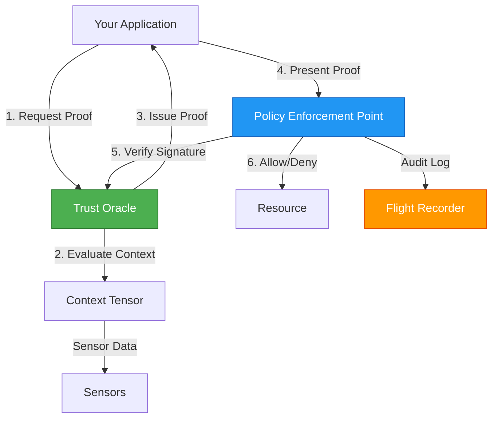

# Implement

*Build with Digital Physics*

---

> **From Theory to Production**: This section transforms the KTP specifications into working code. Whether you're building your first trust-aware application or migrating a legacy system, you'll find the tools and guidance you need here.

---

## Choose Your Path

=== "🚀 Quick Start"
    
    **New to KTP? Start here.**
    
    Get your first KTP integration running in under 10 minutes with our step-by-step quickstart guide.
    
    [:octicons-arrow-right-24: Developer Guide](developer-guide.md)

=== "📚 Deep Dive"
    
    **Need the full API specification?**
    
    Comprehensive reference documentation for every KTP endpoint, data structure, and protocol detail.
    
    [:octicons-arrow-right-24: API Reference](api-reference.md)

=== "💻 Code Examples"
    
    **Learn by doing?**
    
    Browse working implementations, integration patterns, and language-specific examples.
    
    [:octicons-arrow-right-24: Examples](examples.md)

=== "📦 SDKs"
    
    **Looking for a library?**
    
    Official and community-maintained SDKs for Python, JavaScript, Rust, Go, and more.
    
    [:octicons-arrow-right-24: SDKs & Libraries](sdks-and-libraries.md)

---

## Implementation Resources

<div class="grid cards" markdown>

-   :material-book-open-variant:{ .lg .middle } **[Developer Guide](developer-guide.md)**

    ---

    Step-by-step instructions for integrating KTP into your application. From environment setup to production deployment.

-   :material-api:{ .lg .middle } **[API Reference](api-reference.md)**

    ---

    Complete documentation for all KTP endpoints, methods, and parameters. REST, gRPC, and WebSocket APIs.

-   :material-package-variant:{ .lg .middle } **[SDKs & Libraries](sdks-and-libraries.md)**

    ---

    Official libraries for Python, JavaScript, Rust, Go, and more. Installation guides and compatibility matrices.

-   :material-code-tags:{ .lg .middle } **[Examples](examples.md)**

    ---

    Working code samples and reference implementations. Integration patterns for common frameworks and platforms.

-   :material-monitor-eye:{ .lg .middle } **[Digital Physics Viewer](digital-physics-viewer.md)**

    ---

    Interactive visualization tool for exploring trust scores, context tensors, and decision flows in real-time.

</div>

---

## Quick Start

Get up and running with KTP in minutes:

```bash
# Install the KTP SDK
pip install ktp-sdk

# Or for JavaScript
npm install @ktp/sdk
```

```python
from ktp import TrustOracle, Agent, TrustContext

# Initialize connection to your KTP zone
oracle = TrustOracle(zone_url="https://oracle.yourzone.ktp")

# Register your agent
agent = Agent(
    id="agent:service-alpha",
    capabilities=["read:data", "write:logs"]
)

# Request a trust proof
proof = oracle.request_proof(agent)

# Use the proof to authorize an action
if proof.score >= 60:  # Analyst tier
    result = perform_action(proof)
    print(f"Action authorized: {result}")
else:
    print(f"Insufficient trust: {proof.score} < 60")
```

---

## Integration Patterns

KTP can be integrated at multiple layers of your application stack:

<div class="grid cards" markdown>

-   :material-gate:{ .lg .middle } **API Gateway**

    ---
    
    Add KTP middleware to your gateway (Nginx, Envoy, Kong) to verify trust proofs before routing requests.

-   :material-application:{ .lg .middle } **Application Layer**

    ---
    
    Embed KTP logic directly in your application code using our SDKs and libraries.

-   :material-database:{ .lg .middle } **Data Layer**

    ---
    
    Enforce trust-based access control at the database level with KTP-aware query interceptors.

-   :material-robot:{ .lg .middle } **Agent Runtime**

    ---
    
    Build autonomous agents that operate within KTP constraints using our agent frameworks.

</div>

---

## Architecture Overview

Understanding how KTP components work together:



**Key Components:**

- **Trust Oracle**: Calculates trust scores based on context tensors
- **Policy Enforcement Point (PEP)**: Enforces $A \leq E$ at decision time
- **Context Tensor**: Multi-dimensional environmental measurement
- **Flight Recorder**: Immutable audit log of all decisions

---

## Integration Checklist

Before deploying to production, ensure you've completed:

- [x] **Environment Setup**
    - [ ] Install SDK for your language
    - [ ] Configure connection to KTP zone
    - [ ] Set up secure credential storage
    
- [x] **Agent Registration**
    - [ ] Generate agent identity
    - [ ] Define capability requirements
    - [ ] Establish sponsorship (if required)
    
- [x] **Trust Flow Implementation**
    - [ ] Request trust proof logic
    - [ ] Proof verification at enforcement points
    - [ ] Error handling for denied requests
    
- [x] **Context Integration**
    - [ ] Context tensor data collection
    - [ ] Sensor configuration
    - [ ] Real-time updates (WebSocket)
    
- [x] **Observability**
    - [ ] Audit logging configuration
    - [ ] Metrics and monitoring
    - [ ] Alerting for trust anomalies
    
- [x] **Testing & Validation**
    - [ ] Run conformance test suite
    - [ ] Load testing with KTP overhead
    - [ ] Security review of implementation

---

## Conformance Levels

Choose the level that matches your requirements:

| Level | Use Case | Requirements | Time to Implement |
|-------|----------|--------------|-------------------|
| **Level 1: Basic** | Development, Testing | Single Oracle, 3 dimensions | 1-2 days |
| **Level 2: Standard** | Production | 3-node mesh, Full tensor | 1-2 weeks |
| **Level 3: Full** | Critical Infrastructure | 5-node geo-mesh, Hardware enforcement | 4-8 weeks |

See [KTP-Conformance](../rfcs/ktp-conformance.md) for detailed requirements.

---

## Support & Community

!!! tip "Need Help?"
    - **Documentation Issues**: [Open an issue on GitHub](https://github.com/nmcitra/ktp-rfc/issues)
    - **Implementation Questions**: Join the [KTP Developer Slack](#)
    - **Security Concerns**: Email security@ktp.example

---

## Related Specifications

---

## Related Specifications

<div class="grid cards" markdown>

-   :material-book-open-variant:{ .lg .middle } **[KTP-Core](../rfcs/ktp-core.md)**

    ---

    The foundational protocol and the Zeroth Law ($A \leq E$).

-   :material-lan:{ .lg .middle } **[KTP-Transport](../rfcs/ktp-transport.md)**

    ---

    Network protocols for KTP communication (HTTP/2, gRPC, WebSocket).

-   :material-shield-lock:{ .lg .middle } **[KTP-Crypto](../rfcs/ktp-crypto.md)**

    ---

    Cryptographic primitives for trust proofs and signatures.

-   :material-shield-check:{ .lg .middle } **[KTP-Conformance](../rfcs/ktp-conformance.md)**

    ---

    Testing requirements and certification procedures.

</div>
