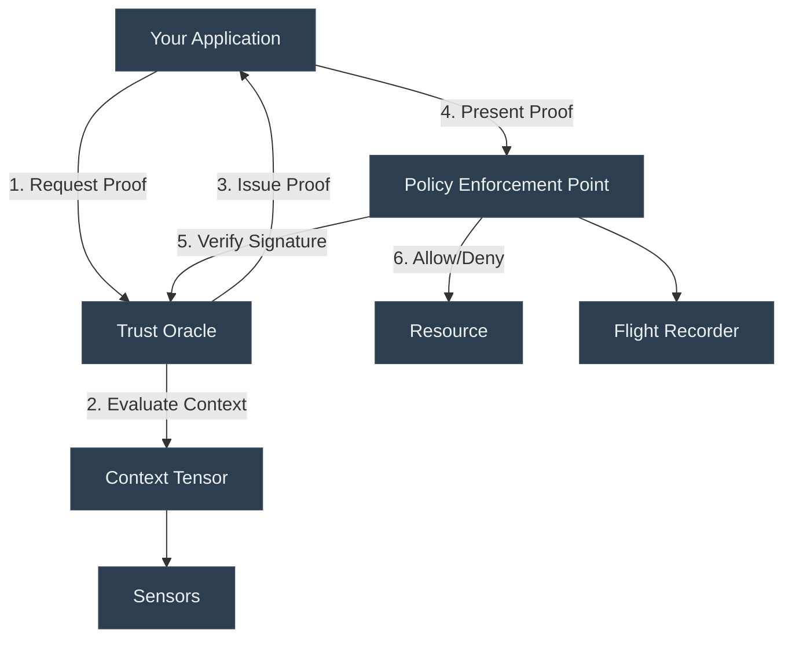

# Implement

*Build with Digital Physics*

---

> **From Theory to Production**: This section transforms the KTP specifications into working code. Whether you're building your first trust-aware application or migrating a legacy system, you'll find the tools and guidance you need here.

---

## Choose Your Path

=== "🚀 Quick Start"
    
    **New to KTP? Start here.**
    
    Get your first KTP integration running in under 10 minutes with our step-by-step quickstart guide.
    
    [:octicons-arrow-right-24: Developer Guide](developer-guide.md)

=== "📚 Deep Dive"
    
    **Need the full API specification?**
    
    Comprehensive reference documentation for every KTP endpoint, data structure, and protocol detail.
    
    [:octicons-arrow-right-24: API Reference](api-reference.md)

=== "💻 Code Examples"
    
    **Learn by doing?**
    
    Browse working implementations, integration patterns, and language-specific examples.
    
    [:octicons-arrow-right-24: Examples](examples.md)

=== "📦 SDKs"
    
    **Looking for a library?**
    
    Official and community-maintained SDKs for Python, JavaScript, Rust, Go, and more.
    
    [:octicons-arrow-right-24: SDKs & Libraries](sdks-and-libraries.md)

---

## Implementation Resources

-   :material-book-open-variant:{ .lg .middle } **[Developer Guide](developer-guide.md)**

    ---

    Step-by-step instructions for integrating KTP into your application. From environment setup to production deployment.

-   :material-api:{ .lg .middle } **[API Reference](api-reference.md)**

    ---

    Complete documentation for all KTP endpoints, methods, and parameters. REST, gRPC, and WebSocket APIs.

-   :material-package-variant:{ .lg .middle } **[SDKs & Libraries](sdks-and-libraries.md)**

    ---

    Official libraries for Python, JavaScript, Rust, Go, and more. Installation guides and compatibility matrices.

-   :material-code-tags:{ .lg .middle } **[Examples](examples.md)**

    ---

    Working code samples and reference implementations. Integration patterns for common frameworks and platforms.

-   :material-monitor-eye:{ .lg .middle } **[Digital Physics Viewer](digital-physics-viewer.md)**

    ---

    Interactive visualization tool for exploring trust scores, context tensors, and decision flows in real-time.

---

## Integration Patterns

KTP can be integrated at multiple layers of your application stack:

-   :material-gate:{ .lg .middle } **API Gateway**

    ---
    
    Add KTP middleware to your gateway (Nginx, Envoy, Kong) to verify trust proofs before routing requests.

-   :material-application:{ .lg .middle } **Application Layer**

    ---
    
    Embed KTP logic directly in your application code using our SDKs and libraries.

-   :material-database:{ .lg .middle } **Data Layer**

    ---
    
    Enforce trust-based access control at the database level with KTP-aware query interceptors.

-   :material-robot:{ .lg .middle } **Agent Runtime**

    ---
    
    Build autonomous agents that operate within KTP constraints using our agent frameworks.

---

## Architecture Overview

Understanding how KTP components work together:

**Key Components:**

- **Trust Oracle**: Calculates trust scores based on context tensors
- **Policy Enforcement Point (PEP)**: Enforces $A \leq E$ at decision time
- **Context Tensor**: Multi-dimensional environmental measurement
- **Flight Recorder**: Immutable audit log of all decisions

---

## Support & Community

!!! tip "Need Help?"
    - **Documentation Issues**: [Open an issue on GitHub](https://github.com/nmcitra/ktp-rfc/issues)
