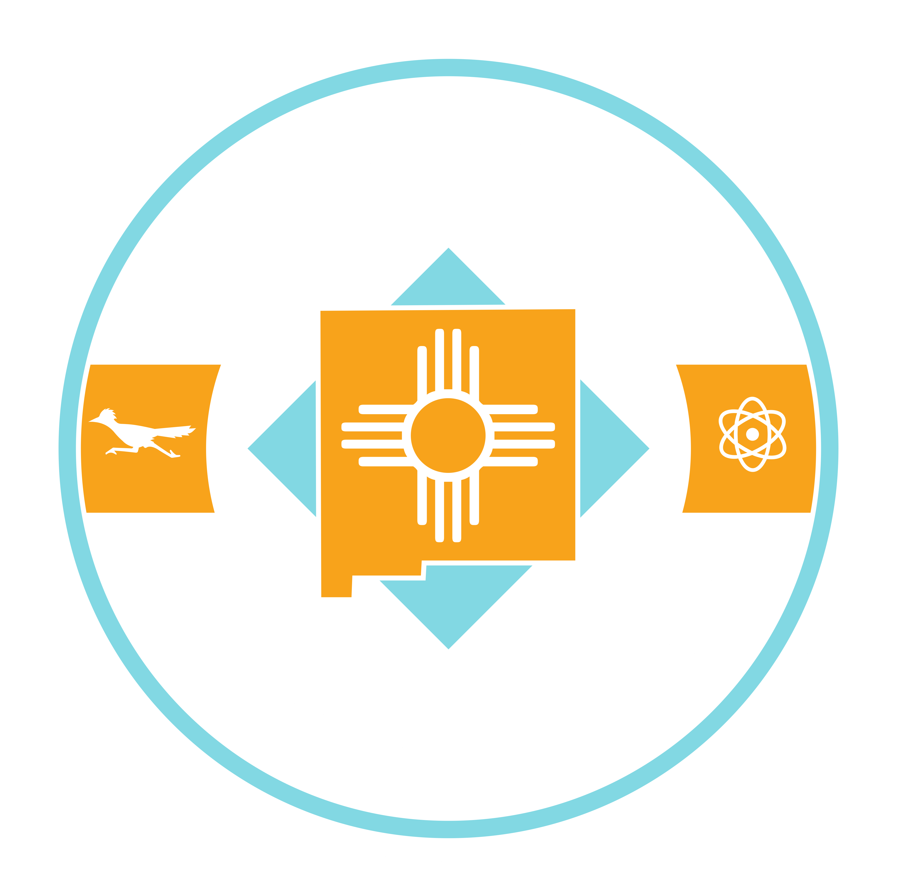

---
hide:
  - navigation
  - toc
---

# Kinetic Trust Protocol

*An Internet Governed by Digital Physics, Not Policy*

  

    

      

        
0

        
Dimensions

        
Measured in real-time

      

      

        
0

        
Trust Dimensions

        
Physics-based geometry

      

      

        
0

        
Tech Specs

        
Protocol RFCs

      

    

  

- :material-rocket-launch:{ .lg .middle }

    **Start Guide**

    Build your mental model in 10 minutes: Zeroth Law, trust geometry, and the language of Digital Physics.

    [Get Started](learn/getting-started.md){ .card-cta }

- :material-scale-balance:{ .lg .middle }

    **Constitution**

    The immutable Zeroth Law and human-safety guardrails every system must honor before speed or autonomy.

    [Read the Constitution](learn/constitution.md){ .card-cta }

- :material-archive:{ .lg .middle }

    **Trust Archive**

    Browse status-tagged RFCs. Action cue: grab the raw text set for diffing and offline review.

    [Open RFC Library](rfcs/index.md){ .card-cta }

- :material-code-json:{ .lg .middle }

    **Build & Validate**

    Start with schemas and SDKs. Action cue: run the Experience Calculator to sanity-check a flow.

    [View Schemas](schemas/index.md){ .card-cta }

- :material-shield-home:{ .lg .middle }

    **Blue Zones**

    Design bounded trust environments with tiered enforcement and governance.

    [Explore Blue Zones](specifications/blue-zones.md){ .card-cta }

- :material-fingerprint:{ .lg .middle }

    **Identity**

    Vector Identity, trajectory authentication, and revocation rules that bind agents to behavior—not just credentials.

    [Explore Identity](specifications/identity.md){ .card-cta }

- :material-vector-polyline:{ .lg .middle }

    **Context Tensor**

    Seven-dimensional trust geometry spanning 1,707 measurements.

    [Dive In](learn/context-tensor.md){ .card-cta }

- :material-chart-line:{ .lg .middle }

    **Telemetry & Physics**

    See how signals become Experience (E) through physics-based pipelines and trustflow deflation.

    [View Telemetry](learn/telemetry.md){ .card-cta }

- :material-calculator-variant:{ .lg .middle }

    **Audit & Provenance**

    Attestable evidence, provenance trails, and non-repudiation for autonomous agents.

    [Read More](rfcs/ktp-provenance.md){ .card-cta }

  

!!! abstract "The Foundation of Digital Trust"
    **The KTP Constitution** establishes the Zeroth Law—the immutable principle that human wellbeing must never be compromised by algorithmic efficiency. Before building with KTP, understand the governance framework that makes trustworthy AI possible.
    
    [:material-scale-balance: Read the Constitution](learn/constitution.md){ .md-button .md-button--primary }
