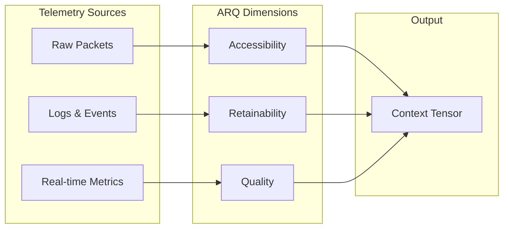

# The Context Tensor

*The Geometry of Trust in a Digital Universe*

---

The **Context Tensor** is the mathematical structure that holds the state of trust for any given interaction. Unlike simple "allow/deny" lists, the Context Tensor models trust as a multi-dimensional vector space, where every interaction has magnitude and direction.

## The ARQ Dimensions

At the heart of the Context Tensor are the three foundational dimensions of digital experience, known as **ARQ**:

1.  **Accessibility (A)**: Can the resource be reached? Is the path open?
2.  **Retainability (R)**: Can the connection be sustained? Is it stable?
3.  **Quality (Q)**: Is the interaction high-fidelity? Is it secure and performant?

These three dimensions form the basis of the **Experience Score (E)**.

### Mapping Telemetry to ARQ

Raw telemetry data is mapped onto these dimensions to form the tensor.

## Risk Deflation

The Context Tensor is not just about positive signals. It also accounts for friction and resistance through **Risk Deflation**.

*   **Security Risks**: Vulnerabilities or threats reduce the effective "velocity" of trust.
*   **Compliance Risks**: Regulatory violations act as a drag coefficient.

$$ E_{final} = E_{raw} \times (1 - RiskFactor) $$

This ensures that a high-performance connection that is insecure does not yield a high trust score.
