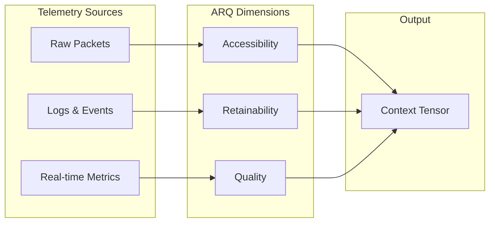

# The Context Tensor

*The Geometry of Trust in a Digital Universe*

Trust isn't a yes/no flag. It's a field. The **Context Tensor** is the mathematical structure that captures the real-time state of trust for any interaction—its weight, direction, and volatility—so authorization can respond like physics, not policy. Instead of static rules, KTP evaluates a living vector space that changes as conditions change.

## The Seven Dimensions

The Context Tensor is expressed across seven primary dimensions:

1. **Mass** — volume and density of telemetry
2. **Momentum** — rate of change in trust
3. **Inertia** — resistance to trust fluctuation
4. **Heat** — operational stress and anomaly detection
5. **Time** — temporal patterns and decay
6. **Observer** — perspective and vantage point
7. **Soul** — constitutional constraints that cannot be overridden

Each dimension is measurable and contributes to the system's live trust geometry. For the full dimensional breakdown (1,707 measurements), see **[KTP-Tensors](../rfcs/ktp-tensors.md)**.

## Incoming Signals

The tensor is fed by live signals. These are normalized, scored, and projected into the seven dimensions.

=== "Packets"
    **Signals:** latency, jitter, packet loss, handshake success, throughput.
    
    **Primary influence:** Accessibility, Time, Mass.
    
    ??? info "All possible signals (collapsed)"
        ```text
        Layer 4: Transport (L4)
        - src_port (Ephemeral port of the client)
        - Ephemeral Port Exhaustion
        - Fixed Source Port
        - Port Scan (Source)
        - dest_port (Service port)
        - Service Distribution
        - Dark Port Access
        - Port Scan (Dest)
        - High Port Usage
        - tcp_flags (SYN, ACK, FIN, RST - Connection state)
        - SYN Flood
        - RST Rate
        - Null Scan
        - Xmas Scan
        - Handshake Completion
        - window_size (TCP Receive Window)
        - Zero Window
        - Window Scaling
        - Retransmission Correlation
        - retransmission_rate (Packets resent due to loss/congestion)
        - Retransmission Spike
        - High Retransmission Host
        - Global Retransmission

        Layer 3.5: Flow (L3.5)
        - flow_bytes_in (Inbound byte count)
        - Inbound Volume
        - Large Transfer
        - Volume Spike
        - Ratio Analysis
        - flow_bytes_out (Outbound byte count)
        - Outbound Volume
        - Exfiltration Detection
        - Upload Anomaly
        - Asymmetric Flow
        - flow_packets (Packet count per flow)
        - Packet Volume
        - Small Packet Flood
        - Packet Size Avg
        - Scan Detection
        - flow_duration (Flow duration)
        - Average Flow Duration
        - Long-Lived Flows
        - C2 Beaconing
        - Tunnel Detection
        - flow_start_time (Flow initiation timestamp)
        - Flow Start Distribution
        - Off-Hours Activity
        - Burst Detection
        - Time Correlation
        - flow_end_reason (Flow termination reason)
        - End Reason Distribution
        - Timeout Flows
        - RST/FIN Analysis
        - Forced Closure
        - application_id (DPI-identified application)
        - App Distribution
        - Shadow IT Detection
        - New Application
        - App Usage Trend
        - flow_direction (Ingress/egress/internal flow direction)
        - Direction Distribution
        - Egress Anomaly
        - Lateral Movement
        - Internal Traffic

        Layer 3: Network (L3)
        - src_ip (Net: Source Identity)
        - Unique Sources
        - New Source Detection
        - Top Talkers
        - Source Reputation
        - Internal vs External
        - dest_ip (Net: Destination Target)
        - Unique Destinations
        - New Destination Alert
        - Destination Reputation
        - Beaconing Detection
        - Rare Destination Access
        - latency (Ops: RTT - primary health metric)
        - Average Latency
        - P50 Latency
        - P95 Latency
        - P99 Latency
        - Latency Anomaly
        - Latency Trend
        - packet_loss (Ops: Indication of bad links or congestion)
        - Loss Rate
        - Loss Spike
        - Loss Outliers
        - Loss by Path
        - P99 Loss
        - hop_count (Net: TTL - detects routing loops)
        - Avg Path Length
        - Path Change Detection
        - Excessive Hops
        - TTL Expiry Rate
        - tos_dscp (QoS: Is voice traffic tagged correctly?)
        - QoS Marking Distribution
        - Voice Traffic Tagging
        - Mismarked Traffic
        - protocol_id (Net: TCP, UDP, ICMP, GRE, ESP)
        - Protocol Distribution
        - Unusual Protocol
        - ICMP Volume
        - GRE/ESP Tunnels
        - icmp_type (Net: Destination Unreachable vs. Echo Request)
        - Unreachable Rate
        - Echo Request Volume
        - ICMP Flood Detection
        - Redirect Messages
        - bgp_peer_state (Routing: Established/Idle)
        - Peer Status
        - State Flap Detection
        - Idle Peer Alert
        - Prefix Count Change
        - Session Uptime
        - route_next_hop (Routing: Where is the traffic going next?)
        - Next Hop Distribution
        - Next Hop Change
        - Black Hole Routes
        - Path Symmetry
        - tunnel_id (SD-WAN: GRE/IPSec tunnel interface ID)
        - Tunnel Status
        - Tunnel Flap Detection
        - Tunnel Latency
        - Tunnel Throughput
        - Failover Events
        - vpc_id (Cloud: AWS/Azure Virtual Cloud ID)
        - VPC Traffic Distribution
        - Cross-VPC Traffic
        - New VPC Detection
        - VPC Flow Anomaly
        - security_group_id (Cloud: Firewall rules applied to the instance)
        - SG Rule Effectiveness
        - Overly Permissive SG
        - SG Change Detection
        - Unused SG Detection
        - SG Deny Spike

        Layer 2: Data Link (L2)
        - src_mac (Sec: Asset identification)
        - Unique MACs
        - New MAC Detection
        - MAC Spoofing Detection
        - OUI Distribution
        - Rogue Device Detection
        - vlan_id (Net: Broadcast domain segmentation)
        - VLAN Distribution
        - VLAN Hopping Detection
        - Native VLAN Traffic
        - Unused VLAN Detection
        - interface (Infra: Gi0/1, eth0 - physical location)
        - Port Utilization
        - Port Flapping
        - Broadcast Storm
        - Port Error Rate
        - Duplex Mismatch
        - frame_type (Net: Ethernet II, 802.3)
        - Frame Type Distribution
        - Unusual EtherType
        - ARP Traffic Volume
        - IPv6 Adoption
        - stp_state (Net: Blocking/Forwarding)
        - Blocking Port Count
        - STP Topology Change
        - Root Bridge Change
        - Port State Flap
        - Designated Port Ratio
        - link_status (Infra: UP/DOWN status)
        - Link Availability
        - Link Down Events
        - Flapping Detection
        - Critical Link Monitor
        - MTTR
        - input_discards (Net: Buffer overflows)
        - Discard Rate
        - Discard Spike
        - input_errors (Net: CRC errors)
        - Error Rate
        - CRC Error Spike
        - Error Trend
        - Hardware Failure
        - Error Distribution
        - neighbor_mac (Infra: LLDP/CDP detected neighbor)
        - Expected Neighbors
        - Neighbor Change
        - Missing Neighbor
        - New Neighbor Detection
        - arp_status (Net: Resolved/Incomplete)
        - Incomplete ARP Rate
        - ARP Timeout Spike
        - ARP Cache Size
        - Duplicate IP Detection

        Layer 1: Physical (L1)
        - rssi (WiFi: Signal strength)
        - Average RSSI
        - P10 RSSI (Worst 10%)
        - Low Signal Clients
        - RSSI Anomaly
        - Coverage Holes
        - RSSI Distribution
        - snr (WiFi: Signal quality vs background noise)
        - Average SNR
        - SNR Anomaly
        - Low SNR Clients
        - SNR vs Throughput
        - channel (WiFi: Congestion/Co-channel interference)
        - Channel Utilization
        - Co-Channel Interference
        - Channel Change Rate
        - DFS Event Rate
        - Channel Width
        - data_rate (WiFi: Negotiated speed)
        - Average Data Rate
        - P10 Data Rate
        - Low Rate Clients
        - Rate vs RSSI
        - retry_rate (WiFi: Percentage of frames re-sent)
        - Average Retry Rate
        - Retry Spike
        - High Retry APs
        - Retry vs Channel Util
        - noise_floor (WiFi: Background RF noise)
        - Average Noise Floor
        - Interference Spike
        - High Noise APs
        - Noise Trend
        - optical_rx_power (WAN: Fiber light levels)
        - Rx Power Level
        - Low Power Alert
        - Power Degradation
        - Link Margin
        - Asymmetric Power
        - transceiver_temp (Infra: SFP module temperature)
        - Average Temperature
        - Overheating Alert
        - Temperature Trend
        - Thermal Runaway
        - poe_power_draw (Infra: Watts used by APs/Cameras)
        - Power Per Device
        - Total Budget Usage
        - Power Anomaly
        - Class Mismatch
        - Power Trend
        - fan_status (Hardware: Critical cooling failure)
        - Fan Health
        - Fan Failure Alert
        - Fan Speed Anomaly
        - Degraded Cooling
        - psu_status (Hardware: Power Supply Unit health)
        - PSU Health
        - PSU Failure
        - Redundancy Status
        - Power Input Voltage
        - Load Balance
        ```

=== "Logs & Events"
    **Signals:** auth failures, policy violations, config changes, runtime errors.
    
    **Primary influence:** Inertia, Heat, Observer.
    
    ??? info "All possible signals (collapsed)"
        ```text
        Global / Session / Environment
        - Phase: The current stage of the attack lifecycle (e.g., AUTH, RECON, LATERAL, ESCALATE, EXFIL, CLEANUP).
        - Event Risk Level (R): The severity rating (0, 1, 2) assigned to each specific forensic event log entry.
        - Zone: The network or security zone associated with a specific event (e.g., VPN, PCI-DSS).

        Layer 8: Identity (L8)
        - user_id (Unique identifier for the human/machine identity)
        - Auth Volume by User
        - Failed Login Rate
        - Concurrent Sessions
        - New Device Access
        - role (RBAC role assigned to the identity)
        - Privilege Escalation
        - Role Change Frequency
        - Toxic Combination
        - Dormant Role Usage
        - department (Organizational unit)
        - Cross-Dept Access
        - Dept Outlier Analysis
        - Shadow IT by Dept
        - geo_location (Physical location of the access)
        - Impossible Travel
        - New Country Access
        - Geo-Velocity Anomaly
        - High Risk Country
        - device_id (Unique identifier for the endpoint)
        - Device Trust Score
        - New Device Rate
        - Jailbroken Device
        - BYOD Usage

        Layer 7: Application (L7)
        - http_method (GET, POST, PUT, DELETE)
        - Method Distribution
        - Unusual Method Usage
        - High Volume POST
        - Method vs Path Anomaly
        - http_status (Response code: 200, 403, 500)
        - Error Rate (5xx)
        - Access Denied (403)
        - Not Found Spike (404)
        - Success Rate
        - url_path (Resource path accessed)
        - Path Traversal Attempt
        - Admin Page Access
        - Sensitive File Access
        - High Cardinality Paths
        - user_agent (Browser/Client string)
        - Rare User Agent
        - Bot/Scraper Detection
        - Outdated Browser
        - UA Spoofing
        - referer (Previous page URL)
        - Empty Referer
        - Cross-Site Scripting
        - External Referer
        - cookie_id (Session or tracking cookie)
        - Cookie Replay
        - Cookie Theft
        - Missing Secure Flag
        - Session Fixation

        Layer 6.5: API (L6.5)
        - api_endpoint (Specific API route)
        - Endpoint Usage
        - Deprecated Endpoint
        - Shadow API
        - Endpoint Latency
        - api_key_id (Identifier for the API client)
        - Key Usage Volume
        - Invalid Key Rate
        - Key Rotation
        - Concurrent Key Use
        - response_size (Size of the API payload returned)
        - Payload Size Avg
        - Data Exfiltration
        - Large Payload
        - Zero Byte Response
        - rate_limit_status (429 Too Many Requests status)
        - Throttled Requests
        - Quota Consumption
        - Abusive Client

        Layer 6: Presentation (L6)
        - tls_version (SSL/TLS protocol version)
        - Legacy Protocol
        - TLS 1.3 Adoption
        - Downgrade Attack
        - cipher_suite (Encryption algorithm used)
        - Weak Cipher Usage
        - Cipher Distribution
        - PFS Usage
        - content_type (MIME type)
        - MIME Type Mismatch
        - Executable Download
        - Unexpected Content
        - encoding (Character set or compression)
        - Compression Ratio
        - Double Encoding
        - Malformed Encoding

        Layer 5: Session (L5)
        - session_id (Unique identifier for a user session)
        - Session Count
        - Session Fixation
        - Session Churn
        - Concurrent Sessions
        - session_duration (Length of time the session was active)
        - Avg Session Length
        - Short Sessions
        - Long Sessions
        - Session Timeout Rate
        - login_status (Success/Failure of session initiation)
        - Login Success Rate
        - Brute Force
        - Credential Stuffing
        - Impossible Travel
        - keepalive_status (Heartbeat status for long-lived connections)
        - Keepalive Failures
        - Zombie Sessions

        Layer 0: Endpoint/Host (L0)
        - process_name (Executable name for process execution tracking)
        - Process Execution Volume
        - Rare Process Detection
        - Process Spawn Rate
        - Living Off the Land
        - process_hash (SHA256/MD5 hash for malware detection)
        - Known Malware Match
        - Unknown Hash Detection
        - Hash Diversity
        - First Seen Hash
        - parent_process (Parent process for process tree analysis)
        - Process Tree Anomaly
        - Suspicious Spawning
        - Injection Detection
        - Execution Chain Length
        - process_cmd_line (Full command line for obfuscation detection)
        - Encoded Command
        - Long Command Line
        - Suspicious Patterns
        - PowerShell Cmdlets
        - registry_key (Windows registry path for persistence detection)
        - Run Key Modifications
        - Service Registry Changes
        - Persistence Detection
        - Unusual Key Access
        - file_operation (File create/modify/delete)
        - File Operations Volume
        - Mass File Changes
        - Sensitive File Access
        - Shadow Copy Deletion
        - network_connection_local (Host-based network connections)
        - Outbound Connections
        - Rare Destination
        - Beaconing Detection
        - Port Anomaly
        - usb_device_id (USB device identification)
        - USB Insert Volume
        - Unknown USB Device
        - USB Write Volume
        - After Hours USB
        ```

=== "Metrics"
    **Signals:** CPU/memory pressure, queue depth, saturation, error rate.
    
    **Primary influence:** Heat, Momentum, Mass.
    
    ??? info "All possible signals (collapsed)"
        ```text
        Global / Session / Environment
        - Throughput: The velocity of session processing, measured in Sessions per Second (Sess/Sec).
        - Trust Mass: The calculated capacity of the identity to withstand friction, derived as 100 - Accumulated Risk.
        - Env Friction (Risk): The instantaneous resistance or risk score (0-100) applied by the environment at the current moment.
        - Accumulated Risk: The total risk accrued over the duration of the session (0-100).
        - Time (T+): The elapsed simulation time cursor (e.g., T+12.50).
        ```

=== "Attestations"
    **Signals:** signatures, audits, provenance trails, human approvals.
    
    **Primary influence:** Observer, Soul.
    
    ??? info "All possible signals (collapsed)"
        ```text
        Global / Session / Environment
        - Trust Mass: The calculated capacity of the identity to withstand friction, derived as 100 - Accumulated Risk.
        - Env Friction (Risk): The instantaneous resistance or risk score (0-100) applied by the environment at the current moment.
        - Accumulated Risk: The total risk accrued over the duration of the session (0-100).

        Layer 8: Identity (L8)
        - user_id (Unique identifier for the human/machine identity)
        - role (RBAC role assigned to the identity)
        - department (Organizational unit)
        - geo_location (Physical location of the access)
        - device_id (Unique identifier for the endpoint)
        ```

## Dimension Lens

Each dimension has a distinct signal signature and behavioral effect.

=== "Mass"
    :material-database: **What it measures:** telemetry density and volume.
    
    **Typical inputs:** request volume, data throughput, sustained activity levels.
    
    ```text
    meta:
      unit: normalized density
      window: 1m / 5m / 1h
      aggregation: local -> cluster -> global
    ```
    
    - **Signal examples:** request volume, throughput, concurrent sessions.
    - **Failure mode:** mass inflation from noisy traffic bursts.
    - :material-lightbulb-on:{ .ktp-note-icon } Consistent volume over time increases Mass more than short spikes.
    - :material-lightbulb-on:{ .ktp-note-icon } Sudden bursts can inflate Mass without improving trust.

=== "Momentum"
    :material-trending-up: **What it measures:** direction and velocity of change.
    
    **Typical inputs:** trust delta per time window, volatility spikes.
    
    ```text
    meta:
      unit: delta per window
      window: 30s / 5m
      smoothing: ema(alpha=0.3)
    ```
    
    - **Signal examples:** trust deltas, rapid swings, step changes.
    - **Failure mode:** whiplash from oscillating inputs.
    - :material-lightbulb-on:{ .ktp-note-icon } Momentum captures velocity, not total trust.
    - :material-lightbulb-on:{ .ktp-note-icon } Oscillation without stabilization reduces confidence.

=== "Inertia"
    :material-sine-wave: **What it measures:** resistance to rapid shifts.
    
    **Typical inputs:** stability of behavior, config drift, dependency churn.
    
    ```text
    meta:
      unit: stability index
      window: 1h / 24h
      penalty: drift and churn
    ```
    
    - **Signal examples:** config stability, dependency consistency.
    - **Failure mode:** rapid drift signals fragility.
    - :material-lightbulb-on:{ .ktp-note-icon } High inertia dampens short-lived noise.
    - :material-lightbulb-on:{ .ktp-note-icon } Low inertia indicates unstable behavior.

=== "Heat"
    :material-thermometer: **What it measures:** environmental stress and anomaly load.
    
    **Typical inputs:** error frequency, adversarial signals, load pressure.
    
    ```text
    meta:
      unit: stress index
      window: 1m / 10m
      sources: errors, anomalies, load
    ```
    
    - **Signal examples:** error spikes, adversarial indicators.
    - **Failure mode:** sustained heat collapses trust quickly.
    - :material-lightbulb-on:{ .ktp-note-icon } Heat is a fast signal that decays slowly.
    - :material-lightbulb-on:{ .ktp-note-icon } Recovery requires sustained cooling windows.

=== "Time"
    :material-clock: **What it measures:** temporal context and decay.
    
    **Typical inputs:** session length, latency trends, freshness windows.
    
    ```text
    meta:
      unit: temporal context
      window: session + historical
      decay: exponential
    ```
    
    - **Signal examples:** freshness windows, session duration.
    - **Failure mode:** stale signals mislead trust.
    - :material-lightbulb-on:{ .ktp-note-icon } New signals outweigh stale history.
    - :material-lightbulb-on:{ .ktp-note-icon } Long-lived sessions shift the baseline.

=== "Observer"
    :material-eye: **What it measures:** who is watching and how reliable their view is.
    
    **Typical inputs:** audit coverage, attestation recency, peer visibility.
    
    ```text
    meta:
      unit: observation coverage
      window: rolling attestation
      trust: observer-weighted
    ```
    
    - **Signal examples:** audit logs, peer visibility, attestations.
    - **Failure mode:** blind spots reduce trust confidence.
    - :material-lightbulb-on:{ .ktp-note-icon } Independent observers raise confidence.
    - :material-lightbulb-on:{ .ktp-note-icon } Sparse visibility lowers trust reliability.

=== "Soul"
    :material-creation: **What it measures:** constitutional constraints and non-negotiables.
    
    **Typical inputs:** jurisdictional flags, consent state, policy vetoes.
    
    ```text
    meta:
      unit: constitutional gate
      window: policy state
      action: veto
    ```
    
    - **Signal examples:** consent flags, jurisdictional vetoes.
    - **Failure mode:** violations override all other signals.
    - :material-lightbulb-on:{ .ktp-note-icon } Soul violations bypass numerical trust scoring.
    - :material-lightbulb-on:{ .ktp-note-icon } Recovery requires explicit governance changes.

## The ARQ Dimensions

At the heart of the Context Tensor are the three foundational dimensions of digital experience, known as **ARQ**:

1.  **Accessibility (A)**: Can the resource be reached? Is the path open?
2.  **Retainability (R)**: Can the connection be sustained? Is it stable?
3.  **Quality (Q)**: Is the interaction high-fidelity? Is it secure and performant?

These three dimensions form the basis of the **Experience Score (E)**.

### How ARQ Maps into the Tensor

ARQ provides the base telemetry signals. Those signals are then projected into the seven-dimensional tensor based on which dimension they inform. For example:

- Accessibility influences **Mass** and **Time** (reachability and latency patterns).
- Retainability influences **Inertia** and **Momentum** (stability over time).
- Quality influences **Heat** and **Observer** (stress signals and validation signals).

In practice, ARQ becomes the input stream that the tensor aggregates and normalizes.

### Mapping Telemetry to ARQ

Raw telemetry data is mapped onto these dimensions to form the tensor.



## Scale, Update Cadence, and Normalization

The tensor is not a small vector. It is a **1,707-dimensional** structure updated continuously from live telemetry.

- **Update cadence** varies by dimension (seconds for volatility, minutes for stability, hours for governance state).
- **Normalization** keeps signals comparable by transforming raw values into bounded scores.
- **Aggregation** blends local, cluster, and global measurements into a single state.

These mechanics ensure the tensor remains stable while still reacting to real-world change.

## Risk Deflation

The Context Tensor is not just about positive signals. It also accounts for friction and resistance through **Risk Deflation**.

*   **Security Risks**: Vulnerabilities or threats reduce the effective "velocity" of trust.
*   **Compliance Risks**: Regulatory violations act as a drag coefficient.

$$ E_{final} = E_{raw} \times (1 - RiskFactor) $$

This ensures that a high-performance connection that is insecure does not yield a high trust score.
