# Telemetry & Physics

<div class="grid cards" markdown>

-   :material-signal:{ .lg .middle } **From Noise to Signal**

    ---

    Transform chaotic raw data into the gravitational force of trust through statistical mechanics.

-   :material-layers-triple:{ .lg .middle } **Three-Layer Model**

    ---

    Micro (packets) → Meso (aggregation) → Macro (experience) — a physics-inspired data pipeline.

</div>

---

## The Foundation of Digital Trust

In the Kinetic Trust Protocol, **trust is not declared—it is derived**. Every millisecond, billions of telemetry events flow through digital systems. The challenge is not collecting this data; it's transforming noise into signal, chaos into understanding.

!!! quote "The Principle"
    *"You cannot trust what you cannot measure. You cannot measure what you cannot observe."*

This page details the telemetry architecture that feeds the KTP model, from individual packets to the Experience Score.

---

## The Three Layers of Observation

We categorize telemetry into three distinct layers, each corresponding to a scale of observation in the Digital Physics model:


| Layer | Physics Analogy | Data Characteristic | Update Frequency |
|-------|-----------------|---------------------|------------------|
| **Micro** | Quantum particles | Individual events, high entropy | Milliseconds |
| **Meso** | Thermodynamics | Statistical emergence, patterns | Seconds-Minutes |
| **Macro** | Celestial mechanics | Gravitational force, stability | Minutes-Hours |

---

## Layer 1: Micro Telemetry

!!! info "Physics Analogy"
    **Particles in motion**—individual, discrete events that have no meaning in isolation but form the foundation of all higher-order understanding.

### Raw Packets

The fundamental particles of the network. Packets are the **photons of the digital universe**—discrete quanta of information that travel at finite speed and can be absorbed, reflected, or lost in transit.

=== "Data Captured"

    | Field | Type | Description |
    |-------|------|-------------|
    | `timestamp` | datetime | Capture time (nanosecond precision) |
    | `src_ip` | string | Source IP address |
    | `dst_ip` | string | Destination IP address |
    | `protocol` | enum | TCP, UDP, ICMP, etc. |
    | `port` | int | Destination port |
    | `payload_len` | int | Payload size in bytes |
    | `tcp_flags` | array | SYN, ACK, FIN, RST, etc. |
    | `ttl` | int | Time-to-live hops |

=== "Derived Metrics"

    | Metric | Calculation | Unit | Impact on ARQ |
    |--------|-------------|------|---------------|
    | **Throughput** | `Σ payload_len / time` | Gbps | Quality ↑ |
    | **Packet Loss** | `lost / total × 100` | % | Quality ↓↓ |
    | **Jitter** | `stddev(inter_arrival_time)` | ms | Quality ↓ |
    | **Latency** | `response_time - request_time` | ms | Accessibility ↓ |

=== "Example Query"

    ```sql
    -- Splunk: Packet loss by region
    index=network sourcetype=packets
    | stats count as total, 
            sum(eval(if(retransmit=1,1,0))) as lost 
      by geo_region
    | eval loss_pct = round(lost/total*100, 4)
    | where loss_pct > 0.01
    | sort -loss_pct
    ```

### Logs & Events

The **semantic layer** of telemetry. Unlike packets, logs contain structured or unstructured text that describes *what* is happening within applications and systems.

!!! tip "Physics Analogy"
    Logs are the **thermodynamic state variables**—they describe the internal configuration and energy distribution of the digital machinery.

=== "Event Types"

    | Level | Description | Example |
    |-------|-------------|---------|
    | `DEBUG` | Detailed diagnostic | "Cache lookup: key=user_123, hit=true" |
    | `INFO` | Normal operations | "Request processed in 45ms" |
    | `WARN` | Potential issues | "Connection pool at 80% capacity" |
    | `ERROR` | Failures | "Database connection timeout after 30s" |
    | `FATAL` | Critical failures | "Out of memory, process terminating" |

=== "Key Metrics"

    | Metric | Calculation | Threshold | Impact |
    |--------|-------------|-----------|--------|
    | **Log Volume** | `Σ bytes / hour` | Baseline ± 2σ | Anomaly detection |
    | **Error Rate** | `errors / total × 100` | < 0.1% | Retainability ↓↓ |
    | **Unique Sources** | `count_distinct(source)` | Expected range | Coverage validation |
    | **Event Clusters** | Temporal pattern analysis | N/A | Root cause analysis |

=== "Example Query"

    ```sql
    -- Splunk: Error rate trend with correlation to E-score
    index=application level=ERROR
    | bucket _time span=5m
    | stats count as errors by _time, service
    | join type=left _time [
        search index=ktp_metrics metric=e_score
        | bucket _time span=5m
        | stats avg(value) as e_score by _time
    ]
    | eval correlation = if(errors > 10 AND e_score < 80, "HIGH", "LOW")
    ```

### Real-time Metrics

**Field measurements** of operational health—the temperature, pressure, and electromagnetic field strength of the digital system.

=== "Infrastructure Metrics"

    | Metric | Source | Warning | Critical |
    |--------|--------|---------|----------|
    | CPU Usage | Host agent | > 70% | > 90% |
    | Memory Pressure | Host agent | > 80% | > 95% |
    | Disk I/O | Host agent | > 500 MB/s | > 800 MB/s |
    | Network Bandwidth | NIC stats | > 70% capacity | > 90% capacity |

=== "Application Metrics"

    | Metric | Source | Calculation | Target |
    |--------|--------|-------------|--------|
    | Request Rate | APM | `count / second` | Within capacity |
    | Response Time (P50) | APM | `percentile(latency, 50)` | < 100ms |
    | Response Time (P99) | APM | `percentile(latency, 99)` | < 500ms |
    | Error Rate | APM | `errors / requests × 100` | < 0.1% |

=== "Collection Methods"

    | Method | Latency | Overhead | Use Case |
    |--------|---------|----------|----------|
    | Push (StatsD) | < 1s | Low | High-frequency counters |
    | Pull (Prometheus) | 10-60s | Medium | Service metrics |
    | Agent (OTEL) | < 5s | Medium | Distributed tracing |
    | Sidecar | < 1s | Low-Medium | Kubernetes pods |

---

## Layer 2: Meso Analysis

!!! info "Physics Analogy"
    **Statistical mechanics**—the emergence of macroscopic properties from microscopic chaos. Just as temperature emerges from the average kinetic energy of particles, ARQ dimensions emerge from the statistical properties of telemetry events.

### Aggregation Functions

The aggregation engine **reduces cardinality while preserving signal**. This is where millions become meaningful:


| Function | Purpose | Example | Preserves |
|----------|---------|---------|-----------|
| `SUM` | Total volume | Total errors | Magnitude |
| `AVG` | Central tendency | Mean latency | Typical behavior |
| `PERCENTILE(95)` | Tail behavior | P95 response time | Worst cases |
| `PERCENTILE(99)` | Extreme cases | P99 latency | Outliers |
| `COUNT_DISTINCT` | Cardinality | Affected users | Scope |
| `STDDEV` | Variability | Latency consistency | Stability |
| `RATE` | Velocity | Requests/second | Throughput |

### Statistical Normalization

To compare "apples to oranges" (latency in ms vs. error rates in %), we apply **Z-score normalization**:

$$
Z = \frac{x - \mu}{\sigma}
$$

Where:

- $x$ = Raw observed value
- $\mu$ = Historical mean (rolling 7-day)
- $\sigma$ = Historical standard deviation

!!! example "Interpretation"
    | Z-Score | Interpretation | Action |
    |---------|----------------|--------|
    | -2 to +2 | Normal variance | Continue monitoring |
    | +2 to +3 | Notable deviation | Investigate |
    | > +3 or < -3 | Significant anomaly | Alert |
    | > +4 or < -4 | Critical anomaly | Auto-remediate |

### ARQ Dimension Calculation

The three ARQ dimensions are the **thermodynamic state variables** of digital trust:

=== "Accessibility (A)"

    *"Can users reach the service?"*

    $$
    A = \left( uptime \times dns\_success \times conn\_rate \right)^{1/3}
    $$

    | Input Metric | Source | Weight |
    |--------------|--------|--------|
    | Uptime % | Synthetic monitoring | 0.4 |
    | DNS Resolution Success | DNS logs | 0.3 |
    | Connection Success Rate | Network metrics | 0.3 |

=== "Retainability (R)"

    *"Can the service maintain engagement?"*

    $$
    R = \left( session\_dur \times completion \times recovery \right)^{1/3}
    $$

    | Input Metric | Source | Weight |
    |--------------|--------|--------|
    | Avg Session Duration | APM | 0.35 |
    | Transaction Completion | APM | 0.40 |
    | Error Recovery Rate | Logs | 0.25 |

=== "Quality (Q)"

    *"Is the experience satisfying?"*

    $$
    Q = \left( response \times throughput \times render \right)^{1/3}
    $$

    | Input Metric | Source | Weight |
    |--------------|--------|--------|
    | Response Time (P95) | APM | 0.40 |
    | Throughput Consistency | Network | 0.30 |
    | Render Performance | RUM | 0.30 |

### Risk Deflation

Risk acts as **friction**—it opposes the positive effects of good performance:

$$
D_{risk} = 1 - \frac{R_{score}}{100}
$$

| Risk Factor | Detection Source | Severity Multiplier |
|-------------|------------------|---------------------|
| Active CVEs (Critical) | Vuln scanner | 0.3 |
| Active CVEs (High) | Vuln scanner | 0.15 |
| Anomalous Traffic | ML detector | 0.2 |
| Compliance Violation | Policy engine | 0.25 |
| Certificate Issues | TLS monitor | 0.1 |
| Data Exposure | DLP | 0.5 |

---

## Layer 3: Macro Intelligence

!!! info "Physics Analogy"
    **Celestial mechanics and gravity**—the E-score represents the gravitational pull of a digital experience, attracting or repelling users based on its strength.

### Global Context

The Experience Score exists within a broader context that modulates its interpretation:

```mermaid
flowchart TB
    subgraph CONTEXT["Global Context Factors"]
        MKT[📈 Market Sentiment<br/><small>Social, news, analyst</small>]
        REG[🌍 Regional Events<br/><small>Sports, politics, weather</small>]
        CMP[🏢 Competitive Status<br/><small>Outages, launches, pricing</small>]
        SEA[📅 Seasonality<br/><small>Holidays, cycles, patterns</small>]
    end
    
    subgraph ADJUST["Context Multiplier"]
        CALC[Calculate<br/>context_mult]
    end
    
    MKT --> CALC
    REG --> CALC
    CMP --> CALC
    SEA --> CALC
    
    CALC --> |0.8 - 1.2| ESCORE[Experience Score]
    
    style CONTEXT fill:#0f3460,stroke:#87CEEB
    style ESCORE fill:#87CEEB,stroke:#333,color:#000
```



| Context Factor | Data Source | Range | Example Impact |
|----------------|-------------|-------|----------------|
| Market Sentiment | News API, social | ±10% | Negative press → stricter threshold |
| Regional Events | Calendar, traffic | ±15% | Major event → higher expected load |
| Competitor Status | Monitoring, news | ±5% | Competitor outage → relative advantage |
| Seasonality | Historical patterns | ±20% | Holiday spike → adjusted baseline |

### Experience Score Formula

The complete formula integrating all layers:

$$
E = \left( A \cdot w_A + R \cdot w_R + Q \cdot w_Q \right) \times D_{risk} \times C_{context} \times 100
$$

Where:

| Variable | Description | Range |
|----------|-------------|-------|
| $A, R, Q$ | ARQ dimension values | 0.0 - 1.0 |
| $w_A, w_R, w_Q$ | Dynamic weights | Sum to 1.0 |
| $D_{risk}$ | Risk deflation factor | 0.0 - 1.0 |
| $C_{context}$ | Context multiplier | 0.8 - 1.2 |
| $E$ | Experience Score | 0 - 100 |

??? example "Full Calculation Example"
    ```
    # Input telemetry (aggregated)
    Accessibility metrics:
      - Uptime: 99.95%
      - DNS Success: 99.99%
      - Connection Rate: 99.8%
      A = (0.9995 × 0.9999 × 0.998)^(1/3) = 0.9991
    
    Retainability metrics:
      - Session Duration: 8.5 min (target: 10 min) → 0.85
      - Completion Rate: 94%
      - Recovery Rate: 88%
      R = (0.85 × 0.94 × 0.88)^(1/3) = 0.8893
    
    Quality metrics:
      - P95 Response: 180ms (target: 200ms) → 0.90
      - Throughput: 95% of capacity
      - Render: 92% within threshold
      Q = (0.90 × 0.95 × 0.92)^(1/3) = 0.9231
    
    # Weights (enterprise segment)
    w_A = 0.30, w_R = 0.40, w_Q = 0.30
    
    # Risk assessment
    - 2 medium CVEs: 0.15 × 2 = 0.30
    - Minor compliance gap: 0.05
    Risk Score = 35
    D_risk = 1 - 0.35 = 0.65
    
    # Context
    - Normal market conditions
    - No regional events
    - Competitor stable
    C_context = 1.0
    
    # Final calculation
    ARQ_weighted = (0.9991 × 0.30) + (0.8893 × 0.40) + (0.9231 × 0.30)
    ARQ_weighted = 0.2997 + 0.3557 + 0.2769 = 0.9323
    
    E = 0.9323 × 0.65 × 1.0 × 100 = 60.6
    ```

---

## Data Dictionary

A comprehensive reference of all telemetry fields used in the KTP model:

### Packet Fields

| Field | Type | Unit | Description | ARQ Impact |
|-------|------|------|-------------|------------|
| `pkt_timestamp` | datetime | ns | Packet capture time | — |
| `pkt_src_ip` | string | — | Source IP address | — |
| `pkt_dst_ip` | string | — | Destination IP address | — |
| `pkt_protocol` | enum | — | Protocol (TCP/UDP/ICMP) | — |
| `pkt_bytes` | int | bytes | Payload size | Q ↑ |
| `pkt_latency` | float | ms | Round-trip time | A ↓, Q ↓ |
| `pkt_loss` | bool | — | Packet lost indicator | Q ↓↓ |
| `pkt_jitter` | float | ms | Inter-arrival variance | Q ↓ |

### Log Fields

| Field | Type | Unit | Description | ARQ Impact |
|-------|------|------|-------------|------------|
| `log_timestamp` | datetime | ms | Event time | — |
| `log_level` | enum | — | DEBUG/INFO/WARN/ERROR/FATAL | R ↓ (errors) |
| `log_service` | string | — | Emitting service | — |
| `log_message` | string | — | Event description | — |
| `log_trace_id` | string | — | Distributed trace ID | — |
| `log_error_code` | string | — | Structured error code | R ↓↓ |

### Metric Fields

| Field | Type | Unit | Description | ARQ Impact |
|-------|------|------|-------------|------------|
| `met_cpu_pct` | float | % | CPU utilization | Q ↓ (high) |
| `met_mem_pct` | float | % | Memory utilization | Q ↓ (high) |
| `met_disk_io` | float | MB/s | Disk throughput | Q ↓ (high) |
| `met_net_bw` | float | Mbps | Network bandwidth | Q ↑ |
| `met_req_rate` | float | req/s | Request throughput | — |
| `met_resp_p50` | float | ms | Median response time | Q ↓ |
| `met_resp_p99` | float | ms | P99 response time | Q ↓↓ |
| `met_error_rate` | float | % | Error percentage | R ↓↓ |

---

## Integration Points

<div class="grid cards" markdown>

-   [:material-chart-sankey:{ .lg } **Digital Physics Viewer**](../implement/digital-physics-viewer.md)

    ---

    Visualize how telemetry flows through the three-layer architecture in real-time.

-   [:material-axis-arrow:{ .lg } **Context Tensor**](context-tensor.md)

    ---

    Understand the mathematical space where ARQ dimensions create the trust manifold.

-   [:fontawesome-solid-satellite:{ .lg } **KTP-Sensors RFC**](../rfcs/ktp-sensors.md)

    ---

    The formal specification for telemetry collection and sensor configuration.

-   [:material-database:{ .lg } **Sensor Config Schema**](../schemas/sensor-config.json)

    ---

    JSON schema for configuring telemetry collection agents.

</div>
