# Telemetry & Physics

## The Foundation of Digital Trust

In the Kinetic Trust Protocol, trust is not declared—it is derived. Every millisecond, billions of telemetry events flow through digital systems. The challenge is

### The Data Compass

| Layer | What | Why | Action |
|-------|------|-----|--------|
| Signals | Facts | Patterns | Alerts |
| Meaning | Context | Insights | Recommendations |
| Wisdom | Principles | Strategies | Decisions |

Use this grid to ensure telemetry covers all three layers: Facts (micro), Context (meso), and Principles (macro). Without all three, you can raise alerts, but you lose adaptive insight.

!!! quote "The Principle"
    *"You cannot trust what you cannot measure. You cannot measure what you cannot observe."*

This page details the telemetry architecture that feeds the KTP model, from individual packets to the Experience Score.

---

## The Three Layers of Observation

We categorize telemetry into three distinct layers, each corresponding to a scale of observation in the Digital Physics model:


| Layer | Physics Analogy | Data Characteristic | Update Frequency |
    |-------|-----------------|---------------------|------------------|
    | **Micro** | Quantum particles | Individual events, high entropy | Milliseconds |
    | **Meso** | Thermodynamics | Statistical emergence, patterns | Seconds-Minutes |
    | **Macro** | Celestial mechanics | Gravitational force, stability | Minutes-Hours |

---

## Layer 1: Micro Telemetry

!!! info "Physics Analogy"
    **Particles in motion**—individual, discrete events that have no meaning in isolation but form the foundation of all higher-order understanding.

### Raw Packets

The fundamental particles of the network. Packets are the **photons of the digital universe**—discrete quanta of information that travel at finite speed and can be absorbed, reflected, or lost in transit.

=== "Data Captured"

    | Field | Type | Description |
    |-------|------|-------------|
    | `timestamp` | datetime | Capture time (nanosecond precision) |
    | `src_ip` | string | Source IP address |
    | `dst_ip` | string | Destination IP address |
    | `protocol` | enum | TCP, UDP, ICMP, etc. |
    | `port` | int | Destination port |
    | `payload_len` | int | Payload size in bytes |
    | `tcp_flags` | array | SYN, ACK, FIN, RST, etc. |
    | `ttl` | int | Time-to-live hops |

=== "Derived Metrics"

    | Metric | Calculation | Unit | Impact on ARQ |
    |--------|-------------|------|---------------|
    | **Throughput** | `Σ payload_len / time` | Gbps | Quality ↑ |
    | **Packet Loss** | `lost / total × 100` | % | Quality ↓↓ |
    | **Jitter** | `stddev(inter_arrival_time)` | ms | Quality ↓ |
    | **Latency** | `response_time - request_time` | ms | Accessibility ↓ |

=== "Example Query"

    ```sql
    -- Splunk: Packet loss by region
    index=network sourcetype=packets
    | stats count as total, 
            sum(eval(if(retransmit=1,1,0))) as lost 
      by geo_region
    | eval loss_pct = round(lost/total*100, 4)
    | where loss_pct > 0.01
    | sort -loss_pct
    ```

### Logs & Events

The **semantic layer** of telemetry. Unlike packets, logs contain structured or unstructured text that describes *what* is happening within applications and systems.

!!! tip "Physics Analogy"
    Logs are the **thermodynamic state variables**—they describe the internal configuration and energy distribution of the digital machinery.

=== "Event Types"

    | Level | Description | Example |
    |-------|-------------|---------|
    | `DEBUG` | Detailed diagnostic | "Cache lookup: key=user_123, hit=true" |
    | `INFO` | Normal operations | "Request processed in 45ms" |
    | `WARN` | Potential issues | "Connection pool at 80% capacity" |
    | `ERROR` | Failures | "Database connection timeout after 30s" |
    | `FATAL` | Critical failures | "Out of memory, process terminating" |

=== "Key Metrics"

    | Metric | Calculation | Threshold | Impact |
    |--------|-------------|-----------|--------|
    | **Log Volume** | `Σ bytes / hour` | Baseline ± 2σ | Anomaly detection |
    | **Error Rate** | `errors / total × 100` | < 0.1% | Retainability ↓↓ |
    | **Unique Sources** | `count_distinct(source)` | Expected range | Coverage validation |
    | **Event Clusters** | Temporal pattern analysis | N/A | Root cause analysis |

=== "Example Query"

    ```sql
    -- Splunk: Error rate trend with correlation to E-score
    index=application level=ERROR
    | bucket _time span=5m
    | stats count as errors by _time, service
    | join type=left _time [
        search index=ktp_metrics metric=e_score
        | bucket _time span=5m
    | stats avg(value) as e_score by _time
    ]
    | eval correlation = if(errors > 10 AND e_score < 80, "HIGH", "LOW")
    ```

### Real-time Metrics

**Field measurements** of operational health—the temperature, pressure, and electromagnetic field strength of the digital system. Below are the Real-time Metrics (**348 Signals**) used in the math mechanics of KTP. Each tab groups signals by layer and includes the calculation model used for scoring and aggregation.

??? info "Notation"
    - `count(x)` is event count per window, describing raw activity volume.
    - `rate(x)` is count per second, capturing velocity and churn.
    - `pXX(x)` is a percentile, used for tail behavior and outliers.
    - `uniq(x)` is distinct count, used for cardinality and spread.
    - `z(x)` is a z-score against baseline, used for anomaly detection.
    - `ema(x)` is exponential moving average, used for smoothing.
    - All metrics are normalized to 0–1 before projection into the tensor.

=== "Global"
    | Metric | Expression | Example |
    |---|---|---|
    | **Throughput_sps** | `sessions / second` | <span class="ktp-metric-detail" data-meso="Immediate indicator of system load; a sudden drop suggests a service outage or blocking event." data-macro="Key performance indicator for infrastructure ROI; demonstrates the system's capacity to support business growth."><span class="ktp-info-icon" aria-hidden="true">i</span></span> |
    | **Trust_Mass** | `100 - Accumulated_Risk` | <span class="ktp-metric-detail" data-meso="Real-time resilience score; high mass allows users to bypass friction (MFA) during low-risk activities." data-macro="Aggregate measure of workforce reliability; high average trust mass reduces security overhead costs."><span class="ktp-info-icon" aria-hidden="true">i</span></span> |
    | **Env_Friction_Risk** | `current_risk_score (0-100)` | <span class="ktp-metric-detail" data-meso="The "drag" applied to a session; high friction triggers step-up authentication or CAPTCHAs."drag" applied to a session; high friction triggers step-up authentication or CAPTCHAs."drag" applied to a session; high friction triggers step-up authentication or CAPTCHAs." data-macro="Organizational risk appetite; adjusting this dial balances security posture against user productivity."><span class="ktp-info-icon" aria-hidden="true">i</span></span> |
    | **Accumulated_Risk** | `sum(risk_score) over session` | <span class="ktp-metric-detail" data-meso="Session-level "heat"; crossing a threshold (e.g., 80) triggers immediate session termination."heat"; crossing a threshold (e.g., 80) triggers immediate session termination."heat"; crossing a threshold (e.g., 80) triggers immediate session termination." data-macro="Long-term threat exposure; high accumulated risk across the org indicates a need for architectural security changes."><span class="ktp-info-icon" aria-hidden="true">i</span></span> |
    | **Phase** | `enum(AUTH, RECON, LATERAL, ESCALATE, EXFIL, CLEANUP)` | <span class="ktp-metric-detail" data-meso="Current attack stage (e.g., Recon, Exfil); dictates which defensive playbooks are active." data-macro="Dwell time analysis; identifying which phase attackers reach most often highlights systemic vulnerabilities."><span class="ktp-info-icon" aria-hidden="true">i</span></span> |
    | **Time_Tplus** | `simulation_time_cursor` | <span class="ktp-metric-detail" data-meso="Incident timeline tracking; correlates specific log events with the exact second of an attack." data-macro="Mean Time to Detect (MTTD); tracks the organization's speed in identifying active threats."><span class="ktp-info-icon" aria-hidden="true">i</span></span> |
    | **Event_Risk_Level** | `severity_enum(0,1,2)` | <span class="ktp-metric-detail" data-meso="Alert prioritization; Level 3 events page the SOC immediately, while Level 1s are logged for review." data-macro="Threat landscape severity; a rising average risk level indicates an increasingly hostile external environment."><span class="ktp-info-icon" aria-hidden="true">i</span></span> |
    | **Zone** | `categorical(network_zone)` | <span class="ktp-metric-detail" data-meso="Segmentation enforcement; traffic moving from "Guest" to "PCI" triggers a firewall block."Guest" to "PCI" triggers a firewall block."Guest" to "PCI" triggers a firewall block." data-macro="Network architecture validation; ensures critical assets are properly isolated from public networks."><span class="ktp-info-icon" aria-hidden="true">i</span></span> |

=== "Layer 8: Identity"
    | Metric | Expression | Example |
    |---|---|---|
    | **user_id** | `identity_key` | <span class="ktp-metric-detail" data-meso="Individual accountability; links every action in the logs to a specific human or machine identity." data-macro="Identity lifecycle management; tracks the total active user base against licensing and HR records."><span class="ktp-info-icon" aria-hidden="true">i</span></span> |
    | **Auth_Volume_by_User** | `count(auth) / window` | <span class="ktp-metric-detail" data-meso="Spike detection; 100 logins in 1 minute triggers a brute-force alert." data-macro="User adoption rate; tracks the utilization of new applications or services."><span class="ktp-info-icon" aria-hidden="true">i</span></span> |
    | **Failed_Login_Rate** | `count(failed_login) / count(login)` | <span class="ktp-metric-detail" data-meso="Account lockout trigger; &gt;5 failures locks the account to prevent unauthorized access." data-macro="UX friction indicator; high failure rates suggest confusing login flows or password policy issues."><span class="ktp-info-icon" aria-hidden="true">i</span></span> |
    | **Concurrent_Sessions** | `active_sessions_per_user` | <span class="ktp-metric-detail" data-meso="Session hijacking indicator; simultaneous logins from NY and London trigger a "kill session" command."kill session" command."kill session" command." data-macro="Licensing compliance; ensures the organization isn't exceeding seat limits for SaaS tools."><span class="ktp-info-icon" aria-hidden="true">i</span></span> |
    | **New_Device_Access** | `count(new_device_login) / count(login)` | <span class="ktp-metric-detail" data-meso="Step-up auth trigger; a login from a never-before-seen laptop requires MFA." data-macro="BYOD trend analysis; measures the shift towards personal device usage in the enterprise."><span class="ktp-info-icon" aria-hidden="true">i</span></span> |
    | **role** | `rbac_role` | <span class="ktp-metric-detail" data-meso="Access control decision; "Intern" role is denied access to "Production DB"."Intern" role is denied access to "Production DB"."Intern" role is denied access to "Production DB"." data-macro="RBAC maturity; tracks the granularity and correctness of role definitions across the org."><span class="ktp-info-icon" aria-hidden="true">i</span></span> |
    | **Privilege_Escalation** | `count(priv_escalation) / window` | <span class="ktp-metric-detail" data-meso="Critical alert; a standard user suddenly adding themselves to "Domain Admins" triggers an immediate page."Domain Admins" triggers an immediate page."Domain Admins" triggers an immediate page." data-macro="Insider threat monitoring; tracks the effectiveness of Least Privilege policies."><span class="ktp-info-icon" aria-hidden="true">i</span></span> |
    | **Role_Change_Frequency** | `count(role_change) / window` | <span class="ktp-metric-detail" data-meso="Anomaly detection; a user changing roles 5 times in an hour suggests an account takeover or error." data-macro="IAM process efficiency; measures the stability of the workforce and the overhead of access requests."><span class="ktp-info-icon" aria-hidden="true">i</span></span> |
    | **Toxic_Combination** | `count(toxic_pairings) / window` | <span class="ktp-metric-detail" data-meso="Separation of Duties (SoD) violation; a user with both "Create Vendor" and "Pay Vendor" rights is flagged."Create Vendor" and "Pay Vendor" rights is flagged."Create Vendor" and "Pay Vendor" rights is flagged." data-macro="Fraud prevention; ensures compliance with financial regulations (SOX)."><span class="ktp-info-icon" aria-hidden="true">i</span></span> |
    | **Dormant_Role_Usage** | `count(dormant_role_use) / window` | <span class="ktp-metric-detail" data-meso="Cleanup trigger; a role unused for 90 days is automatically flagged for removal." data-macro="Attack surface reduction; minimizes the number of over-privileged accounts available to attackers."><span class="ktp-info-icon" aria-hidden="true">i</span></span> |
    | **department** | `org_unit` | <span class="ktp-metric-detail" data-meso="Contextual access; "HR" department users are allowed access to payroll systems."HR" department users are allowed access to payroll systems."HR" department users are allowed access to payroll systems." data-macro="Cost allocation; tracks IT resource consumption by business unit."><span class="ktp-info-icon" aria-hidden="true">i</span></span> |
    | **Cross_Dept_Access** | `count(cross_dept_access) / window` | <span class="ktp-metric-detail" data-meso="Data leakage risk; "Engineering" accessing "Legal" files triggers a DLP alert."Engineering" accessing "Legal" files triggers a DLP alert."Engineering" accessing "Legal" files triggers a DLP alert." data-macro="Collaboration patterns; visualizes how different teams interact and share data."><span class="ktp-info-icon" aria-hidden="true">i</span></span> |
    | **Dept_Outlier_Analysis** | `z(access_volume_by_dept)` | <span class="ktp-metric-detail" data-meso="Behavioral anomaly; one user downloading 10x more data than their peers triggers an investigation." data-macro="Insider threat baseline; establishes "normal" behavior profiles for different job functions."normal" behavior profiles for different job functions."normal" behavior profiles for different job functions."><span class="ktp-info-icon" aria-hidden="true">i</span></span> |
    | **Shadow_IT_by_Dept** | `count(unapproved_apps_by_dept) / window` | <span class="ktp-metric-detail" data-meso="Policy enforcement; "Marketing" using an unapproved file sharing tool triggers a block."Marketing" using an unapproved file sharing tool triggers a block."Marketing" using an unapproved file sharing tool triggers a block." data-macro="Vendor risk management; identifies unvetted SaaS tools that need to be brought under governance."><span class="ktp-info-icon" aria-hidden="true">i</span></span> |
    | **geo_location** | `geo_coord` | <span class="ktp-metric-detail" data-meso="Conditional access; logins from sanctioned countries are auto-blocked." data-macro="Global footprint; visualizes where the workforce is operating to optimize CDN and edge placement."><span class="ktp-info-icon" aria-hidden="true">i</span></span> |
    | **Impossible_Travel** | `count(impossible_travel) / window` | <span class="ktp-metric-detail" data-meso="Access denial; login from North Korea 5 minutes after a login from Texas is auto-blocked." data-macro="Global threat landscape; identifies targeted attacks from specific geopolitical regions."><span class="ktp-info-icon" aria-hidden="true">i</span></span> |
    | **New_Country_Access** | `count(new_country_access) / window` | <span class="ktp-metric-detail" data-meso="Risk scoring; first-time access from a new country adds 20 points to the risk score." data-macro="Expansion monitoring; tracks legitimate business growth into new international markets."><span class="ktp-info-icon" aria-hidden="true">i</span></span> |
    | **Geo_Velocity_Anomaly** | `z(geo_velocity)` | <span class="ktp-metric-detail" data-meso="Credential theft indicator; a user "moving" at 5000 mph implies shared credentials."moving" at 5000 mph implies shared credentials."moving" at 5000 mph implies shared credentials." data-macro="Remote work policy; validates that employees are working from authorized locations."><span class="ktp-info-icon" aria-hidden="true">i</span></span> |
    | **High_Risk_Country** | `count(risky_geo_access) / window` | <span class="ktp-metric-detail" data-meso="Enhanced monitoring; all traffic from high-risk zones is subjected to full packet capture." data-macro="Geopolitical risk; aligns IT security posture with broader corporate travel and safety policies."><span class="ktp-info-icon" aria-hidden="true">i</span></span> |
    | **device_id** | `device_key` | <span class="ktp-metric-detail" data-meso="Asset tracking; links a specific laptop to a security incident." data-macro="Hardware lifecycle; tracks the age and distribution of the endpoint fleet."><span class="ktp-info-icon" aria-hidden="true">i</span></span> |
    | **Device_Trust_Score** | `ema(device_trust)` | <span class="ktp-metric-detail" data-meso="Access gate; devices with a score &lt;50 are denied access to sensitive apps." data-macro="Endpoint hygiene; measures the overall patch level and security configuration of the fleet."><span class="ktp-info-icon" aria-hidden="true">i</span></span> |
    | **New_Device_Rate** | `count(new_device) / count(auth)` | <span class="ktp-metric-detail" data-meso="Fraud detection; a user registering 5 new devices in a day triggers a review." data-macro="Tech refresh cycle; tracks the rollout of new hardware to employees."><span class="ktp-info-icon" aria-hidden="true">i</span></span> |
    | **Jailbroken_Device** | `count(jailbroken_device) / count(device)` | <span class="ktp-metric-detail" data-meso="Compliance block; rooted phones are blocked from accessing corporate email." data-macro="Mobile security posture; measures the risk exposure from compromised mobile endpoints."><span class="ktp-info-icon" aria-hidden="true">i</span></span> |
    | **BYOD_Usage** | `count(byod) / count(device)` | <span class="ktp-metric-detail" data-meso="Policy enforcement; personal devices are routed to a restricted guest network." data-macro="IT strategy; informs the decision to move towards or away from a BYOD model."><span class="ktp-info-icon" aria-hidden="true">i</span></span> |

=== "Layer 7: Application"
    | Metric | Expression | Example |
    |---|---|---|
    | **http_method** | `enum(GET, POST, PUT, DELETE)` | <span class="ktp-metric-detail" data-meso="Request routing; GET requests are cached, POST requests are sent to the backend." data-macro="Application architecture; analyzes the RESTfulness and design patterns of APIs."><span class="ktp-info-icon" aria-hidden="true">i</span></span> |
    | **Method_Distribution** | `distribution(http_method)` | <span class="ktp-metric-detail" data-meso="Anomaly detection; a sudden spike in DELETE requests suggests a data destruction attack." data-macro="API usage patterns; informs capacity planning for read-heavy vs. write-heavy services."><span class="ktp-info-icon" aria-hidden="true">i</span></span> |
    | **Unusual_Method_Usage** | `z(method_rate)` | <span class="ktp-metric-detail" data-meso="Attack detection; using DEBUG or TRACE methods triggers a WAF block." data-macro="Security configuration; ensures production servers have dangerous HTTP methods disabled."><span class="ktp-info-icon" aria-hidden="true">i</span></span> |
    | **High_Volume_POST** | `rate(POST) > baseline` | <span class="ktp-metric-detail" data-meso="DoS/Spam detection; rapid POSTs to a comment form trigger a rate limit." data-macro="Data ingestion tracking; monitors the volume of data being written to the platform."><span class="ktp-info-icon" aria-hidden="true">i</span></span> |
    | **Method_vs_Path_Anomaly** | `z(method_path_pair)` | <span class="ktp-metric-detail" data-meso="Logic flaw probe; sending a POST to a read-only image file triggers an alert." data-macro="API design consistency; ensures endpoints adhere to standard HTTP semantics."><span class="ktp-info-icon" aria-hidden="true">i</span></span> |
    | **http_status** | `enum(200,403,500)` | <span class="ktp-metric-detail" data-meso="Health check; a stream of 200 OKs indicates the service is healthy." data-macro="Reliability metric; tracks the overall availability and uptime of the application portfolio."><span class="ktp-info-icon" aria-hidden="true">i</span></span> |
    | **Error_Rate_5xx** | `count(5xx) / count(request)` | <span class="ktp-metric-detail" data-meso="Service health; &gt;1% error rate triggers an automated rollback of the latest deployment." data-macro="SLA compliance; directly impacts customer satisfaction and contractual penalties."><span class="ktp-info-icon" aria-hidden="true">i</span></span> |
    | **Access_Denied_403** | `count(403) / count(request)` | <span class="ktp-metric-detail" data-meso="Reconnaissance detection; high 403s indicate an attacker scanning for vulnerable paths." data-macro="Policy effectiveness; validates that access controls are correctly restricting unauthorized users."><span class="ktp-info-icon" aria-hidden="true">i</span></span> |
    | **Not_Found_Spike_404** | `z(count(404))` | <span class="ktp-metric-detail" data-meso="Broken link detection; a spike in 404s triggers a webmaster review." data-macro="SEO health; ensures the public-facing site is crawlable and user-friendly."><span class="ktp-info-icon" aria-hidden="true">i</span></span> |
    | **Success_Rate** | `count(200) / count(request)` | <span class="ktp-metric-detail" data-meso="Operational baseline; &lt;99% success rate triggers a P2 incident." data-macro="Business performance; correlates technical success with conversion rates and revenue."><span class="ktp-info-icon" aria-hidden="true">i</span></span> |
    | **url_path** | `path_key` | <span class="ktp-metric-detail" data-meso="Traffic routing; requests to /api/* are routed to the API gateway." data-macro="Content strategy; analyzes which pages or features are most popular with users."><span class="ktp-info-icon" aria-hidden="true">i</span></span> |
    | **Path_Traversal_Attempt** | `count(path_traversal) / window` | <span class="ktp-metric-detail" data-meso="Exploit block; ../../etc/passwd in the URL triggers an immediate IP ban." data-macro="Vulnerability management; highlights code that needs input validation fixes."><span class="ktp-info-icon" aria-hidden="true">i</span></span> |
    | **Admin_Page_Access** | `count(admin_path) / window` | <span class="ktp-metric-detail" data-meso="High-risk monitoring; access to /admin triggers a log entry and potential alert." data-macro="Attack surface reduction; drives the decision to hide or VPN-gate administrative interfaces."><span class="ktp-info-icon" aria-hidden="true">i</span></span> |
    | **Sensitive_File_Access** | `count(sensitive_path) / window` | <span class="ktp-metric-detail" data-meso="Data leak prevention; access to backup.sql triggers a critical alert." data-macro="Information classification; validates that sensitive assets are stored in secure locations."><span class="ktp-info-icon" aria-hidden="true">i</span></span> |
    | **High_Cardinality_Paths** | `uniq(url_path) / window` | <span class="ktp-metric-detail" data-meso="Scraper detection; a user hitting 10,000 unique product pages is blocked." data-macro="Bot management; measures the impact of automated traffic on infrastructure costs."><span class="ktp-info-icon" aria-hidden="true">i</span></span> |
    | **user_agent** | `ua_string` | <span class="ktp-metric-detail" data-meso="Client identification; serves mobile-optimized content to iPhone users." data-macro="Browser support strategy; decides which legacy browsers (e.g., IE11) to deprecate."><span class="ktp-info-icon" aria-hidden="true">i</span></span> |
    | **Rare_User_Agent** | `z(ua_rarity)` | <span class="ktp-metric-detail" data-meso="Bot detection; a UA string like Python-urllib/3.8 triggers a challenge." data-macro="Threat intelligence; identifies custom tools used by specific threat actors."><span class="ktp-info-icon" aria-hidden="true">i</span></span> |
    | **Bot_Scraper_Detection** | `score(bot_score)` | <span class="ktp-metric-detail" data-meso="Traffic shaping; known bots are rate-limited to prevent server overload." data-macro="Competitive intelligence protection; prevents rivals from scraping pricing data."><span class="ktp-info-icon" aria-hidden="true">i</span></span> |
    | **Outdated_Browser** | `count(outdated_browser) / window` | <span class="ktp-metric-detail" data-meso="Security warning; users on Chrome 50 are warned to update." data-macro="Vulnerability exposure; measures the risk of client-side exploits across the user base."><span class="ktp-info-icon" aria-hidden="true">i</span></span> |
    | **UA_Spoofing** | `count(ua_mismatch) / window` | <span class="ktp-metric-detail" data-meso="Evasion detection; a Linux machine claiming to be an iPhone is flagged." data-macro="Fraud analysis; identifies sophisticated actors trying to mask their identity."><span class="ktp-info-icon" aria-hidden="true">i</span></span> |
    | **referer** | `referer_url` | <span class="ktp-metric-detail" data-meso="Traffic source tracking; identifies where a user came from (e.g., Google, email)." data-macro="Marketing attribution; measures the ROI of different ad campaigns."><span class="ktp-info-icon" aria-hidden="true">i</span></span> |
    | **Empty_Referer** | `count(empty_referer) / window` | <span class="ktp-metric-detail" data-meso="Suspicious traffic; direct access to deep links triggers a fraud check." data-macro="Privacy trend; tracks the increase in users utilizing privacy tools that strip headers."><span class="ktp-info-icon" aria-hidden="true">i</span></span> |
    | **Cross_Site_Scripting** | `count(xss_indicators) / window` | <span class="ktp-metric-detail" data-meso="Input sanitization failure; a script tag in a comment field triggers a content filter." data-macro="Application security posture; drives the prioritization of bug bounty programs."><span class="ktp-info-icon" aria-hidden="true">i</span></span> |
    | **External_Referer** | `count(external_referer) / window` | <span class="ktp-metric-detail" data-meso="Hotlinking protection; blocks other sites from embedding your images." data-macro="Brand monitoring; identifies external sites linking to your content (positive or negative)."><span class="ktp-info-icon" aria-hidden="true">i</span></span> |
    | **cookie_id** | `cookie_key` | <span class="ktp-metric-detail" data-meso="Session tracking; maintains user state across page loads." data-macro="Privacy compliance; ensures cookie usage aligns with GDPR/CCPA consent."><span class="ktp-info-icon" aria-hidden="true">i</span></span> |
    | **Cookie_Replay** | `count(cookie_replay) / window` | <span class="ktp-metric-detail" data-meso="Session hijacking; a cookie used from a different IP triggers a session reset." data-macro="Authentication security; validates the effectiveness of token binding technologies."><span class="ktp-info-icon" aria-hidden="true">i</span></span> |
    | **Cookie_Theft** | `count(cookie_theft) / window` | <span class="ktp-metric-detail" data-meso="Malware alert; detection of a cookie database access triggers an endpoint scan." data-macro="Incident response; drives the need for shorter session lifetimes."><span class="ktp-info-icon" aria-hidden="true">i</span></span> |
    | **Missing_Secure_Flag** | `count(missing_secure) / window` | <span class="ktp-metric-detail" data-meso="Compliance violation; cookies sent over HTTP are flagged for remediation." data-macro="Security best practices; ensures all sensitive cookies are protected in transit."><span class="ktp-info-icon" aria-hidden="true">i</span></span> |
    | **Session_Fixation** | `count(session_fixation) / window` | <span class="ktp-metric-detail" data-meso="Account takeover; a user reusing a pre-auth session ID triggers a forced logout." data-macro="Identity architecture; validates the robustness of the session management framework."><span class="ktp-info-icon" aria-hidden="true">i</span></span> |

=== "Layer 6.5: API"
    | Metric | Expression | Example |
    |---|---|---|
    | **api_endpoint** | `endpoint_path` | <span class="ktp-metric-detail" data-meso="Service routing; directs calls to the appropriate microservice." data-macro="API catalog; maintains an inventory of all available programmatic interfaces."><span class="ktp-info-icon" aria-hidden="true">i</span></span> |
    | **Endpoint_Usage** | `count(endpoint) / window` | <span class="ktp-metric-detail" data-meso="Resource allocation; high traffic to /v1/search triggers auto-scaling for that specific service." data-macro="Feature adoption; tracks which API capabilities are driving business value."><span class="ktp-info-icon" aria-hidden="true">i</span></span> |
    | **Deprecated_Endpoint** | `count(deprecated_endpoint) / window` | <span class="ktp-metric-detail" data-meso="Developer warning; returns a "Sunset" header to clients using old versions."Sunset" header to clients using old versions."Sunset" header to clients using old versions." data-macro="Technical debt; tracks the progress of migrating clients to newer API versions."><span class="ktp-info-icon" aria-hidden="true">i</span></span> |
    | **Shadow_API** | `count(unknown_endpoint) / window` | <span class="ktp-metric-detail" data-meso="Security gap; traffic to an undocumented endpoint (/v1/test_admin) triggers an alert." data-macro="Governance gap; highlights unauthorized development or legacy endpoints that need decommissioning."><span class="ktp-info-icon" aria-hidden="true">i</span></span> |
    | **Endpoint_Latency** | `p95(endpoint_latency)` | <span class="ktp-metric-detail" data-meso="Performance bottleneck; slow response times trigger a database optimization review." data-macro="Developer experience; ensures the API is performant enough for third-party integrations."><span class="ktp-info-icon" aria-hidden="true">i</span></span> |
    | **api_key_id** | `api_client_key` | <span class="ktp-metric-detail" data-meso="Client authentication; validates the caller has permission to access the API." data-macro="Partner management; tracks the usage and billing for different API consumers."><span class="ktp-info-icon" aria-hidden="true">i</span></span> |
    | **Key_Usage_Volume** | `count(api_key_use) / window` | <span class="ktp-metric-detail" data-meso="Quota enforcement; a partner exceeding their daily limit is throttled." data-macro="Revenue forecasting; predicts API usage tiers and potential overage charges."><span class="ktp-info-icon" aria-hidden="true">i</span></span> |
    | **Invalid_Key_Rate** | `count(invalid_key) / count(api_key_use)` | <span class="ktp-metric-detail" data-meso="Misconfiguration detection; high failures suggest a broken client integration." data-macro="Security scanning; identifies actors attempting to guess valid API keys."><span class="ktp-info-icon" aria-hidden="true">i</span></span> |
    | **Key_Rotation** | `count(key_rotation) / window` | <span class="ktp-metric-detail" data-meso="Security hygiene; forces clients to update keys every 90 days." data-macro="Compliance audit; proves that credential management policies are being followed."><span class="ktp-info-icon" aria-hidden="true">i</span></span> |
    | **Concurrent_Key_Use** | `uniq(concurrent_key_use)` | <span class="ktp-metric-detail" data-meso="Key sharing detection; the same key used from 50 IPs simultaneously triggers a block." data-macro="License enforcement; prevents customers from sharing a single API account."><span class="ktp-info-icon" aria-hidden="true">i</span></span> |
    | **response_size** | `bytes_out` | <span class="ktp-metric-detail" data-meso="Bandwidth management; compresses large JSON responses to save data." data-macro="Infrastructure cost; correlates payload sizes with egress bandwidth bills."><span class="ktp-info-icon" aria-hidden="true">i</span></span> |
    | **Payload_Size_Avg** | `avg(response_size)` | <span class="ktp-metric-detail" data-meso="Optimization target; identifies bloated responses that slow down mobile apps." data-macro="Data efficiency; drives API design improvements (e.g., GraphQL) to fetch only needed data."><span class="ktp-info-icon" aria-hidden="true">i</span></span> |
    | **Data_Exfiltration** | `z(bytes_out) > threshold` | <span class="ktp-metric-detail" data-meso="DLP trigger; a 5GB response from a "User Profile" endpoint is blocked immediately."User Profile" endpoint is blocked immediately."User Profile" endpoint is blocked immediately." data-macro="Intellectual property protection; monitors the flow of sensitive data leaving the organization."><span class="ktp-info-icon" aria-hidden="true">i</span></span> |
    | **Large_Payload** | `p99(response_size)` | <span class="ktp-metric-detail" data-meso="DoS risk; a request body &gt;10MB is rejected to prevent memory exhaustion." data-macro="System stability; ensures the API is robust against malformed or excessive inputs."><span class="ktp-info-icon" aria-hidden="true">i</span></span> |
    | **Zero_Byte_Response** | `count(response_size == 0) / window` | <span class="ktp-metric-detail" data-meso="Bug detection; empty responses suggest a silent failure in the backend." data-macro="Quality assurance; tracks the reliability of API data delivery."><span class="ktp-info-icon" aria-hidden="true">i</span></span> |
    | **rate_limit_status** | `count(429) / window` | <span class="ktp-metric-detail" data-meso="DoS protection; a client hitting the limit is temporarily IP-banned." data-macro="API monetization; identifies customers who need to be upsold to a higher tier plan."><span class="ktp-info-icon" aria-hidden="true">i</span></span> |
    | **Throttled_Requests** | `count(429) / count(request)` | <span class="ktp-metric-detail" data-meso="Client feedback; returns a Retry-After header to well-behaved clients." data-macro="Capacity planning; high throttling indicates a need to increase infrastructure limits."><span class="ktp-info-icon" aria-hidden="true">i</span></span> |
    | **Quota_Consumption** | `used_quota / allocated_quota` | <span class="ktp-metric-detail" data-meso="Resource protection; prevents a single tenant from consuming all available resources." data-macro="Fair use policy; ensures equitable access to shared API infrastructure."><span class="ktp-info-icon" aria-hidden="true">i</span></span> |
    | **Abusive_Client** | `score(client_abuse)` | <span class="ktp-metric-detail" data-meso="Ban trigger; a client hitting limits 100x in a row is permanently blocked." data-macro="Platform integrity; protects the ecosystem from malicious or poorly written integrations."><span class="ktp-info-icon" aria-hidden="true">i</span></span> |

=== "Layer 6: Presentation"
    | Metric | Expression | Example |
    |---|---|---|
    | **tls_version** | `enum(TLS1.0, TLS1.2, TLS1.3)` | <span class="ktp-metric-detail" data-meso="Connection security; a client negotiating TLS 1.0 is rejected." data-macro="Compliance standard; ensures alignment with PCI-DSS requirements (no SSL/early TLS)."><span class="ktp-info-icon" aria-hidden="true">i</span></span> |
    | **Legacy_Protocol** | `count(TLS1.0) / window` | <span class="ktp-metric-detail" data-meso="Deprecation warning; logs usage of SSLv3 to identify impacted clients." data-macro="Modernization roadmap; tracks the elimination of obsolete cryptographic standards."><span class="ktp-info-icon" aria-hidden="true">i</span></span> |
    | **TLS_1_3_Adoption** | `count(TLS1.3) / count(tls_handshake)` | <span class="ktp-metric-detail" data-meso="Performance boost; faster handshakes improve initial page load times." data-macro="Security leadership; demonstrates commitment to using the latest secure protocols."><span class="ktp-info-icon" aria-hidden="true">i</span></span> |
    | **Downgrade_Attack** | `count(downgrade_attempt) / window` | <span class="ktp-metric-detail" data-meso="MITM detection; a forced downgrade to plaintext triggers a connection reset." data-macro="Network integrity; validates that active defenses against interception are working."><span class="ktp-info-icon" aria-hidden="true">i</span></span> |
    | **cipher_suite** | `cipher_id` | <span class="ktp-metric-detail" data-meso="Encryption strength; ensures the session uses strong algorithms (e.g., AES-256)." data-macro="Risk management; balances security requirements with client compatibility."><span class="ktp-info-icon" aria-hidden="true">i</span></span> |
    | **Weak_Cipher_Usage** | `count(weak_cipher) / window` | <span class="ktp-metric-detail" data-meso="Encryption downgrade; a request for RC4 is blocked to prevent interception." data-macro="Cryptographic agility; measures the organization's readiness for post-quantum standards."><span class="ktp-info-icon" aria-hidden="true">i</span></span> |
    | **Cipher_Distribution** | `distribution(cipher_suite)` | <span class="ktp-metric-detail" data-meso="Configuration audit; verifies that the server prefers the strongest available ciphers." data-macro="Industry alignment; ensures the crypto profile matches current best practices (NIST)."><span class="ktp-info-icon" aria-hidden="true">i</span></span> |
    | **PFS_Usage** | `count(pfs_cipher) / count(cipher_suite)` | <span class="ktp-metric-detail" data-meso="Privacy assurance; ensures past sessions can't be decrypted if the key is stolen later." data-macro="Data confidentiality; critical for protecting long-term sensitive communications."><span class="ktp-info-icon" aria-hidden="true">i</span></span> |
    | **content_type** | `mime_type` | <span class="ktp-metric-detail" data-meso="Parsing logic; tells the browser how to render the data (JSON vs. HTML)." data-macro="Interoperability; ensures APIs are returning data in expected formats."><span class="ktp-info-icon" aria-hidden="true">i</span></span> |
    | **MIME_Type_Mismatch** | `count(mime_mismatch) / window` | <span class="ktp-metric-detail" data-meso="Malware delivery; a file named invoice.pdf with application/x-dosexec content is quarantined." data-macro="Content security policy; enforces strict data type validation across the enterprise."><span class="ktp-info-icon" aria-hidden="true">i</span></span> |
    | **Executable_Download** | `count(exec_download) / window` | <span class="ktp-metric-detail" data-meso="Security block; downloading .exe files is restricted to admin users." data-macro="Endpoint protection; reduces the risk of drive-by downloads and malware infection."><span class="ktp-info-icon" aria-hidden="true">i</span></span> |
    | **Unexpected_Content** | `count(unexpected_content) / window` | <span class="ktp-metric-detail" data-meso="Anomaly detection; an image upload containing PHP code is rejected." data-macro="Web security; prevents file upload vulnerabilities (webshells)."><span class="ktp-info-icon" aria-hidden="true">i</span></span> |
    | **encoding** | `charset_or_compression` | <span class="ktp-metric-detail" data-meso="Data integrity; ensures characters are displayed correctly (UTF-8)." data-macro="Globalization; supports the localization of applications for international markets."><span class="ktp-info-icon" aria-hidden="true">i</span></span> |
    | **Compression_Ratio** | `bytes_in / bytes_out` | <span class="ktp-metric-detail" data-meso="Bandwidth optimization; high compression (GZIP/Brotli) speeds up delivery." data-macro="Infrastructure efficiency; reduces CDN costs and improves user experience."><span class="ktp-info-icon" aria-hidden="true">i</span></span> |
    | **Double_Encoding** | `count(double_encode) / window` | <span class="ktp-metric-detail" data-meso="WAF evasion; %252E (double encoded dot) triggers a security block." data-macro="Attack signature tuning; improves the detection of sophisticated evasion techniques."><span class="ktp-info-icon" aria-hidden="true">i</span></span> |
    | **Malformed_Encoding** | `count(malformed_encode) / window` | <span class="ktp-metric-detail" data-meso="Error handling; invalid byte sequences trigger a 400 Bad Request." data-macro="Robustness testing; ensures the application handles fuzzing and bad input gracefully."><span class="ktp-info-icon" aria-hidden="true">i</span></span> |

=== "Layer 5: Session"
    | Metric | Expression | Example |
    |---|---|---|
    | **session_id** | `session_key` | <span class="ktp-metric-detail" data-meso="User tracking; correlates multiple requests into a single user journey." data-macro="Audit trail; provides a unique key to reconstruct user activity for forensics."><span class="ktp-info-icon" aria-hidden="true">i</span></span> |
    | **Session_Count** | `count(session_id) / window` | <span class="ktp-metric-detail" data-meso="Load monitoring; total active sessions tracks server memory usage." data-macro="Business activity; correlates with daily active users (DAU)."><span class="ktp-info-icon" aria-hidden="true">i</span></span> |
    | **Session_Fixation** | `count(session_fixation) / window` | <span class="ktp-metric-detail" data-meso="Account takeover; a user reusing a pre-auth session ID triggers a forced logout." data-macro="Identity architecture; validates the robustness of the session management framework."><span class="ktp-info-icon" aria-hidden="true">i</span></span> |
    | **Session_Churn** | `count(session_end) / window` | <span class="ktp-metric-detail" data-meso="UX issue; high churn suggests users are getting logged out unexpectedly." data-macro="Application stability; measures the reliability of the session persistence layer."><span class="ktp-info-icon" aria-hidden="true">i</span></span> |
    | **Concurrent_Sessions** | `uniq(active_session_id)` | <span class="ktp-metric-detail" data-meso="Session hijacking indicator; simultaneous logins from NY and London trigger a "kill session" command."kill session" command."kill session" command." data-macro="Licensing compliance; ensures the organization isn't exceeding seat limits for SaaS tools."><span class="ktp-info-icon" aria-hidden="true">i</span></span> |
    | **session_duration** | `seconds_active` | <span class="ktp-metric-detail" data-meso="Timeout enforcement; a session active for &gt;24 hours is forced to re-authenticate." data-macro="Productivity vs. Security; balancing long session convenience against the risk of unattended access."><span class="ktp-info-icon" aria-hidden="true">i</span></span> |
    | **Avg_Session_Length** | `avg(session_duration)` | <span class="ktp-metric-detail" data-meso="Engagement metric; longer sessions imply deeper user engagement." data-macro="Product value; indicates how "sticky" the application is for users."sticky" the application is for users."sticky" the application is for users."><span class="ktp-info-icon" aria-hidden="true">i</span></span> |
    | **Short_Sessions** | `count(session_duration < threshold)` | <span class="ktp-metric-detail" data-meso="Bot behavior; 1-second sessions suggest a crawler or health check." data-macro="Traffic quality; filters out non-human traffic from analytics reports."><span class="ktp-info-icon" aria-hidden="true">i</span></span> |
    | **Long_Sessions** | `count(session_duration > threshold)` | <span class="ktp-metric-detail" data-meso="Security risk; sessions &gt;8 hours are flagged for re-verification." data-macro="Workflow analysis; understands how long users typically need to complete tasks."><span class="ktp-info-icon" aria-hidden="true">i</span></span> |
    | **Session_Timeout_Rate** | `count(timeout) / count(session_end)` | <span class="ktp-metric-detail" data-meso="Configuration tuning; high timeouts suggest the idle timer is too aggressive." data-macro="User frustration; balancing security requirements with usability."><span class="ktp-info-icon" aria-hidden="true">i</span></span> |
    | **login_status** | `enum(success, failure)` | <span class="ktp-metric-detail" data-meso="Access control; determines if the user is allowed into the system." data-macro="System health; tracks the overall reliability of the authentication service."><span class="ktp-info-icon" aria-hidden="true">i</span></span> |
    | **Login_Success_Rate** | `count(success) / count(login)` | <span class="ktp-metric-detail" data-meso="Operational baseline; &lt;99% success rate triggers a P2 incident." data-macro="Business performance; correlates technical success with conversion rates and revenue."><span class="ktp-info-icon" aria-hidden="true">i</span></span> |
    | **Brute_Force** | `z(failed_login_rate)` | <span class="ktp-metric-detail" data-meso="Credential defense; 50 failed logins from one IP triggers a CAPTCHA for all users from that IP." data-macro="Threat intelligence; identifies botnet IPs to feed into the global blocklist."><span class="ktp-info-icon" aria-hidden="true">i</span></span> |
    | **Credential_Stuffing** | `score(credential_stuffing)` | <span class="ktp-metric-detail" data-meso="Account protection; detects login attempts using leaked username/password pairs." data-macro="Fraud loss reduction; prevents mass account takeovers and subsequent financial fraud."><span class="ktp-info-icon" aria-hidden="true">i</span></span> |
    | **Impossible_Travel** | `count(impossible_travel) / window` | <span class="ktp-metric-detail" data-meso="Access denial; login from North Korea 5 minutes after a login from Texas is auto-blocked." data-macro="Global threat landscape; identifies targeted attacks from specific geopolitical regions."><span class="ktp-info-icon" aria-hidden="true">i</span></span> |
    | **keepalive_status** | `enum(alive, dead)` | <span class="ktp-metric-detail" data-meso="Connection health; ensures the link remains open for push notifications." data-macro="Mobile experience; critical for real-time features in mobile apps."><span class="ktp-info-icon" aria-hidden="true">i</span></span> |
    | **Keepalive_Failures** | `count(keepalive_fail) / window` | <span class="ktp-metric-detail" data-meso="Network instability; frequent failures suggest a flaky client connection." data-macro="Infrastructure reliability; identifies issues with load balancers dropping idle connections."><span class="ktp-info-icon" aria-hidden="true">i</span></span> |
    | **Zombie_Sessions** | `count(zombie_session) / window` | <span class="ktp-metric-detail" data-meso="Resource leak; sessions that remain open after the user leaves consume memory." data-macro="Capacity planning; accurate sizing requires cleaning up dead sessions."><span class="ktp-info-icon" aria-hidden="true">i</span></span> |

=== "Layer 4: Transport"
    | Metric | Expression | Example |
    |---|---|---|
    | **src_port** | `port_number` | <span class="ktp-metric-detail" data-meso="Connection tracking; identifies the client side of a socket pair." data-macro="NAT capacity; monitors the usage of available ports on NAT gateways."><span class="ktp-info-icon" aria-hidden="true">i</span></span> |
    | **Ephemeral_Port_Exhaustion** | `z(src_port_distribution)` | <span class="ktp-metric-detail" data-meso="Connection failure; inability to open new outbound connections triggers a load balancer alert." data-macro="Infrastructure scalability; indicates a need to redesign connection pooling strategies."><span class="ktp-info-icon" aria-hidden="true">i</span></span> |
    | **Fixed_Source_Port** | `count(src_port_fixed) / window` | <span class="ktp-metric-detail" data-meso="DNS poisoning risk; static source ports make DNS spoofing easier." data-macro="Security hardening; ensures randomization is used to prevent prediction attacks."><span class="ktp-info-icon" aria-hidden="true">i</span></span> |
    | **Port_Scan_Source** | `count(src_port_scan) / window` | <span class="ktp-metric-detail" data-meso="Recon detection; a single IP connecting to 100 different ports is blocked." data-macro="Threat landscape; measures the background noise of internet scanning activity."><span class="ktp-info-icon" aria-hidden="true">i</span></span> |
    | **dest_port** | `service_port` | <span class="ktp-metric-detail" data-meso="Service identification; traffic to port 80 is Web, port 22 is SSH." data-macro="Attack surface; tracks which services are exposed to the internet."><span class="ktp-info-icon" aria-hidden="true">i</span></span> |
    | **Service_Distribution** | `distribution(dest_port)` | <span class="ktp-metric-detail" data-meso="Traffic analysis; visualizes the mix of HTTP, DNS, and SMTP traffic." data-macro="Network planning; informs QoS policies based on application types."><span class="ktp-info-icon" aria-hidden="true">i</span></span> |
    | **Dark_Port_Access** | `count(dest_port_unexpected) / window` | <span class="ktp-metric-detail" data-meso="Malware beaconing; traffic to non-standard ports (e.g., 6667) is blocked." data-macro="Firewall policy; validates that the "default deny" rule is effective."default deny" rule is effective."default deny" rule is effective."><span class="ktp-info-icon" aria-hidden="true">i</span></span> |
    | **Port_Scan_Dest** | `count(dest_port_scan) / window` | <span class="ktp-metric-detail" data-meso="Targeted attack; multiple IPs scanning a specific server suggests a focused campaign." data-macro="Vulnerability management; prioritizes patching for services receiving scan attention."><span class="ktp-info-icon" aria-hidden="true">i</span></span> |
    | **High_Port_Usage** | `count(dest_port_high) / window` | <span class="ktp-metric-detail" data-meso="P2P detection; traffic on high-numbered ports suggests torrenting." data-macro="Compliance; ensures corporate networks aren't used for illegal file sharing."><span class="ktp-info-icon" aria-hidden="true">i</span></span> |
    | **tcp_flags** | `enum(SYN, ACK, FIN, RST)` | <span class="ktp-metric-detail" data-meso="State inspection; validates the TCP handshake sequence (SYN -&gt; SYN-ACK -&gt; ACK)." data-macro="Firewall efficiency; stateful inspection relies on tracking these flags."><span class="ktp-info-icon" aria-hidden="true">i</span></span> |
    | **SYN_Flood** | `rate(SYN) > baseline` | <span class="ktp-metric-detail" data-meso="DDoS mitigation; a spike in SYN packets without ACKs triggers SYN cookies." data-macro="Business continuity; ensures critical services remain available during volumetric attacks."><span class="ktp-info-icon" aria-hidden="true">i</span></span> |
    | **RST_Rate** | `count(RST) / count(tcp_flags)` | <span class="ktp-metric-detail" data-meso="Connection errors; high resets suggest a firewall is actively rejecting traffic." data-macro="Network health; helps diagnose application connectivity issues."><span class="ktp-info-icon" aria-hidden="true">i</span></span> |
    | **Null_Scan** | `count(null_scan) / window` | <span class="ktp-metric-detail" data-meso="Evasion attempt; packets with no flags set trigger an IDS alert." data-macro="IDS tuning; improves detection of non-standard scanning techniques."><span class="ktp-info-icon" aria-hidden="true">i</span></span> |
    | **Xmas_Scan** | `count(xmas_scan) / window` | <span class="ktp-metric-detail" data-meso="OS fingerprinting; packets with FIN, URG, and PSH set are blocked." data-macro="Reconnaissance defense; makes it harder for attackers to identify target OS versions."><span class="ktp-info-icon" aria-hidden="true">i</span></span> |
    | **Handshake_Completion** | `count(handshake_ok) / count(handshake_start)` | <span class="ktp-metric-detail" data-meso="Connection success; measures the ratio of successful TCP setups." data-macro="User experience; failed handshakes equal failed page loads."><span class="ktp-info-icon" aria-hidden="true">i</span></span> |
    | **window_size** | `tcp_window` | <span class="ktp-metric-detail" data-meso="Flow control; a shrinking window indicates the receiver is overwhelmed." data-macro="Performance tuning; optimizing window sizes improves throughput on long-fat networks."><span class="ktp-info-icon" aria-hidden="true">i</span></span> |
    | **Zero_Window** | `count(window_size == 0) / window` | <span class="ktp-metric-detail" data-meso="Stalled connection; the receiver pauses data transmission to clear its buffer." data-macro="Application performance; frequent zero windows indicate an under-resourced server."><span class="ktp-info-icon" aria-hidden="true">i</span></span> |
    | **Window_Scaling** | `avg(window_scale)` | <span class="ktp-metric-detail" data-meso="High-speed transfer; enables window sizes &gt;64KB for gigabit links." data-macro="Network modernization; ensures the stack supports modern high-bandwidth applications."><span class="ktp-info-icon" aria-hidden="true">i</span></span> |
    | **Retransmission_Correlation** | `corr(retransmissions, latency)` | <span class="ktp-metric-detail" data-meso="Loss diagnosis; correlates retransmits with congestion events." data-macro="Root cause analysis; distinguishes between physical loss and congestion loss."><span class="ktp-info-icon" aria-hidden="true">i</span></span> |
    | **retransmission_rate** | `count(retransmit) / count(packet)` | <span class="ktp-metric-detail" data-meso="Network congestion; high retransmits trigger a rerouting of traffic to a healthy link." data-macro="User experience; directly correlates with application "sluggishness" and employee frustration."sluggishness" and employee frustration."sluggishness" and employee frustration."><span class="ktp-info-icon" aria-hidden="true">i</span></span> |
    | **Retransmission_Spike** | `z(retransmission_rate)` | <span class="ktp-metric-detail" data-meso="Incident trigger; a sudden jump to 10% loss alerts the NOC." data-macro="SLA monitoring; tracks periods of degraded network performance."><span class="ktp-info-icon" aria-hidden="true">i</span></span> |
    | **High_Retransmission_Host** | `top(retransmission_host)` | <span class="ktp-metric-detail" data-meso="Fault isolation; identifies a specific server with a bad NIC or cable." data-macro="Hardware maintenance; drives proactive replacement of failing components."><span class="ktp-info-icon" aria-hidden="true">i</span></span> |
    | **Global_Retransmission** | `avg(retransmission_rate)` | <span class="ktp-metric-detail" data-meso="Network-wide issue; high retransmits everywhere suggest an ISP outage." data-macro="Vendor management; holds upstream providers accountable for quality."><span class="ktp-info-icon" aria-hidden="true">i</span></span> |

=== "Layer 3.5: Flow"
    | Metric | Expression | Example |
    |---|---|---|
    | **flow_bytes_in** | `bytes_in` | <span class="ktp-metric-detail" data-meso="Download tracking; measures the volume of data entering the network." data-macro="Capacity planning; ensures internet circuits are sized correctly."><span class="ktp-info-icon" aria-hidden="true">i</span></span> |
    | **Inbound_Volume** | `sum(flow_bytes_in)` | <span class="ktp-metric-detail" data-meso="DDoS detection; a massive spike in inbound bytes triggers scrubbing." data-macro="Cost analysis; tracks data ingress costs for cloud providers."><span class="ktp-info-icon" aria-hidden="true">i</span></span> |
    | **Large_Transfer** | `p99(flow_bytes_in)` | <span class="ktp-metric-detail" data-meso="Backup detection; a single flow moving 1TB is flagged as a backup job." data-macro="Traffic engineering; schedules large transfers for off-peak hours."><span class="ktp-info-icon" aria-hidden="true">i</span></span> |
    | **Volume_Spike** | `z(flow_bytes_in)` | <span class="ktp-metric-detail" data-meso="Flash crowd; sudden traffic to a marketing site triggers auto-scaling." data-macro="Event management; prepares infrastructure for product launches or announcements."><span class="ktp-info-icon" aria-hidden="true">i</span></span> |
    | **Ratio_Analysis** | `flow_bytes_out / flow_bytes_in` | <span class="ktp-metric-detail" data-meso="C2 detection; high outbound/low inbound ratio suggests exfiltration." data-macro="Threat modeling; defines "normal" traffic profiles for different server types."normal" traffic profiles for different server types."normal" traffic profiles for different server types."><span class="ktp-info-icon" aria-hidden="true">i</span></span> |
    | **flow_bytes_out** | `bytes_out` | <span class="ktp-metric-detail" data-meso="Upload tracking; measures data leaving the network." data-macro="Egress cost; monitors the most expensive part of cloud networking bills."><span class="ktp-info-icon" aria-hidden="true">i</span></span> |
    | **Outbound_Volume** | `sum(flow_bytes_out)` | <span class="ktp-metric-detail" data-meso="Leak detection; a database server sending high volume to the internet is blocked." data-macro="Security posture; enforces the principle that servers should not initiate outbound connections."><span class="ktp-info-icon" aria-hidden="true">i</span></span> |
    | **Exfiltration_Detection** | `z(flow_bytes_out)` | <span class="ktp-metric-detail" data-meso="DLP alert; sensitive data patterns detected in outbound flows." data-macro="Risk mitigation; prevents the loss of customer PII or trade secrets."><span class="ktp-info-icon" aria-hidden="true">i</span></span> |
    | **Upload_Anomaly** | `z(flow_bytes_out / flow_duration)` | <span class="ktp-metric-detail" data-meso="Insider threat; a user uploading 50GB to Dropbox is investigated." data-macro="Policy enforcement; restricts the use of personal cloud storage on corporate devices."><span class="ktp-info-icon" aria-hidden="true">i</span></span> |
    | **Asymmetric_Flow** | `z(flow_bytes_out / flow_bytes_in)` | <span class="ktp-metric-detail" data-meso="Routing issue; traffic leaving one path and returning another causes firewall drops." data-macro="Network design; ensures routing symmetry for stateful security devices."><span class="ktp-info-icon" aria-hidden="true">i</span></span> |
    | **flow_packets** | `packet_count` | <span class="ktp-metric-detail" data-meso="Load measurement; packet rate (PPS) determines firewall CPU load." data-macro="Hardware sizing; ensures devices can handle the packet-per-second throughput."><span class="ktp-info-icon" aria-hidden="true">i</span></span> |
    | **Packet_Volume** | `sum(flow_packets)` | <span class="ktp-metric-detail" data-meso="DDoS type; high PPS with low bandwidth suggests a small-packet flood." data-macro="Infrastructure resilience; tests the limits of the network control plane."><span class="ktp-info-icon" aria-hidden="true">i</span></span> |
    | **Small_Packet_Flood** | `count(flow_packets < threshold)` | <span class="ktp-metric-detail" data-meso="Attack signature; millions of 64-byte packets overwhelm routers." data-macro="Defense strategy; prioritizes hardware-based mitigation for volumetric attacks."><span class="ktp-info-icon" aria-hidden="true">i</span></span> |
    | **Packet_Size_Avg** | `avg(flow_bytes_out / flow_packets)` | <span class="ktp-metric-detail" data-meso="Traffic characterization; large packets = file transfer, small packets = VoIP/Gaming." data-macro="QoS policy; optimizes queues based on the nature of the traffic."><span class="ktp-info-icon" aria-hidden="true">i</span></span> |
    | **Scan_Detection** | `score(scan_pattern)` | <span class="ktp-metric-detail" data-meso="Recon alert; a source sending 1 packet to thousands of destinations is blocked." data-macro="Threat intelligence; identifies active scanners on the internet."><span class="ktp-info-icon" aria-hidden="true">i</span></span> |
    | **flow_duration** | `seconds_active` | <span class="ktp-metric-detail" data-meso="Connection state; tracks how long a conversation lasts." data-macro="Application behavior; helps understand the persistence of different protocols."><span class="ktp-info-icon" aria-hidden="true">i</span></span> |
    | **Average_Flow_Duration** | `avg(flow_duration)` | <span class="ktp-metric-detail" data-meso="Baseline; web traffic is short, SSH/RDP is long." data-macro="Anomaly detection; deviations from the baseline indicate a change in usage."><span class="ktp-info-icon" aria-hidden="true">i</span></span> |
    | **Long_Lived_Flows** | `count(flow_duration > threshold)` | <span class="ktp-metric-detail" data-meso="Tunnel detection; a flow active for days suggests a VPN or C2 channel." data-macro="Security audit; investigates why connections are remaining open indefinitely."><span class="ktp-info-icon" aria-hidden="true">i</span></span> |
    | **C2_Beaconing** | `score(beacon_pattern)` | <span class="ktp-metric-detail" data-meso="Malware comms; short, periodic flows to a bad IP trigger an alert." data-macro="APT defense; detects the "heartbeat" of compromised machines."heartbeat" of compromised machines."heartbeat" of compromised machines."><span class="ktp-info-icon" aria-hidden="true">i</span></span> |
    | **Tunnel_Detection** | `score(tunnel_pattern)` | <span class="ktp-metric-detail" data-meso="Evasion; DNS traffic with long durations suggests DNS tunneling." data-macro="Policy enforcement; blocks unauthorized VPNs and proxy tools."><span class="ktp-info-icon" aria-hidden="true">i</span></span> |
    | **flow_start_time** | `timestamp_start` | <span class="ktp-metric-detail" data-meso="Temporal analysis; correlates flows with specific time-based events." data-macro="Usage patterns; identifies peak hours for capacity planning."><span class="ktp-info-icon" aria-hidden="true">i</span></span> |
    | **Flow_Start_Distribution** | `distribution(flow_start_time)` | <span class="ktp-metric-detail" data-meso="Boot storm; thousands of flows starting at 9 AM crashes the login server." data-macro="Infrastructure scaling; pre-warms resources before expected traffic spikes."><span class="ktp-info-icon" aria-hidden="true">i</span></span> |
    | **Off_Hours_Activity** | `count(off_hours_flow) / window` | <span class="ktp-metric-detail" data-meso="Suspicious behavior; a backup server active at 2 PM (instead of 2 AM) is flagged." data-macro="Operational discipline; ensures scheduled tasks run within their maintenance windows."><span class="ktp-info-icon" aria-hidden="true">i</span></span> |
    | **Burst_Detection** | `z(burst_rate)` | <span class="ktp-metric-detail" data-meso="Microburst; sub-second traffic spikes that drop packets are identified." data-macro="Buffer sizing; ensures network buffers are large enough to absorb bursts."><span class="ktp-info-icon" aria-hidden="true">i</span></span> |
    | **Time_Correlation** | `corr(flow_start_time, flow_end_time)` | <span class="ktp-metric-detail" data-meso="Forensic timeline; links a network flow to a specific log entry." data-macro="Incident reconstruction; builds a complete picture of an attack across systems."><span class="ktp-info-icon" aria-hidden="true">i</span></span> |
    | **flow_end_reason** | `enum(RST, FIN, TIMEOUT)` | <span class="ktp-metric-detail" data-meso="Termination cause; did the flow end normally (FIN) or abruptly (RST)?" data-macro="Network health; high rates of abnormal termination indicate underlying issues."><span class="ktp-info-icon" aria-hidden="true">i</span></span> |
    | **End_Reason_Distribution** | `distribution(flow_end_reason)` | <span class="ktp-metric-detail" data-meso="Troubleshooting; a spike in timeouts suggests a firewall is silently dropping packets." data-macro="Reliability engineering; aims to maximize clean flow terminations."><span class="ktp-info-icon" aria-hidden="true">i</span></span> |
    | **Timeout_Flows** | `count(flow_end_reason == TIMEOUT)` | <span class="ktp-metric-detail" data-meso="Zombie connections; flows that just stop talking consume state table entries." data-macro="Firewall tuning; adjusting timeout values to match application behavior."><span class="ktp-info-icon" aria-hidden="true">i</span></span> |
    | **RST_FIN_Analysis** | `count(RST) / count(FIN)` | <span class="ktp-metric-detail" data-meso="Connection teardown; distinguishes between polite closing and forced resets." data-macro="Application quality; well-behaved apps close connections gracefully."><span class="ktp-info-icon" aria-hidden="true">i</span></span> |
    | **Forced_Closure** | `count(forced_close) / window` | <span class="ktp-metric-detail" data-meso="Security intervention; an IPS sending a RST to kill a bad connection." data-macro="Defense effectiveness; measures how often security tools are actively blocking threats."><span class="ktp-info-icon" aria-hidden="true">i</span></span> |
    | **application_id** | `dpi_app_id` | <span class="ktp-metric-detail" data-meso="Layer 7 visibility; identifies traffic as "Netflix" or "Salesforce" via DPI."Netflix" or "Salesforce" via DPI."Netflix" or "Salesforce" via DPI." data-macro="App rationalization; identifies redundant applications (e.g., Zoom vs. Teams)."><span class="ktp-info-icon" aria-hidden="true">i</span></span> |
    | **App_Distribution** | `distribution(application_id)` | <span class="ktp-metric-detail" data-meso="Bandwidth allocation; shows that 40% of WAN traffic is YouTube." data-macro="Policy enforcement; justifies the need to throttle recreational traffic."><span class="ktp-info-icon" aria-hidden="true">i</span></span> |
    | **Shadow_IT_Detection** | `count(unknown_app) / window` | <span class="ktp-metric-detail" data-meso="Unauthorized app; detection of "Tor" traffic triggers an immediate block."Tor" traffic triggers an immediate block."Tor" traffic triggers an immediate block." data-macro="Risk management; brings unapproved tools into the governance process."><span class="ktp-info-icon" aria-hidden="true">i</span></span> |
    | **New_Application** | `count(new_app) / window` | <span class="ktp-metric-detail" data-meso="Change detection; first time seeing "BitTorrent" on the network."BitTorrent" on the network."BitTorrent" on the network." data-macro="Threat hunting; investigates new, unknown protocols appearing in the environment."><span class="ktp-info-icon" aria-hidden="true">i</span></span> |
    | **App_Usage_Trend** | `trend(app_usage)` | <span class="ktp-metric-detail" data-meso="Adoption tracking; monitors the growth of a new corporate tool." data-macro="Licensing; ensures the org has enough licenses for the number of active users."><span class="ktp-info-icon" aria-hidden="true">i</span></span> |
    | **flow_direction** | `enum(ingress, egress, internal)` | <span class="ktp-metric-detail" data-meso="Traffic classification; East-West (server-to-server) vs. North-South (client-to-server)." data-macro="Architecture validation; ensures traffic flows match the intended network design."><span class="ktp-info-icon" aria-hidden="true">i</span></span> |
    | **Direction_Distribution** | `distribution(flow_direction)` | <span class="ktp-metric-detail" data-meso="Segmentation check; ensures Guest WiFi isn't sending traffic to the Data Center." data-macro="Zero Trust; validates that lateral movement is restricted."><span class="ktp-info-icon" aria-hidden="true">i</span></span> |
    | **Egress_Anomaly** | `z(egress_ratio)` | <span class="ktp-metric-detail" data-meso="Data leak; a database server initiating a connection to the internet is blocked." data-macro="Security posture; enforces strict egress filtering rules."><span class="ktp-info-icon" aria-hidden="true">i</span></span> |
    | **Lateral_Movement** | `score(lateral_pattern)` | <span class="ktp-metric-detail" data-meso="Attack propagation; an infected laptop scanning other laptops is isolated." data-macro="Containment strategy; measures the effectiveness of micro-segmentation."><span class="ktp-info-icon" aria-hidden="true">i</span></span> |
    | **Internal_Traffic** | `rate(internal_flow)` | <span class="ktp-metric-detail" data-meso="LAN performance; monitors the health of local switching infrastructure." data-macro="Network capacity; ensures the backbone can handle internal file transfers and backups."><span class="ktp-info-icon" aria-hidden="true">i</span></span> |

=== "Layer 3: Network"
    | Metric | Expression | Example |
    |---|---|---|
    | **src_ip** | `source_identity` | <span class="ktp-metric-detail" data-meso="Identity attribution; maps an IP address to a specific device or user." data-macro="Asset management; tracks the usage of IP address space."><span class="ktp-info-icon" aria-hidden="true">i</span></span> |
    | **Unique_Sources** | `uniq(src_ip)` | <span class="ktp-metric-detail" data-meso="DDoS metric; a sudden jump to 100k unique sources indicates a botnet attack." data-macro="User base sizing; estimates the number of active devices on the network."><span class="ktp-info-icon" aria-hidden="true">i</span></span> |
    | **New_Source_Detection** | `count(new_src_ip) / window` | <span class="ktp-metric-detail" data-meso="NAC alert; a new IP appearing on a server VLAN triggers an investigation." data-macro="Change management; validates that new deployments are authorized."><span class="ktp-info-icon" aria-hidden="true">i</span></span> |
    | **Top_Talkers** | `top(src_ip_by_volume)` | <span class="ktp-metric-detail" data-meso="Bandwidth hog; a single host consuming 80% of the link is throttled." data-macro="Cost management; identifies departments or apps driving up ISP/Cloud egress bills."><span class="ktp-info-icon" aria-hidden="true">i</span></span> |
    | **Source_Reputation** | `score(src_ip_reputation)` | <span class="ktp-metric-detail" data-meso="Threat blocking; traffic from a known "Spam" IP is dropped at the border."Spam" IP is dropped at the border."Spam" IP is dropped at the border." data-macro="Threat intelligence; leverages global data to protect the local environment."><span class="ktp-info-icon" aria-hidden="true">i</span></span> |
    | **Internal_vs_External** | `ratio(internal, external)` | <span class="ktp-metric-detail" data-meso="Perimeter monitoring; tracks the ratio of local vs. internet traffic." data-macro="Network architecture; informs decisions about DMZ placement and internet breakout."><span class="ktp-info-icon" aria-hidden="true">i</span></span> |
    | **dest_ip** | `destination_target` | <span class="ktp-metric-detail" data-meso="Target identification; shows where traffic is going." data-macro="Dependency mapping; builds a map of external services the org relies on."><span class="ktp-info-icon" aria-hidden="true">i</span></span> |
    | **Unique_Destinations** | `uniq(dest_ip)` | <span class="ktp-metric-detail" data-meso="Malware behavior; a host connecting to 1000 random IPs is likely infected." data-macro="Internet usage; understands the breadth of external sites accessed by employees."><span class="ktp-info-icon" aria-hidden="true">i</span></span> |
    | **New_Destination_Alert** | `count(new_dest_ip) / window` | <span class="ktp-metric-detail" data-meso="C2 detection; a server connecting to a never-before-seen IP is flagged." data-macro="Threat hunting; investigates connections to newly registered domains."><span class="ktp-info-icon" aria-hidden="true">i</span></span> |
    | **Destination_Reputation** | `score(dest_ip_reputation)` | <span class="ktp-metric-detail" data-meso="Web filtering; access to "Gambling" or "Malware" sites is blocked."Gambling" or "Malware" sites is blocked."Gambling" or "Malware" sites is blocked." data-macro="Acceptable use policy; enforces corporate rules on internet usage."><span class="ktp-info-icon" aria-hidden="true">i</span></span> |
    | **Beaconing_Detection** | `score(beaconing_pattern)` | <span class="ktp-metric-detail" data-meso="C2 identification; regular 5-minute pulses to a rare IP trigger a host isolation." data-macro="APT detection; reveals long-term, stealthy compromises that evaded perimeter defenses."><span class="ktp-info-icon" aria-hidden="true">i</span></span> |
    | **Rare_Destination_Access** | `z(dest_ip_rarity)` | <span class="ktp-metric-detail" data-meso="Anomaly detection; traffic to a country the org does no business with is flagged." data-macro="Risk reduction; geo-blocking reduces the attack surface."><span class="ktp-info-icon" aria-hidden="true">i</span></span> |
    | **latency** | `rtt_ms` | <span class="ktp-metric-detail" data-meso="Performance monitoring; measures the round-trip time (RTT) for packets." data-macro="User experience; high latency kills productivity for interactive apps."><span class="ktp-info-icon" aria-hidden="true">i</span></span> |
    | **Average_Latency** | `avg(latency)` | <span class="ktp-metric-detail" data-meso="Baseline; establishes the "normal" speed of the network."normal" speed of the network."normal" speed of the network." data-macro="SLA tracking; ensures providers are meeting their latency guarantees."><span class="ktp-info-icon" aria-hidden="true">i</span></span> |
    | **P50_Latency** | `p50(latency)` | <span class="ktp-metric-detail" data-meso="Median performance; the experience of the typical user." data-macro="Quality consistency; ensures stable performance for the majority."><span class="ktp-info-icon" aria-hidden="true">i</span></span> |
    | **P95_Latency** | `p95(latency)` | <span class="ktp-metric-detail" data-meso="Outlier detection; the experience of the slowest 5% of requests." data-macro="Performance optimization; targeting P95 improvements fixes the worst bottlenecks."><span class="ktp-info-icon" aria-hidden="true">i</span></span> |
    | **P99_Latency** | `p99(latency)` | <span class="ktp-metric-detail" data-meso="Worst-case scenario; the extreme tail latency." data-macro="Critical app support; vital for real-time trading or voice applications."><span class="ktp-info-icon" aria-hidden="true">i</span></span> |
    | **Latency_Anomaly** | `z(latency)` | <span class="ktp-metric-detail" data-meso="Performance degradation; a 50ms jump in RTT triggers a ticket to the network team." data-macro="Digital experience; ensures remote workers have the connectivity needed to be productive."><span class="ktp-info-icon" aria-hidden="true">i</span></span> |
    | **Latency_Trend** | `trend(latency)` | <span class="ktp-metric-detail" data-meso="Capacity planning; slowly increasing latency suggests a link is reaching saturation." data-macro="Infrastructure investment; justifies the need for bandwidth upgrades."><span class="ktp-info-icon" aria-hidden="true">i</span></span> |
    | **packet_loss** | `loss_ratio` | <span class="ktp-metric-detail" data-meso="Link health; drops indicate a bad cable, congestion, or errors." data-macro="Application reliability; loss causes retransmits and slowness."><span class="ktp-info-icon" aria-hidden="true">i</span></span> |
    | **Loss_Rate** | `avg(packet_loss)` | <span class="ktp-metric-detail" data-meso="Quality threshold; &gt;0.1% loss triggers an alert for VoIP circuits." data-macro="Vendor performance; holds ISPs accountable for clean circuits."><span class="ktp-info-icon" aria-hidden="true">i</span></span> |
    | **Loss_Spike** | `z(packet_loss)` | <span class="ktp-metric-detail" data-meso="Incident trigger; a sudden burst of loss indicates a failure or attack." data-macro="Operational stability; minimizes the impact of transient network issues."><span class="ktp-info-icon" aria-hidden="true">i</span></span> |
    | **Loss_Outliers** | `count(packet_loss > threshold)` | <span class="ktp-metric-detail" data-meso="Problem isolation; identifies specific paths or times with high loss." data-macro="Root cause analysis; helps pinpoint intermittent issues."><span class="ktp-info-icon" aria-hidden="true">i</span></span> |
    | **Loss_by_Path** | `group(path, avg(packet_loss))` | <span class="ktp-metric-detail" data-meso="Route optimization; traffic is steered away from a lossy ISP peer." data-macro="Multi-cloud strategy; ensures redundancy across different network paths."><span class="ktp-info-icon" aria-hidden="true">i</span></span> |
    | **P99_Loss** | `p99(packet_loss)` | <span class="ktp-metric-detail" data-meso="Worst-case quality; ensures even the worst connections are usable." data-macro="User equity; ensures remote users in rural areas can still work."><span class="ktp-info-icon" aria-hidden="true">i</span></span> |
    | **hop_count** | `ttl_hops` | <span class="ktp-metric-detail" data-meso="Path length; measures the number of routers traffic passes through." data-macro="Routing efficiency; fewer hops usually means lower latency."><span class="ktp-info-icon" aria-hidden="true">i</span></span> |
    | **Avg_Path_Length** | `avg(hop_count)` | <span class="ktp-metric-detail" data-meso="Topology baseline; establishes the normal distance to key services." data-macro="Network design; validates the flatness of the data center fabric."><span class="ktp-info-icon" aria-hidden="true">i</span></span> |
    | **Path_Change_Detection** | `count(path_change) / window` | <span class="ktp-metric-detail" data-meso="Routing instability; a change in hop count suggests a route flap." data-macro="Internet weather; monitors global routing changes affecting connectivity."><span class="ktp-info-icon" aria-hidden="true">i</span></span> |
    | **Excessive_Hops** | `count(hop_count > threshold)` | <span class="ktp-metric-detail" data-meso="Routing loop; hop count hitting 255 means traffic is circling endlessly." data-macro="Configuration audit; identifies misconfigured routing protocols."><span class="ktp-info-icon" aria-hidden="true">i</span></span> |
    | **TTL_Expiry_Rate** | `count(ttl_expired) / window` | <span class="ktp-metric-detail" data-meso="Connectivity loss; packets dropping due to TTL=0 triggers a routing protocol reset." data-macro="Network stability; highlights fragile or misconfigured routing architectures."><span class="ktp-info-icon" aria-hidden="true">i</span></span> |
    | **tos_dscp** | `qos_tag` | <span class="ktp-metric-detail" data-meso="QoS tagging; ensures critical traffic is marked for priority handling." data-macro="Service assurance; guarantees voice and video quality during congestion."><span class="ktp-info-icon" aria-hidden="true">i</span></span> |
    | **QoS_Marking_Distribution** | `distribution(tos_dscp)` | <span class="ktp-metric-detail" data-meso="Policy audit; verifies that only authorized apps are using the "Expedited Forwarding" tag."Expedited Forwarding" tag."Expedited Forwarding" tag." data-macro="Network fairness; prevents low-priority traffic from starving critical apps."><span class="ktp-info-icon" aria-hidden="true">i</span></span> |
    | **Voice_Traffic_Tagging** | `count(voice_tag) / window` | <span class="ktp-metric-detail" data-meso="VoIP quality; ensures phone calls are tagged EF (DSCP 46)." data-macro="Collaboration experience; ensures clear audio for meetings."><span class="ktp-info-icon" aria-hidden="true">i</span></span> |
    | **Mismarked_Traffic** | `count(mismark) / window` | <span class="ktp-metric-detail" data-meso="Configuration error; YouTube traffic tagged as "Critical" is re-marked to "Best Effort"."Critical" is re-marked to "Best Effort"."Critical" is re-marked to "Best Effort"." data-macro="Bandwidth management; enforces the intended QoS policy."><span class="ktp-info-icon" aria-hidden="true">i</span></span> |
    | **protocol_id** | `enum(TCP, UDP, ICMP, GRE, ESP)` | <span class="ktp-metric-detail" data-meso="Traffic mix; identifies the underlying transport (TCP, UDP, ICMP)." data-macro="Protocol support; ensures firewalls pass necessary protocols (e.g., GRE for VPNs)."><span class="ktp-info-icon" aria-hidden="true">i</span></span> |
    | **Protocol_Distribution** | `distribution(protocol_id)` | <span class="ktp-metric-detail" data-meso="Baseline; 90% TCP, 9% UDP, 1% ICMP is typical." data-macro="Anomaly detection; a shift to 50% UDP suggests a DDoS or new streaming app."><span class="ktp-info-icon" aria-hidden="true">i</span></span> |
    | **Unusual_Protocol** | `z(protocol_id_rarity)` | <span class="ktp-metric-detail" data-meso="Security alert; seeing protocol 47 (GRE) where none is expected suggests a rogue tunnel." data-macro="Attack surface; blocks obscure protocols not required for business."><span class="ktp-info-icon" aria-hidden="true">i</span></span> |
    | **ICMP_Volume** | `rate(ICMP)` | <span class="ktp-metric-detail" data-meso="Recon detection; high ICMP suggests a ping sweep." data-macro="Network visibility; allows necessary troubleshooting traffic while blocking abuse."><span class="ktp-info-icon" aria-hidden="true">i</span></span> |
    | **GRE_ESP_Tunnels** | `count(GRE_or_ESP) / window` | <span class="ktp-metric-detail" data-meso="VPN tracking; monitors the health of site-to-site VPN tunnels." data-macro="Secure connectivity; ensures remote sites remain connected."><span class="ktp-info-icon" aria-hidden="true">i</span></span> |
    | **icmp_type** | `enum(unreachable, echo_request)` | <span class="ktp-metric-detail" data-meso="Message analysis; distinguishes between "Echo Request" (Ping) and "Unreachable"."Echo Request" (Ping) and "Unreachable"."Echo Request" (Ping) and "Unreachable"." data-macro="Troubleshooting; "Fragmentation Needed" messages help fix MTU issues."Fragmentation Needed" messages help fix MTU issues."Fragmentation Needed" messages help fix MTU issues."><span class="ktp-info-icon" aria-hidden="true">i</span></span> |
    | **Unreachable_Rate** | `count(icmp_unreachable) / count(icmp_type)` | <span class="ktp-metric-detail" data-meso="Configuration error; high unreachables suggest a router has no route to a destination." data-macro="Network availability; minimizes "black holes" in the network."black holes" in the network."black holes" in the network."><span class="ktp-info-icon" aria-hidden="true">i</span></span> |
    | **Echo_Request_Volume** | `rate(icmp_echo)` | <span class="ktp-metric-detail" data-meso="Ping flood; a massive spike in pings triggers a rate limit." data-macro="Monitoring overhead; ensures monitoring tools aren't generating too much noise."><span class="ktp-info-icon" aria-hidden="true">i</span></span> |
    | **ICMP_Flood_Detection** | `z(icmp_echo_rate)` | <span class="ktp-metric-detail" data-meso="DoS defense; blocks ICMP traffic exceeding a threshold." data-macro="Infrastructure protection; prevents router CPUs from being overwhelmed."><span class="ktp-info-icon" aria-hidden="true">i</span></span> |
    | **Redirect_Messages** | `count(icmp_redirect) / window` | <span class="ktp-metric-detail" data-meso="Routing inefficiency; redirects mean the sender is using the wrong gateway." data-macro="Network optimization; fixing the sender's routing table removes the need for redirects."><span class="ktp-info-icon" aria-hidden="true">i</span></span> |
    | **bgp_peer_state** | `enum(established, idle)` | <span class="ktp-metric-detail" data-meso="Peering health; tracks the status of BGP sessions with ISPs." data-macro="Internet connectivity; a down peer means loss of redundancy or connectivity."><span class="ktp-info-icon" aria-hidden="true">i</span></span> |
    | **Peer_Status** | `count(bgp_peer_state) / window` | <span class="ktp-metric-detail" data-meso="Alerting; a peer going from "Established" to "Idle" pages the engineer."Established" to "Idle" pages the engineer."Established" to "Idle" pages the engineer." data-macro="Vendor reliability; tracks the stability of ISP connections."><span class="ktp-info-icon" aria-hidden="true">i</span></span> |
    | **State_Flap_Detection** | `count(bgp_flap) / window` | <span class="ktp-metric-detail" data-meso="Instability; a peer bouncing up and down triggers a "dampening" penalty."dampening" penalty."dampening" penalty." data-macro="Route stability; prevents unstable routes from propagating to the internet."><span class="ktp-info-icon" aria-hidden="true">i</span></span> |
    | **Idle_Peer_Alert** | `count(bgp_idle) / window` | <span class="ktp-metric-detail" data-meso="Configuration check; a peer configured but never established suggests a mismatch." data-macro="Redundancy verification; ensures backup paths are actually ready to take traffic."><span class="ktp-info-icon" aria-hidden="true">i</span></span> |
    | **Prefix_Count_Change** | `z(prefix_count)` | <span class="ktp-metric-detail" data-meso="Route leak; an ISP suddenly sending 800k routes (full table) instead of 10 crashes the router." data-macro="Routing security; validates that peers are sending the expected number of routes."><span class="ktp-info-icon" aria-hidden="true">i</span></span> |
    | **Session_Uptime** | `avg(bgp_session_uptime)` | <span class="ktp-metric-detail" data-meso="Stability metric; long uptime indicates a stable connection." data-macro="Operational excellence; aims for 100% uptime on core peering sessions."><span class="ktp-info-icon" aria-hidden="true">i</span></span> |
    | **route_next_hop** | `next_hop_ip` | <span class="ktp-metric-detail" data-meso="Forwarding decision; determines the immediate next step for a packet." data-macro="Traffic engineering; manipulating next hops steers traffic to cheaper or faster paths."><span class="ktp-info-icon" aria-hidden="true">i</span></span> |
    | **Next_Hop_Distribution** | `distribution(route_next_hop)` | <span class="ktp-metric-detail" data-meso="Load balancing; ensures traffic is spread evenly across available links." data-macro="Capacity utilization; prevents one link from being saturated while others are empty."><span class="ktp-info-icon" aria-hidden="true">i</span></span> |
    | **Next_Hop_Change** | `count(next_hop_change) / window` | <span class="ktp-metric-detail" data-meso="Rerouting event; traffic shifting to a backup path indicates a primary failure." data-macro="Failover testing; validates that backup paths work as expected."><span class="ktp-info-icon" aria-hidden="true">i</span></span> |
    | **Black_Hole_Routes** | `count(blackhole_route) / window` | <span class="ktp-metric-detail" data-meso="DDoS mitigation; routing traffic for a victim IP to "Null0" drops it at the edge."Null0" drops it at the edge."Null0" drops it at the edge." data-macro="Infrastructure protection; sacrifices one victim to save the rest of the network."><span class="ktp-info-icon" aria-hidden="true">i</span></span> |
    | **Path_Symmetry** | `score(path_symmetry)` | <span class="ktp-metric-detail" data-meso="Firewall health; ensures return traffic comes back to the same stateful firewall." data-macro="Network design; simplifies troubleshooting and security policy enforcement."><span class="ktp-info-icon" aria-hidden="true">i</span></span> |
    | **tunnel_id** | `sdwan_tunnel_id` | <span class="ktp-metric-detail" data-meso="Interface tracking; identifies specific virtual interfaces (Tunnel0, Tunnel1)." data-macro="Overlay network; manages the complexity of SD-WAN and VPN topologies."><span class="ktp-info-icon" aria-hidden="true">i</span></span> |
    | **Tunnel_Status** | `count(tunnel_up) / window` | <span class="ktp-metric-detail" data-meso="Connectivity check; is the VPN tunnel UP or DOWN?" data-macro="Site availability; ensures branch offices can reach the data center."><span class="ktp-info-icon" aria-hidden="true">i</span></span> |
    | **Tunnel_Flap_Detection** | `count(tunnel_flap) / window` | <span class="ktp-metric-detail" data-meso="Link quality; flapping tunnels suggest packet loss on the underlay internet link." data-macro="SD-WAN performance; triggers an automatic switch to a better path (e.g., MPLS)."><span class="ktp-info-icon" aria-hidden="true">i</span></span> |
    | **Tunnel_Latency** | `avg(tunnel_latency)` | <span class="ktp-metric-detail" data-meso="Performance monitoring; measures the delay across the virtual path." data-macro="App performance; high tunnel latency kills VDI and VoIP sessions."><span class="ktp-info-icon" aria-hidden="true">i</span></span> |
    | **Tunnel_Throughput** | `avg(tunnel_throughput)` | <span class="ktp-metric-detail" data-meso="Capacity planning; monitors bandwidth usage inside the tunnel." data-macro="WAN sizing; ensures the overlay network has enough underlay bandwidth."><span class="ktp-info-icon" aria-hidden="true">i</span></span> |
    | **Failover_Events** | `count(failover) / window` | <span class="ktp-metric-detail" data-meso="Resilience tracking; counts how often the network has to switch paths." data-macro="Link stability; frequent failovers indicate a poor quality ISP."><span class="ktp-info-icon" aria-hidden="true">i</span></span> |
    | **vpc_id** | `cloud_vpc_id` | <span class="ktp-metric-detail" data-meso="Cloud segmentation; identifies which virtual cloud (AWS VPC) traffic belongs to." data-macro="Cloud architecture; enforces isolation between Prod, Dev, and Test environments."><span class="ktp-info-icon" aria-hidden="true">i</span></span> |
    | **VPC_Traffic_Distribution** | `distribution(vpc_id)` | <span class="ktp-metric-detail" data-meso="Cost allocation; tracks traffic volume per VPC for chargeback." data-macro="Cloud spend; identifies which projects are driving data transfer costs."><span class="ktp-info-icon" aria-hidden="true">i</span></span> |
    | **Cross_VPC_Traffic** | `count(cross_vpc) / window` | <span class="ktp-metric-detail" data-meso="Peering monitoring; tracks traffic flowing between VPCs." data-macro="Security boundaries; ensures only authorized VPCs are talking to each other."><span class="ktp-info-icon" aria-hidden="true">i</span></span> |
    | **New_VPC_Detection** | `count(new_vpc) / window` | <span class="ktp-metric-detail" data-meso="Shadow IT; a new VPC appearing without approval triggers an alert." data-macro="Governance; ensures all cloud resources are created via Infrastructure as Code (IaC)."><span class="ktp-info-icon" aria-hidden="true">i</span></span> |
    | **VPC_Flow_Anomaly** | `z(vpc_flow_rate)` | <span class="ktp-metric-detail" data-meso="Threat detection; unusual traffic patterns within a VPC suggest a compromise." data-macro="Cloud security; monitors the "East-West" traffic inside the cloud perimeter."East-West" traffic inside the cloud perimeter."East-West" traffic inside the cloud perimeter."><span class="ktp-info-icon" aria-hidden="true">i</span></span> |
    | **security_group_id** | `cloud_sg_id` | <span class="ktp-metric-detail" data-meso="Firewall rule; identifies the specific AWS Security Group applied to an instance." data-macro="Micro-segmentation; enforces granular access controls at the instance level."><span class="ktp-info-icon" aria-hidden="true">i</span></span> |
    | **SG_Rule_Effectiveness** | `score(sg_effectiveness)` | <span class="ktp-metric-detail" data-meso="Rule cleanup; identifies rules that are never hit and can be removed." data-macro="Policy hygiene; keeps the firewall policy set clean and manageable."><span class="ktp-info-icon" aria-hidden="true">i</span></span> |
    | **Overly_Permissive_SG** | `count(overly_permissive_sg) / window` | <span class="ktp-metric-detail" data-meso="Risk alert; an SG allowing 0.0.0.0/0 on port 22 is flagged immediately." data-macro="Compliance; ensures no administrative ports are exposed to the public internet."><span class="ktp-info-icon" aria-hidden="true">i</span></span> |
    | **SG_Change_Detection** | `count(sg_change) / window` | <span class="ktp-metric-detail" data-meso="Audit trail; logs who changed a security group and when." data-macro="Change control; ensures all firewall changes go through the approval process."><span class="ktp-info-icon" aria-hidden="true">i</span></span> |
    | **Unused_SG_Detection** | `count(unused_sg) / window` | <span class="ktp-metric-detail" data-meso="Cleanup; identifies SGs not attached to any instances." data-macro="Cloud hygiene; removes clutter from the cloud environment."><span class="ktp-info-icon" aria-hidden="true">i</span></span> |
    | **SG_Deny_Spike** | `z(sg_deny_rate)` | <span class="ktp-metric-detail" data-meso="Attack detection; a spike in denies indicates someone probing the instance." data-macro="Threat visibility; highlights which resources are being targeted."><span class="ktp-info-icon" aria-hidden="true">i</span></span> |

=== "Layer 2: Data Link"
    | Metric | Expression | Example |
    |---|---|---|
    | **src_mac** | `mac_address` | <span class="ktp-metric-detail" data-meso="Asset identification; the physical address of the network card." data-macro="Inventory management; the ultimate source of truth for what hardware is on the wire."><span class="ktp-info-icon" aria-hidden="true">i</span></span> |
    | **Unique_MACs** | `uniq(src_mac)` | <span class="ktp-metric-detail" data-meso="Capacity planning; tracks the size of the MAC address table on switches." data-macro="Network sizing; ensures subnets are sized correctly for the device count."><span class="ktp-info-icon" aria-hidden="true">i</span></span> |
    | **New_MAC_Detection** | `count(new_mac) / window` | <span class="ktp-metric-detail" data-meso="NAC enforcement; a new MAC address on a secure port triggers a "quarantine VLAN" assignment."quarantine VLAN" assignment."quarantine VLAN" assignment." data-macro="Asset inventory; ensures the CMDB is accurate and no unauthorized hardware is on the network."><span class="ktp-info-icon" aria-hidden="true">i</span></span> |
    | **MAC_Spoofing_Detection** | `count(mac_spoof) / window` | <span class="ktp-metric-detail" data-meso="Security alert; seeing the same MAC on two different ports triggers a shutdown." data-macro="Zero Trust; prevents attackers from impersonating trusted devices."><span class="ktp-info-icon" aria-hidden="true">i</span></span> |
    | **OUI_Distribution** | `distribution(oui)` | <span class="ktp-metric-detail" data-meso="Vendor analysis; identifies the manufacturer (Apple, Dell, Cisco) of devices." data-macro="Fleet composition; tracks the mix of vendors in the environment."><span class="ktp-info-icon" aria-hidden="true">i</span></span> |
    | **Rogue_Device_Detection** | `count(rogue_device) / window` | <span class="ktp-metric-detail" data-meso="Security block; a Raspberry Pi detected on a printer port is isolated." data-macro="Physical security; prevents unauthorized hardware implants."><span class="ktp-info-icon" aria-hidden="true">i</span></span> |
    | **vlan_id** | `vlan_identifier` | <span class="ktp-metric-detail" data-meso="Segmentation; identifies the broadcast domain (e.g., VLAN 10 = Users)." data-macro="Network architecture; separates traffic types (Voice, Data, Guest) for security and performance."><span class="ktp-info-icon" aria-hidden="true">i</span></span> |
    | **VLAN_Distribution** | `distribution(vlan_id)` | <span class="ktp-metric-detail" data-meso="Load balancing; ensures users are spread evenly across available VLANs." data-macro="Subnet planning; prevents VLAN exhaustion."><span class="ktp-info-icon" aria-hidden="true">i</span></span> |
    | **VLAN_Hopping_Detection** | `count(vlan_hop) / window` | <span class="ktp-metric-detail" data-meso="Attack detection; a device trying to tag traffic for a different VLAN is blocked." data-macro="Switch hardening; validates that ports are configured as "Access" not "Trunk"."Access" not "Trunk"."Access" not "Trunk"."><span class="ktp-info-icon" aria-hidden="true">i</span></span> |
    | **Native_VLAN_Traffic** | `rate(native_vlan)` | <span class="ktp-metric-detail" data-meso="Misconfiguration; traffic on VLAN 1 (Native) is often a security risk." data-macro="Best practices; ensures the Native VLAN is unused and secured."><span class="ktp-info-icon" aria-hidden="true">i</span></span> |
    | **Unused_VLAN_Detection** | `count(unused_vlan) / window` | <span class="ktp-metric-detail" data-meso="Cleanup; identifies VLANs with no active ports." data-macro="Configuration hygiene; removes dead config from switches."><span class="ktp-info-icon" aria-hidden="true">i</span></span> |
    | **interface** | `port_identifier` | <span class="ktp-metric-detail" data-meso="Physical connection; identifies the specific jack (Gi0/1) a user is plugged into." data-macro="Port management; tracks available capacity on switches."><span class="ktp-info-icon" aria-hidden="true">i</span></span> |
    | **Port_Utilization** | `avg(port_util)` | <span class="ktp-metric-detail" data-meso="Congestion; a port hitting 90% usage drops packets." data-macro="Capacity planning; identifies when to upgrade to 10Gbps uplinks."><span class="ktp-info-icon" aria-hidden="true">i</span></span> |
    | **Port_Flapping** | `count(port_flap) / window` | <span class="ktp-metric-detail" data-meso="Physical fault; a port going Up/Down rapidly suggests a bad cable." data-macro="Maintenance; drives the replacement of faulty cabling infrastructure."><span class="ktp-info-icon" aria-hidden="true">i</span></span> |
    | **Broadcast Storm** | `z(broadcast_rate)` | <span class="ktp-metric-detail" data-meso="Network meltdown; broadcast traffic &gt;20% triggers storm control suppression." data-macro="Network hygiene; indicates a need for better segmentation (smaller VLANs)."><span class="ktp-info-icon" aria-hidden="true">i</span></span> |
    | **Port_Error_Rate** | `count(port_error) / window` | <span class="ktp-metric-detail" data-meso="Signal quality; errors indicate duplex mismatch or bad hardware." data-macro="Link reliability; ensures clean physical layer connectivity."><span class="ktp-info-icon" aria-hidden="true">i</span></span> |
    | **Duplex_Mismatch** | `count(duplex_mismatch) / window` | <span class="ktp-metric-detail" data-meso="Performance killer; one side Half, one side Full causes massive collisions." data-macro="Configuration standard; enforces "Auto/Auto" negotiation everywhere."Auto/Auto" negotiation everywhere."Auto/Auto" negotiation everywhere."><span class="ktp-info-icon" aria-hidden="true">i</span></span> |
    | **frame_type** | `enum(Ethernet_II, 802.3)` | <span class="ktp-metric-detail" data-meso="Protocol analysis; Ethernet II vs. 802.3." data-macro="Legacy support; identifies old devices using non-standard framing."><span class="ktp-info-icon" aria-hidden="true">i</span></span> |
    | **Frame_Type_Distribution** | `distribution(frame_type)` | <span class="ktp-metric-detail" data-meso="Baseline; mostly Ethernet II (IP)." data-macro="Anomaly detection; a spike in non-IP frames suggests a legacy app issue."><span class="ktp-info-icon" aria-hidden="true">i</span></span> |
    | **Unusual_EtherType** | `count(unknown_ethertype) / window` | <span class="ktp-metric-detail" data-meso="Protocol discovery; seeing AppleTalk or IPX suggests legacy devices." data-macro="Network modernization; identifies targets for decommissioning."><span class="ktp-info-icon" aria-hidden="true">i</span></span> |
    | **ARP_Traffic_Volume** | `rate(arp)` | <span class="ktp-metric-detail" data-meso="Broadcast noise; high ARP volume slows down all hosts on the subnet." data-macro="Subnet sizing; indicates VLANs are too large (too many hosts)."><span class="ktp-info-icon" aria-hidden="true">i</span></span> |
    | **IPv6_Adoption** | `count(ipv6) / count(frame_type)` | <span class="ktp-metric-detail" data-meso="Meso: Modernization; tracks the migration from IPv4 to IPv6." data-macro="Future proofing; ensures the network is ready for the IPv4 address exhaustion."><span class="ktp-info-icon" aria-hidden="true">i</span></span> |
    | **stp_state** | `enum(blocking, forwarding)` | <span class="ktp-metric-detail" data-meso="Loop prevention; Forwarding vs. Blocking." data-macro="Topology stability; ensures the Spanning Tree Protocol is building a loop-free path."><span class="ktp-info-icon" aria-hidden="true">i</span></span> |
    | **Blocking_Port_Count** | `count(stp_blocking) / window` | <span class="ktp-metric-detail" data-meso="Redundancy check; ensures redundant links are actually in Blocking mode (standby)." data-macro="Network efficiency; too many blocking ports suggests wasted cabling."><span class="ktp-info-icon" aria-hidden="true">i</span></span> |
    | **STP_Topology_Change** | `count(stp_change) / window` | <span class="ktp-metric-detail" data-meso="Network blip; a TCN causes a temporary flood of traffic while MAC tables flush." data-macro="Stability monitoring; frequent changes indicate a flapping link somewhere."><span class="ktp-info-icon" aria-hidden="true">i</span></span> |
    | **Root_Bridge_Change** | `count(root_bridge_change) / window` | <span class="ktp-metric-detail" data-meso="Critical event; a new switch taking over as Root can crash the network." data-macro="Configuration audit; ensures the Core Switch is hard-coded as Root."><span class="ktp-info-icon" aria-hidden="true">i</span></span> |
    | **Port_State_Flap** | `count(stp_flap) / window` | <span class="ktp-metric-detail" data-meso="Instability; a port cycling through STP states prevents connectivity." data-macro="Edge protection; use "PortFast" to skip STP steps for end-user devices."PortFast" to skip STP steps for end-user devices."PortFast" to skip STP steps for end-user devices."><span class="ktp-info-icon" aria-hidden="true">i</span></span> |
    | **Designated_Port_Ratio** | `count(designated_port) / count(port)` | <span class="ktp-metric-detail" data-meso="Topology map; identifies which switches are downstream." data-macro="Tree structure; validates the hierarchical design of the network."><span class="ktp-info-icon" aria-hidden="true">i</span></span> |
    | **link_status** | `enum(up, down)` | <span class="ktp-metric-detail" data-meso="Up/Down; is the cable plugged in?" data-macro="Availability; the most basic measure of network uptime."><span class="ktp-info-icon" aria-hidden="true">i</span></span> |
    | **Link_Availability** | `count(up) / window` | <span class="ktp-metric-detail" data-meso="SLA metric; % of time the link is Up." data-macro="Vendor management; holds circuit providers to their uptime contracts."><span class="ktp-info-icon" aria-hidden="true">i</span></span> |
    | **Link_Down_Events** | `count(down) / window` | <span class="ktp-metric-detail" data-meso="Incident log; counts how many times a link failed." data-macro="Reliability trend; increasing down events suggests failing hardware."><span class="ktp-info-icon" aria-hidden="true">i</span></span> |
    | **Flapping_Detection** | `count(link_flap) / window` | <span class="ktp-metric-detail" data-meso="Suppression; an interface flapping 5 times in 10 seconds is error-disabled." data-macro="Stability protection; prevents a bad link from destabilizing the routing table."><span class="ktp-info-icon" aria-hidden="true">i</span></span> |
    | **Critical_Link_Monitor** | `count(critical_link_down) / window` | <span class="ktp-metric-detail" data-meso="Alerting; a core uplink going down pages the entire team." data-macro="Risk management; identifies single points of failure."><span class="ktp-info-icon" aria-hidden="true">i</span></span> |
    | **MTTR** | `mean(time_to_recover)` | <span class="ktp-metric-detail" data-meso="Operational speed; Mean Time To Repair a down link." data-macro="Team efficiency; measures how fast the NOC resolves outages."><span class="ktp-info-icon" aria-hidden="true">i</span></span> |
    | **input_discards** | `count(input_discard) / window` | <span class="ktp-metric-detail" data-meso="Congestion; the router has no buffer memory left to store the packet." data-macro="Capacity planning; indicates the need for hardware with larger buffers."><span class="ktp-info-icon" aria-hidden="true">i</span></span> |
    | **Discard_Rate** | `input_discards / window` | <span class="ktp-metric-detail" data-meso="Quality impact; discards cause TCP backoff and slow apps." data-macro="Hardware sizing; ensures devices are sized for the traffic bursts."><span class="ktp-info-icon" aria-hidden="true">i</span></span> |
    | **Discard_Spike** | `z(input_discards)` | <span class="ktp-metric-detail" data-meso="Microburst; a split-second traffic spike fills the buffer." data-macro="Traffic engineering; smoothing out traffic flows to prevent drops."><span class="ktp-info-icon" aria-hidden="true">i</span></span> |
    | **input_errors** | `count(input_error) / window` | <span class="ktp-metric-detail" data-meso="Physical corruption; the packet was mangled on the wire." data-macro="Layer 1 health; the primary indicator of bad cables or optics."><span class="ktp-info-icon" aria-hidden="true">i</span></span> |
    | **Error_Rate** | `input_errors / window` | <span class="ktp-metric-detail" data-meso="Threshold; &gt;1 error per million packets triggers a check." data-macro="Maintenance; drives the schedule for fiber cleaning and cable replacement."><span class="ktp-info-icon" aria-hidden="true">i</span></span> |
    | **CRC_Error_Spike** | `z(crc_error)` | <span class="ktp-metric-detail" data-meso="Interference; a sudden burst of errors suggests EMI (e.g., a motor starting)." data-macro="Environmental audit; checks for electrical noise sources near cabling."><span class="ktp-info-icon" aria-hidden="true">i</span></span> |
    | **Error_Trend** | `trend(input_errors)` | <span class="ktp-metric-detail" data-meso="Meso: Degradation; errors increasing over time suggest a failing component." data-macro="Predictive maintenance; replacing parts before they fail completely."><span class="ktp-info-icon" aria-hidden="true">i</span></span> |
    | **Hardware_Failure** | `count(hardware_failure) / window` | <span class="ktp-metric-detail" data-meso="Component death; massive errors on all ports suggests a bad ASIC." data-macro="Lifecycle management; tracking failure rates by vendor/model."><span class="ktp-info-icon" aria-hidden="true">i</span></span> |
    | **Error_Distribution** | `distribution(error_type)` | <span class="ktp-metric-detail" data-meso="Isolation; errors on one port vs. all ports helps pinpoint the issue." data-macro="Troubleshooting; guides the technician to the switch or the patch panel."><span class="ktp-info-icon" aria-hidden="true">i</span></span> |
    | **neighbor_mac** | `lldp_cdp_neighbor` | <span class="ktp-metric-detail" data-meso="Discovery; identifies the device connected to the other end (LLDP/CDP)." data-macro="Topology mapping; automatically draws the network diagram."><span class="ktp-info-icon" aria-hidden="true">i</span></span> |
    | **Expected_Neighbors** | `count(expected_neighbor) / window` | <span class="ktp-metric-detail" data-meso="Validation; ensures the Core Switch is connected to the Distribution Switch." data-macro="Design compliance; verifies the cabling matches the documentation."><span class="ktp-info-icon" aria-hidden="true">i</span></span> |
    | **Neighbor_Change** | `count(neighbor_change) / window` | <span class="ktp-metric-detail" data-meso="Alert; a neighbor changing suggests a cable was moved." data-macro="Change control; detects unauthorized cabling changes."><span class="ktp-info-icon" aria-hidden="true">i</span></span> |
    | **Missing_Neighbor** | `count(missing_neighbor) / window` | <span class="ktp-metric-detail" data-meso="Fault detection; a link is Up but no neighbor is seen (one-way traffic)." data-macro="Protocol health; ensures discovery protocols are running everywhere."><span class="ktp-info-icon" aria-hidden="true">i</span></span> |
    | **New_Neighbor_Detection** | `count(new_neighbor) / window` | <span class="ktp-metric-detail" data-meso="Rogue device; a "Linksys" router appearing as a neighbor is flagged."Linksys" router appearing as a neighbor is flagged."Linksys" router appearing as a neighbor is flagged." data-macro="Security audit; prevents unauthorized switches from extending the network."><span class="ktp-info-icon" aria-hidden="true">i</span></span> |
    | **arp_status** | `enum(resolved, incomplete)` | <span class="ktp-metric-detail" data-meso="L2-L3 mapping; resolves IP addresses to MAC addresses." data-macro="Connectivity; without ARP, IP communication is impossible."><span class="ktp-info-icon" aria-hidden="true">i</span></span> |
    | **Incomplete_ARP_Rate** | `count(incomplete_arp) / count(arp)` | <span class="ktp-metric-detail" data-meso="Scanning detection; high incomplete ARPs suggest scanning of empty IP space." data-macro="Subnet hygiene; identifies misconfigured hosts trying to reach dead IPs."><span class="ktp-info-icon" aria-hidden="true">i</span></span> |
    | **ARP_Timeout_Spike** | `z(arp_timeout)` | <span class="ktp-metric-detail" data-meso="Performance; slow ARP responses delay connection setup." data-macro="Control plane load; high ARP load can overwhelm the router CPU."><span class="ktp-info-icon" aria-hidden="true">i</span></span> |
    | **ARP_Cache_Size** | `avg(arp_cache_size)` | <span class="ktp-metric-detail" data-meso="Resource usage; tracks the number of active hosts on the subnet." data-macro="Hardware limits; ensures the router's memory isn't exhausted."><span class="ktp-info-icon" aria-hidden="true">i</span></span> |
    | **Duplicate_IP_Detection** | `count(duplicate_ip) / window` | <span class="ktp-metric-detail" data-meso="Conflict alert; two MACs claiming the same IP triggers a log." data-macro="IPAM integrity; ensures unique IP assignment (DHCP vs. Static)."><span class="ktp-info-icon" aria-hidden="true">i</span></span> |

=== "Layer 1: Physical"
    | Metric | Expression | Example |
    |---|---|---|
    | **rssi** | `signal_strength` | <span class="ktp-metric-detail" data-meso="WiFi signal strength; -65dBm is good, -80dBm is bad." data-macro="Coverage quality; ensures the office has adequate WiFi signal everywhere."><span class="ktp-info-icon" aria-hidden="true">i</span></span> |
    | **Average_RSSI** | `avg(rssi)` | <span class="ktp-metric-detail" data-meso="Cell health; the average experience of clients on an AP." data-macro="Site survey; validates the AP placement design."><span class="ktp-info-icon" aria-hidden="true">i</span></span> |
    | **P10_RSSI** | `p10(rssi)` | <span class="ktp-metric-detail" data-meso="Edge users; the experience of the users with the worst signal." data-macro="Coverage gaps; identifies dead zones that need new APs."><span class="ktp-info-icon" aria-hidden="true">i</span></span> |
    | **Low_Signal_Clients** | `count(rssi < threshold)` | <span class="ktp-metric-detail" data-meso="Roaming issue; a client sticking to a far AP needs to be kicked." data-macro="Client tuning; optimizing roaming aggressiveness on laptops."><span class="ktp-info-icon" aria-hidden="true">i</span></span> |
    | **RSSI_Anomaly** | `z(rssi)` | <span class="ktp-metric-detail" data-meso="Obstruction; a sudden drop suggests a new wall or metal cabinet." data-macro="Environment monitoring; detects physical changes in the building."><span class="ktp-info-icon" aria-hidden="true">i</span></span> |
    | **Coverage_Holes** | `count(coverage_gap) / window` | <span class="ktp-metric-detail" data-meso="Dead zone; areas with no signal &lt; -85dBm." data-macro="Remediation; drives the installation of fill-in APs."><span class="ktp-info-icon" aria-hidden="true">i</span></span> |
    | **RSSI_Distribution** | `distribution(rssi)` | <span class="ktp-metric-detail" data-meso="Capacity planning; ensures clients are distributed across the signal range." data-macro="Design validation; confirms the cell sizing is correct."><span class="ktp-info-icon" aria-hidden="true">i</span></span> |
    | **snr** | `signal_to_noise` | <span class="ktp-metric-detail" data-meso="Signal quality; Signal-to-Noise Ratio determines the max speed." data-macro="RF health; high SNR is required for high-speed WiFi (MCS rates)."><span class="ktp-info-icon" aria-hidden="true">i</span></span> |
    | **Average_SNR** | `avg(snr)` | <span class="ktp-metric-detail" data-meso="Performance baseline; &gt;25dB is required for voice/video." data-macro="User experience; correlates directly with throughput."><span class="ktp-info-icon" aria-hidden="true">i</span></span> |
    | **SNR_Anomaly** | `z(snr)` | <span class="ktp-metric-detail" data-meso="Interference; a drop in SNR without a drop in RSSI means noise increased." data-macro="Spectrum analysis; identifies sources of RF pollution."><span class="ktp-info-icon" aria-hidden="true">i</span></span> |
    | **Low_SNR_Clients** | `count(snr < threshold)` | <span class="ktp-metric-detail" data-meso="Performance drag; low SNR clients consume more airtime (slow data rates)." data-macro="Airtime fairness; prevents one bad client from slowing down the whole AP."><span class="ktp-info-icon" aria-hidden="true">i</span></span> |
    | **SNR_vs_Throughput** | `corr(snr, throughput)` | <span class="ktp-metric-detail" data-meso="Efficiency; validates that high SNR is actually delivering high speed." data-macro="Driver optimization; identifies client devices with poor radios."><span class="ktp-info-icon" aria-hidden="true">i</span></span> |
    | **channel** | `channel_id` | <span class="ktp-metric-detail" data-meso="Frequency slot; 2.4GHz vs 5GHz channels." data-macro="Capacity planning; 5GHz offers more channels and capacity."><span class="ktp-info-icon" aria-hidden="true">i</span></span> |
    | **Channel_Utilization** | `avg(channel_util)` | <span class="ktp-metric-detail" data-meso="Congestion; &gt;50% utilization means the WiFi is slow." data-macro="Density planning; high utilization drives the need for smaller cells (more APs)."><span class="ktp-info-icon" aria-hidden="true">i</span></span> |
    | **Co_Channel_Interference** | `z(co_channel_interference)` | <span class="ktp-metric-detail" data-meso="Self-interference; APs on the same channel hearing each other slows everyone down." data-macro="Channel planning; optimizing the channel map to minimize overlap."><span class="ktp-info-icon" aria-hidden="true">i</span></span> |
    | **Channel_Change_Rate** | `count(channel_change) / window` | <span class="ktp-metric-detail" data-meso="Instability; frequent changes suggest the AP is "running away" from noise."running away" from noise."running away" from noise." data-macro="RRM tuning; adjusting the sensitivity of the auto-channel algorithm."><span class="ktp-info-icon" aria-hidden="true">i</span></span> |
    | **DFS_Event_Rate** | `count(dfs_event) / window` | <span class="ktp-metric-detail" data-meso="Radar detection; AP jumping off a DFS channel due to radar." data-macro="Spectrum availability; determines if DFS channels are usable in this location."><span class="ktp-info-icon" aria-hidden="true">i</span></span> |
    | **Channel_Width** | `avg(channel_width)` | <span class="ktp-metric-detail" data-meso="Speed vs. Reliability; 80MHz is fast but prone to noise, 20MHz is stable." data-macro="Design strategy; balancing top speed against connection stability."><span class="ktp-info-icon" aria-hidden="true">i</span></span> |
    | **data_rate** | `negotiated_rate` | <span class="ktp-metric-detail" data-meso="Connection speed; the negotiated PHY rate (e.g., 866Mbps)." data-macro="Technology generation; tracks the adoption of WiFi 6/6E/7."><span class="ktp-info-icon" aria-hidden="true">i</span></span> |
    | **Average_Data_Rate** | `avg(data_rate)` | <span class="ktp-metric-detail" data-meso="Cell efficiency; higher average rate = more efficient use of airtime." data-macro="Device refresh; identifies old clients dragging down the average."><span class="ktp-info-icon" aria-hidden="true">i</span></span> |
    | **P10_Data_Rate** | `p10(data_rate)` | <span class="ktp-metric-detail" data-meso="Legacy support; the speed of the slowest clients." data-macro="Minimum bitrate; setting a floor (e.g., disable 11Mbps) to force upgrades."><span class="ktp-info-icon" aria-hidden="true">i</span></span> |
    | **Low_Rate_Clients** | `count(data_rate < threshold)` | <span class="ktp-metric-detail" data-meso="Airtime hogs; clients connecting at 1Mbps consume 100x more airtime than at 100Mbps." data-macro="Configuration tuning; disabling low data rates improves overall capacity."><span class="ktp-info-icon" aria-hidden="true">i</span></span> |
    | **Rate_vs_RSSI** | `corr(data_rate, rssi)` | <span class="ktp-metric-detail" data-meso="Client health; checks if clients are selecting the best rate for their signal." data-macro="Driver validation; identifies buggy client drivers."><span class="ktp-info-icon" aria-hidden="true">i</span></span> |
    | **retry_rate** | `retries / frames` | <span class="ktp-metric-detail" data-meso="Packet loss; % of WiFi frames that had to be resent." data-macro="RF quality; high retries kill real-time apps like VoIP."><span class="ktp-info-icon" aria-hidden="true">i</span></span> |
    | **Average_Retry_Rate** | `avg(retry_rate)` | <span class="ktp-metric-detail" data-meso="Health metric; &lt;10% is good, &gt;20% is bad." data-macro="Environment tuning; high retries suggest hidden nodes or interference."><span class="ktp-info-icon" aria-hidden="true">i</span></span> |
    | **Retry_Spike** | `z(retry_rate)` | <span class="ktp-metric-detail" data-meso="Transient noise; a microwave running causes a spike in retries." data-macro="User complaints; correlates "WiFi sucks" tickets with interference events."WiFi sucks" tickets with interference events."WiFi sucks" tickets with interference events."><span class="ktp-info-icon" aria-hidden="true">i</span></span> |
    | **High_Retry_APs** | `top(retry_rate)` | <span class="ktp-metric-detail" data-meso="Problem isolation; identifies specific APs in noisy areas." data-macro="Site remediation; moving APs away from interference sources."><span class="ktp-info-icon" aria-hidden="true">i</span></span> |
    | **Retry_vs_Channel_Util** | `corr(retry_rate, channel_util)` | <span class="ktp-metric-detail" data-meso="Congestion impact; distinguishes between noise-based and congestion-based retries." data-macro="Capacity management; adding more APs fixes congestion, not noise."><span class="ktp-info-icon" aria-hidden="true">i</span></span> |
    | **noise_floor** | `rf_noise` | <span class="ktp-metric-detail" data-meso="Background noise; the level of non-WiFi RF energy (-95dBm)." data-macro="RF environment; a clean noise floor is essential for good WiFi."><span class="ktp-info-icon" aria-hidden="true">i</span></span> |
    | **Average_Noise_Floor** | `avg(noise_floor)` | <span class="ktp-metric-detail" data-meso="Baseline; establishes the "silence" of the environment."silence" of the environment."silence" of the environment." data-macro="Site suitability; noisy environments (factories) need different hardware."><span class="ktp-info-icon" aria-hidden="true">i</span></span> |
    | **Interference_Spike** | `z(noise_floor)` | <span class="ktp-metric-detail" data-meso="Connectivity drop; a microwave turning on causes packet loss; AP changes channels." data-macro="Spectrum management; identifies non-WiFi devices (Bluetooth, security cameras) polluting the airwaves."><span class="ktp-info-icon" aria-hidden="true">i</span></span> |
    | **High_Noise_APs** | `top(noise_floor)` | <span class="ktp-metric-detail" data-meso="Location issue; APs near breakrooms or elevators often see high noise." data-macro="Deployment guidelines; avoiding placement near interference sources."><span class="ktp-info-icon" aria-hidden="true">i</span></span> |
    | **Noise_Trend** | `trend(noise_floor)` | <span class="ktp-metric-detail" data-meso="Degradation; noise increasing over time suggests new equipment was installed." data-macro="Environmental control; managing the RF spectrum as a shared resource."><span class="ktp-info-icon" aria-hidden="true">i</span></span> |
    | **optical_rx_power** | `rx_light_level` | <span class="ktp-metric-detail" data-meso="Fiber health; light level received by the SFP (-10dBm)." data-macro="Link budget; ensures fiber runs are within distance limits."><span class="ktp-info-icon" aria-hidden="true">i</span></span> |
    | **Rx_Power_Level** | `avg(optical_rx_power)` | <span class="ktp-metric-detail" data-meso="Signal strength; determines if the link is stable." data-macro="Installation quality; validates fiber cleaning and termination."><span class="ktp-info-icon" aria-hidden="true">i</span></span> |
    | **Low_Power_Alert** | `count(optical_rx_power < threshold)` | <span class="ktp-metric-detail" data-meso="Link failure imminent; light level dropping to -25dBm triggers a "clean fiber" ticket."clean fiber" ticket."clean fiber" ticket." data-macro="Physical plant health; proactive maintenance prevents costly unplanned outages."><span class="ktp-info-icon" aria-hidden="true">i</span></span> |
    | **Power_Degradation** | `trend(optical_rx_power)` | <span class="ktp-metric-detail" data-meso="Dirty fiber; gradual loss of light suggests dust accumulation." data-macro="Maintenance schedule; prompts regular cleaning of fiber patch panels."><span class="ktp-info-icon" aria-hidden="true">i</span></span> |
    | **Link_Margin** | `target_rx - optical_rx_power` | <span class="ktp-metric-detail" data-meso="Safety buffer; how much light can be lost before the link drops." data-macro="Reliability engineering; designing links with adequate margin for aging."><span class="ktp-info-icon" aria-hidden="true">i</span></span> |
    | **Asymmetric_Power** | `abs(tx_power - rx_power)` | <span class="ktp-metric-detail" data-meso="Single strand issue; good Tx but bad Rx suggests one broken fiber strand." data-macro="Troubleshooting; guides the tech to check a specific connector."><span class="ktp-info-icon" aria-hidden="true">i</span></span> |
    | **transceiver_temp** | `temp_c` | <span class="ktp-metric-detail" data-meso="Component health; temperature of the SFP module." data-macro="Environmental monitoring; high temps suggest rack cooling issues."><span class="ktp-info-icon" aria-hidden="true">i</span></span> |
    | **Average_Temperature** | `avg(transceiver_temp)` | <span class="ktp-metric-detail" data-meso="Baseline; establishes normal operating range." data-macro="Hardware longevity; cooler components last longer."><span class="ktp-info-icon" aria-hidden="true">i</span></span> |
    | **Overheating_Alert** | `count(transceiver_temp > threshold)` | <span class="ktp-metric-detail" data-meso="Hardware risk; &gt;70C triggers a shutdown warning." data-macro="Cooling failure; indicates a failed fan or blocked airflow."><span class="ktp-info-icon" aria-hidden="true">i</span></span> |
    | **Temperature_Trend** | `trend(transceiver_temp)` | <span class="ktp-metric-detail" data-meso="AC failure; rising temps across all modules suggests the room AC died." data-macro="Facility management; monitors the health of the data center environment."><span class="ktp-info-icon" aria-hidden="true">i</span></span> |
    | **Thermal_Runaway** | `z(transceiver_temp)` | <span class="ktp-metric-detail" data-meso="Fire risk; rapid temp rise triggers an emergency power off." data-macro="Safety compliance; protects the facility from hardware fires."><span class="ktp-info-icon" aria-hidden="true">i</span></span> |
    | **poe_power_draw** | `watts` | <span class="ktp-metric-detail" data-meso="Power delivery; Watts consumed by the attached device (AP, Phone)." data-macro="Energy efficiency; tracks the power consumption of the edge network."><span class="ktp-info-icon" aria-hidden="true">i</span></span> |
    | **Power_Per_Device** | `avg(poe_power_draw)` | <span class="ktp-metric-detail" data-meso="Device health; a phone drawing 0W is dead." data-macro="Budgeting; estimating the power bill for the network."><span class="ktp-info-icon" aria-hidden="true">i</span></span> |
    | **Total_Budget_Usage** | `sum(poe_power_draw)` | <span class="ktp-metric-detail" data-meso="Switch capacity; ensures the switch has enough power for all ports." data-macro="Hardware selection; buying switches with larger power supplies for high-power APs."><span class="ktp-info-icon" aria-hidden="true">i</span></span> |
    | **Power_Anomaly** | `z(poe_power_draw)` | <span class="ktp-metric-detail" data-meso="Short circuit; a sudden spike in draw triggers a port shutdown." data-macro="Safety; prevents damaged cables from causing electrical issues."><span class="ktp-info-icon" aria-hidden="true">i</span></span> |
    | **Class_Mismatch** | `count(power_class_mismatch) / window` | <span class="ktp-metric-detail" data-meso="Configuration error; a Class 4 device requesting Class 3 power." data-macro="Compatibility; ensures devices negotiate the correct power level."><span class="ktp-info-icon" aria-hidden="true">i</span></span> |
    | **Power_Trend** | `trend(poe_power_draw)` | <span class="ktp-metric-detail" data-meso="Load profile; tracks power usage over the day (phones sleeping at night)." data-macro="Green IT; optimizing power usage to reduce carbon footprint."><span class="ktp-info-icon" aria-hidden="true">i</span></span> |
    | **fan_status** | `enum(ok, fail)` | <span class="ktp-metric-detail" data-meso="Cooling active; fan RPM and health status." data-macro="Hardware reliability; active cooling is critical for switch life."><span class="ktp-info-icon" aria-hidden="true">i</span></span> |
    | **Fan_Health** | `count(ok) / window` | <span class="ktp-metric-detail" data-meso="Pass/Fail; is the fan spinning?" data-macro="RMA tracking; identifying models with high fan failure rates."><span class="ktp-info-icon" aria-hidden="true">i</span></span> |
    | **Fan_Failure_Alert** | `count(fail) / window` | <span class="ktp-metric-detail" data-meso="Critical alarm; a stopped fan triggers an immediate replacement." data-macro="Uptime risk; a switch with one fan left is a ticking time bomb."><span class="ktp-info-icon" aria-hidden="true">i</span></span> |
    | **Fan_Speed_Anomaly** | `z(fan_speed)` | <span class="ktp-metric-detail" data-meso="Airflow blockage; fans spinning at 100% suggests the intake is blocked." data-macro="Maintenance; prompts cleaning of dust filters."><span class="ktp-info-icon" aria-hidden="true">i</span></span> |
    | **Degraded_Cooling** | `count(degraded_cooling) / window` | <span class="ktp-metric-detail" data-meso="Warning; temp rising despite max fan speed." data-macro="Environment check; is the ambient air too hot?"><span class="ktp-info-icon" aria-hidden="true">i</span></span> |
    | **psu_status** | `enum(ok, fail)` | <span class="ktp-metric-detail" data-meso="Power input; status of the Power Supply Unit." data-macro="Power redundancy; ensures dual-PSU switches have both plugged in."><span class="ktp-info-icon" aria-hidden="true">i</span></span> |
    | **PSU_Health** | `count(ok) / window` | <span class="ktp-metric-detail" data-meso="Pass/Fail; is the PSU providing power?" data-macro="Availability; dual PSUs allow for hitless failover."><span class="ktp-info-icon" aria-hidden="true">i</span></span> |
    | **PSU_Failure** | `count(fail) / window` | <span class="ktp-metric-detail" data-meso="Critical alarm; loss of a PSU removes redundancy." data-macro="Site resilience; ensures the switch stays up on the remaining PSU."><span class="ktp-info-icon" aria-hidden="true">i</span></span> |
    | **Redundancy_Status** | `score(redundancy)` | <span class="ktp-metric-detail" data-meso="Protection level; N+1 or N+N redundancy." data-macro="Risk acceptance; running on a single PSU is a risk."><span class="ktp-info-icon" aria-hidden="true">i</span></span> |
    | **Power_Input_Voltage** | `avg(input_voltage)` | <span class="ktp-metric-detail" data-meso="Quality check; 110V vs 220V input." data-macro="Facility power; monitors the stability of the utility power."><span class="ktp-info-icon" aria-hidden="true">i</span></span> |
    | **Load_Balance** | `score(load_balance)` | <span class="ktp-metric-detail" data-meso="Efficiency; are both PSUs sharing the load equally?" data-macro="Hardware design; ensures optimal efficiency and lifespan."><span class="ktp-info-icon" aria-hidden="true">i</span></span> |

=== "Layer 0: Endpoint/Host"
    | Metric | Expression | Example |
    |---|---|---|
    | **process_name** | `executable_name` | <span class="ktp-metric-detail" data-meso="Execution tracking; what is running? (e.g., chrome.exe)." data-macro="Software inventory; tracks what apps are actually being used."><span class="ktp-info-icon" aria-hidden="true">i</span></span> |
    | **Process_Execution_Volume** | `count(process_start) / window` | <span class="ktp-metric-detail" data-meso="Anomaly; a sudden spawn of 1000 processes suggests a fork bomb." data-macro="Performance profiling; identifies resource-intensive applications."><span class="ktp-info-icon" aria-hidden="true">i</span></span> |
    | **Rare_Process_Detection** | `z(process_rarity)` | <span class="ktp-metric-detail" data-meso="Malware execution; a process named svchost.exe running from C:\Temp is killed." data-macro="Threat hunting; identifies novel malware variants before signatures are available."><span class="ktp-info-icon" aria-hidden="true">i</span></span> |
    | **Process_Spawn_Rate** | `rate(process_spawn)` | <span class="ktp-metric-detail" data-meso="Behavior analysis; rapid spawning is typical of malware unpacking." data-macro="Heuristic tuning; adjusting thresholds to reduce false positives."><span class="ktp-info-icon" aria-hidden="true">i</span></span> |
    | **Living_Off_the_Land** | `score(lotl_usage)` | <span class="ktp-metric-detail" data-meso="Stealth attack; PowerShell downloading a file triggers an EDR alert." data-macro="Attack surface reduction; drives policies to restrict the use of admin tools by standard users."><span class="ktp-info-icon" aria-hidden="true">i</span></span> |
    | **process_hash** | `sha256_or_md5` | <span class="ktp-metric-detail" data-meso="Integrity check; unique fingerprint (SHA256) of the binary." data-macro="Whitelisting; ensuring only approved binaries can run."><span class="ktp-info-icon" aria-hidden="true">i</span></span> |
    | **Known_Malware_Match** | `count(known_hash) / window` | <span class="ktp-metric-detail" data-meso="Blocking; hash matches a VirusTotal entry, execution is denied." data-macro="Threat landscape; tracks the prevalence of commodity malware."><span class="ktp-info-icon" aria-hidden="true">i</span></span> |
    | **Unknown_Hash_Detection** | `count(unknown_hash) / window` | <span class="ktp-metric-detail" data-meso="Zero-day risk; a never-before-seen binary triggers sandbox analysis." data-macro="Innovation vs. Risk; balancing developer freedom with strict execution control."><span class="ktp-info-icon" aria-hidden="true">i</span></span> |
    | **Hash_Diversity** | `uniq(process_hash)` | <span class="ktp-metric-detail" data-meso="Polymorphism; seeing 100 variants of the same file name suggests polymorphic malware." data-macro="Defense evasion; attackers changing hashes to bypass static signatures."><span class="ktp-info-icon" aria-hidden="true">i</span></span> |
    | **First_Seen_Hash** | `count(new_hash) / window` | <span class="ktp-metric-detail" data-meso="Alerting; new code appearing in the environment is flagged." data-macro="Change management; correlates new binaries with software deployments."><span class="ktp-info-icon" aria-hidden="true">i</span></span> |
    | **parent_process** | `parent_exec` | <span class="ktp-metric-detail" data-meso="Context; who started this? (e.g., Word spawning PowerShell)." data-macro="Attack chain; visualizes the sequence of events in an exploit."><span class="ktp-info-icon" aria-hidden="true">i</span></span> |
    | **Process_Tree_Anomaly** | `score(process_tree_anomaly)` | <span class="ktp-metric-detail" data-meso="Exploit detection; Outlook spawning cmd.exe is blocked." data-macro="Behavioral rules; defining "normal" parent-child relationships."normal" parent-child relationships."normal" parent-child relationships."><span class="ktp-info-icon" aria-hidden="true">i</span></span> |
    | **Suspicious_Spawning** | `count(suspicious_spawn) / window` | <span class="ktp-metric-detail" data-meso="Persistence; a scheduled task spawning a temp file." data-macro="EDR efficacy; validates that behavioral rules are catching attacks."><span class="ktp-info-icon" aria-hidden="true">i</span></span> |
    | **Injection_Detection** | `count(injection) / window` | <span class="ktp-metric-detail" data-meso="Memory defense; one process writing to another's memory is blocked." data-macro="Advanced defense; protecting against fileless malware."><span class="ktp-info-icon" aria-hidden="true">i</span></span> |
    | **Execution_Chain_Length** | `avg(exec_chain_length)` | <span class="ktp-metric-detail" data-meso="Complexity; long chains (A-&gt;B-&gt;C-&gt;D) are suspicious." data-macro="Forensic depth; ensures logs capture the full history."><span class="ktp-info-icon" aria-hidden="true">i</span></span> |
    | **process_cmd_line** | `full_command` | <span class="ktp-metric-detail" data-meso="Intent analysis; arguments passed to the process (e.g., -Enc)." data-macro="Visibility; command lines reveal what the attacker was trying to do."><span class="ktp-info-icon" aria-hidden="true">i</span></span> |
    | **Encoded_Command** | `count(encoded_cmd) / window` | <span class="ktp-metric-detail" data-meso="Obfuscation; Base64 strings in command lines trigger alerts." data-macro="Policy; blocking the use of encoded commands by default."><span class="ktp-info-icon" aria-hidden="true">i</span></span> |
    | **Long_Command_Line** | `z(cmd_length)` | <span class="ktp-metric-detail" data-meso="Evasion; extremely long commands try to buffer overflow logging tools." data-macro="Tool robustness; ensures security tools can handle large inputs."><span class="ktp-info-icon" aria-hidden="true">i</span></span> |
    | **Suspicious_Patterns** | `score(cmd_pattern)` | <span class="ktp-metric-detail" data-meso="Signature match; IEX(New-Object Net.WebClient) is blocked." data-macro="Threat intelligence; updating patterns based on new TTPs."><span class="ktp-info-icon" aria-hidden="true">i</span></span> |
    | **PowerShell_Cmdlets** | `count(ps_cmdlet) / window` | <span class="ktp-metric-detail" data-meso="Usage tracking; monitors use of Invoke-WebRequest or Mimikatz." data-macro="Scripting governance; restricting PowerShell to signed scripts only."><span class="ktp-info-icon" aria-hidden="true">i</span></span> |
    | **registry_key** | `reg_path` | <span class="ktp-metric-detail" data-meso="Configuration; Windows settings database." data-macro="System state; monitors changes to the OS configuration."><span class="ktp-info-icon" aria-hidden="true">i</span></span> |
    | **Run_Key_Modifications** | `count(run_key_change) / window` | <span class="ktp-metric-detail" data-meso="Persistence; adding an entry to CurrentVersion\Run triggers an alert." data-macro="Baseline enforcement; keeping startup items clean."><span class="ktp-info-icon" aria-hidden="true">i</span></span> |
    | **Service_Registry_Changes** | `count(service_reg_change) / window` | <span class="ktp-metric-detail" data-meso="Privilege escalation; modifying a service binary path." data-macro="System hardening; locking down service permissions."><span class="ktp-info-icon" aria-hidden="true">i</span></span> |
    | **Persistence_Detection** | `score(persistence_indicators)` | <span class="ktp-metric-detail" data-meso="Hunting; looking for hidden autostart locations (WMI, Scheduled Tasks)." data-macro="Dwell time reduction; finding backdoors before they are used."><span class="ktp-info-icon" aria-hidden="true">i</span></span> |
    | **Unusual_Key_Access** | `count(unusual_reg_access) / window` | <span class="ktp-metric-detail" data-meso="Credential theft; reading LSA secrets keys is blocked." data-macro="OS security; protecting critical system secrets."><span class="ktp-info-icon" aria-hidden="true">i</span></span> |
    | **file_operation** | `enum(create, modify, delete)` | <span class="ktp-metric-detail" data-meso="Disk activity; creating, reading, or deleting files." data-macro="Data protection; monitoring access to sensitive documents."><span class="ktp-info-icon" aria-hidden="true">i</span></span> |
    | **File_Operations_Volume** | `count(file_op) / window` | <span class="ktp-metric-detail" data-meso="Ransomware; rapid encryption/renaming of thousands of files triggers a kill switch." data-macro="Backup strategy; high change rates impact backup windows."><span class="ktp-info-icon" aria-hidden="true">i</span></span> |
    | **Mass_File_Changes** | `z(file_op_rate)` | <span class="ktp-metric-detail" data-meso="Bulk change detection; a spike in file writes indicates mass edits or encryption." data-macro="Data integrity; measures exposure to destructive file operations."><span class="ktp-info-icon" aria-hidden="true">i</span></span> |
    | **Sensitive_File_Access** | `count(sensitive_file) / window` | <span class="ktp-metric-detail" data-meso="Data leak prevention; access to backup.sql triggers a critical alert." data-macro="Information classification; validates that sensitive assets are stored in secure locations."><span class="ktp-info-icon" aria-hidden="true">i</span></span> |
    | **Shadow_Copy_Deletion** | `count(shadow_copy_delete) / window` | <span class="ktp-metric-detail" data-meso="Recovery evasion; deleting shadow copies triggers an immediate ransomware alert." data-macro="Resilience posture; ensures recovery safeguards remain intact."><span class="ktp-info-icon" aria-hidden="true">i</span></span> |
    | **network_connection_local** | `local_conn` | <span class="ktp-metric-detail" data-meso="Host network context; tracks local sockets for suspicious connections." data-macro="Endpoint visibility; strengthens correlation between host and network telemetry."><span class="ktp-info-icon" aria-hidden="true">i</span></span> |
    | **Outbound_Connections** | `count(outbound_conn) / window` | <span class="ktp-metric-detail" data-meso="Exfiltration signal; unusual outbound spikes trigger DLP checks." data-macro="Egress governance; validates that endpoints are not leaking data."><span class="ktp-info-icon" aria-hidden="true">i</span></span> |
    | **Rare_Destination** | `z(dest_rarity)` | <span class="ktp-metric-detail" data-meso="Anomaly detection; connections to uncommon IPs/domains raise risk." data-macro="Threat exposure; highlights emerging destinations outside normal business traffic."><span class="ktp-info-icon" aria-hidden="true">i</span></span> |
    | **Beaconing_Detection** | `score(beaconing_pattern)` | <span class="ktp-metric-detail" data-meso="C2 identification; regular 5-minute pulses to a rare IP trigger a host isolation." data-macro="APT detection; reveals long-term, stealthy compromises that evaded perimeter defenses."><span class="ktp-info-icon" aria-hidden="true">i</span></span> |
    | **Port_Anomaly** | `z(port_rarity)` | <span class="ktp-metric-detail" data-meso="Policy violation; unexpected ports in use trigger a block or review." data-macro="Baseline hygiene; enforces standard port usage across endpoints."><span class="ktp-info-icon" aria-hidden="true">i</span></span> |
    | **usb_device_id** | `usb_key` | <span class="ktp-metric-detail" data-meso="Device accountability; ties USB activity to a specific device fingerprint." data-macro="Peripheral governance; tracks removable media across the fleet."><span class="ktp-info-icon" aria-hidden="true">i</span></span> |
    | **USB_Insert_Volume** | `count(usb_insert) / window` | <span class="ktp-metric-detail" data-meso="Insider risk; bursts of USB insertions trigger monitoring." data-macro="Control effectiveness; measures policy compliance around removable media."><span class="ktp-info-icon" aria-hidden="true">i</span></span> |
    | **Unknown_USB_Device** | `count(unknown_usb) / window` | <span class="ktp-metric-detail" data-meso="Threat alert; unrecognized USB devices prompt isolation." data-macro="Hardware assurance; prevents unmanaged devices from entering the environment."><span class="ktp-info-icon" aria-hidden="true">i</span></span> |
    | **USB_Write_Volume** | `count(usb_write) / window` | <span class="ktp-metric-detail" data-meso="Data leakage; large USB writes trigger an alert." data-macro="IP protection; reduces offline data theft risks."><span class="ktp-info-icon" aria-hidden="true">i</span></span> |
    | **After_Hours_USB** | `count(usb_after_hours) / window` | <span class="ktp-metric-detail" data-meso="Timing anomaly; USB activity outside working hours flags review." data-macro="Insider threat; detects off-hours data movement patterns."><span class="ktp-info-icon" aria-hidden="true">i</span></span> |

---

## Layer 2: Meso Analysis

!!! info "Physics Analogy"
    **Statistical mechanics**—the emergence of macroscopic properties from microscopic chaos. Just as temperature emerges from the average kinetic energy of particles, ARQ dimensions emerge from the statistical properties of telemetry events.

### Aggregation Functions

The aggregation engine **reduces cardinality while preserving signal**. This is where millions become meaningful:

| Function | Purpose | Example | Preserves |
    |----------|---------|---------|-----------|
    | `SUM` | Total volume | Total errors | Magnitude |
    | `AVG` | Central tendency | Mean latency | Typical behavior |
    | `MEDIAN` | Robust center | Median response time | Typical behavior |
    | `MIN` | Lower bound | Min response time | Best-case behavior |
    | `MAX` | Upper bound | Max response time | Worst-case behavior |
    | `MODE` | Most common value | Most frequent status code | Typical behavior |
    | `PERCENTILE(95)` | Tail behavior | P95 response time | Worst cases |
    | `PERCENTILE(99)` | Extreme cases | P99 latency | Outliers |
    | `COUNT_DISTINCT` | Cardinality | Affected users | Scope |
    | `STDDEV` | Variability | Latency consistency | Stability |
    | `HISTOGRAM(bucket)` | Distribution shape | Latency histogram | Spread & density |
    | `ROLLUP` | Hierarchical aggregation | By service → region → org | Scope alignment |
    | `TOPK(k)` | Highest contributors | Top 10 noisy hosts | Concentration |
    | `SMA(window)` | Simple moving average | SMA(5m) latency | Trend smoothing |
    | `EMA(alpha)` | Weighted moving average | EMA(0.3) error rate | Trend smoothing |
    | `RATE` | Velocity | Requests/second | Throughput |
    | `DELTA` | Change over time | Error rate delta | Change detection |

### Statistical Normalization

To compare "apples to oranges" (latency in ms vs. error rates in %), we apply **Z-score normalization**:

$$
Z = \frac{x - \mu}{\sigma}
$$

Where:

- $x$ = Raw observed value
- $\mu$ = Historical mean (rolling 7-day)
- $\sigma$ = Historical standard deviation

!!! example "Interpretation"
    | Z-Score | Interpretation | Action |
    |---------|----------------|--------|
    | -2 to +2 | Normal variance | Continue monitoring |
    | +2 to +3 | Notable deviation | Investigate |
    | > +3 or < -3 | Significant anomaly | Alert |
    | > +4 or < -4 | Critical anomaly | Auto-remediate |

### ARQ Dimension Calculation

Raw technical capability score composed of Accessibility (40%), Retainability (30%), and Quality (30%).

=== "Accessibility (A)"

    **Weight: 40%** - Measures the ability to establish initial connection.

    | Signal | Why it matters | Contribution |
    |--------|----------------|-------------|
    | Physical layer connectivity and signal strength | Confirms the link is viable before higher layers can succeed. | Stabilizes first-contact reliability and reduces retries. |
    | Network address allocation success rate | Ensures devices can obtain a usable network identity. | Prevents early session failures and onboarding drop-offs. |
    | Identity verification and access control | Validates the requester and policy compliance at the edge. | Filters invalid access while keeping legitimate access fast. |
    | Name resolution service availability | Guarantees services can be discovered by clients. | Removes the most common early-failure point in sessions. |
    | Initial data transmission success rate | Confirms the first payload crosses the link cleanly. | Sets the baseline for downstream session continuity. |

=== "Retainability (R)"

    **Weight: 30%** - Measures the ability to maintain connection.

    | Signal | Why it matters | Contribution |
    |--------|----------------|-------------|
    | Connection stability over time | Long-lived sessions are sensitive to jitter and drops. | Preserves continuity for real user workflows. |
    | Seamless transition between access points | Mobility without interruption prevents session resets. | Sustains engagement during roaming or handoffs. |
    | Overall connection quality metrics | Captures sustained performance beyond initial access. | Keeps sessions usable under real load conditions. |
    | Automatic recovery from failures | Fast recovery reduces user-visible interruptions. | Converts transient faults into acceptable blips. |

=== "Quality (Q)"

    **Weight: 30%** - Measures the quality of the connection.

    | Signal | Why it matters | Contribution |
    |--------|----------------|-------------|
    | Round-trip time and response speed | Latency dominates perceived responsiveness. | Keeps interactions crisp and predictable. |
    | Data transfer rate and bandwidth | Throughput governs task completion time. | Sustains heavy workflows without bottlenecks. |
    | End-to-end application responsiveness | Measures real service behavior, not just transport. | Aligns technical performance with user outcomes. |
    | Perceived quality from user perspective | Captures the human judgment of the experience. | Anchors Q to actual satisfaction signals. |

### Risk Deflation

Risk acts as **friction**—it opposes the positive effects of good performance:

$$
D_{risk} = 1 - \frac{R_{score}}{100}
$$

| Risk Factor | Detection Source | Severity Multiplier |
    |-------------|------------------|---------------------|
    | Active CVEs (Critical) | Vuln scanner | 0.3 |
    | Active CVEs (High) | Vuln scanner | 0.15 |
    | Anomalous Traffic | ML detector | 0.2 |
    | Compliance Violation | Policy engine | 0.25 |
    | Certificate Issues | TLS monitor | 0.1 |
    | Data Exposure | DLP | 0.5 |

---

## Layer 3: Macro Intelligence

!!! info "Physics Analogy"
    **Celestial mechanics and gravity**—the E-score represents the gravitational pull of a digital experience, attracting or repelling users based on its strength.

### Global Context

The Experience Score exists within a broader context that modulates its interpretation:

```mermaid
flowchart TB
    subgraph CONTEXT["Global Context Factors"]
        MKT[📈 Market Sentiment<br/><small>Social, news, analyst</small>]
        REG[🌍 Regional Events<br/><small>Sports, politics, weather</small>]
        CMP[🏢 Competitive Status<br/><small>Outages, launches, pricing</small>]
        SEA[📅 Seasonality<br/><small>Holidays, cycles, patterns</small>]
    end
    
    subgraph ADJUST["Context Multiplier"]
        CALC[Calculate<br/>context_mult]
    end
    
    MKT --> CALC
    REG --> CALC
    CMP --> CALC
    SEA --> CALC
    
    CALC --> |0.8 - 1.2| ESCORE[Experience Score]

    classDef dark fill:#121922,stroke:#cfd8e3,color:#f5f5f5;
    class MKT,REG,CMP,SEA,CALC,ESCORE dark;
    style CONTEXT fill:#121922,stroke:#cfd8e3,color:#f5f5f5
    style ADJUST fill:#121922,stroke:#cfd8e3,color:#f5f5f5
```



| Context Factor | Data Source | Range | Example Impact |
    |----------------|-------------|-------|----------------|
    | Market Sentiment | News API, social | ±10% | Negative press → stricter threshold |
    | Regional Events | Calendar, traffic | ±15% | Major event → higher expected load |
    | Competitor Status | Monitoring, news | ±5% | Competitor outage → relative advantage |
    | Seasonality | Historical patterns | ±20% | Holiday spike → adjusted baseline |

### Experience Score Formula

The complete formula integrating all layers:

$$
E = \left( A \cdot w_A + R \cdot w_R + Q \cdot w_Q \right) \times D_{risk} \times C_{context} \times 100
$$

Where:

| Variable | Description | Range |
    |----------|-------------|-------|
    | $A, R, Q$ | ARQ dimension values | 0.0 - 1.0 |
    | $w_A, w_R, w_Q$ | Dynamic weights | Sum to 1.0 |
    | $D_{risk}$ | Risk deflation factor | 0.0 - 1.0 |
    | $C_{context}$ | Context multiplier | 0.8 - 1.2 |
    | $E$ | Experience Score | 0 - 100 |

??? example "Full Calculation Example"
    ```
    # Input telemetry (aggregated)
    Accessibility metrics:
      - Uptime: 99.95%
      - DNS Success: 99.99%
      - Connection Rate: 99.8%
      A = (0.9995 × 0.9999 × 0.998)^(1/3) = 0.9991
    
    Retainability metrics:
      - Session Duration: 8.5 min (target: 10 min) → 0.85
      - Completion Rate: 94%
      - Recovery Rate: 88%
      R = (0.85 × 0.94 × 0.88)^(1/3) = 0.8893
    
    Quality metrics:
      - P95 Response: 180ms (target: 200ms) → 0.90
      - Throughput: 95% of capacity
      - Render: 92% within threshold
      Q = (0.90 × 0.95 × 0.92)^(1/3) = 0.9231
    
    # Weights (enterprise segment)
    w_A = 0.30, w_R = 0.40, w_Q = 0.30
    
    # Risk assessment
    - 2 medium CVEs: 0.15 × 2 = 0.30
    - Minor compliance gap: 0.05
    Risk Score = 35
    D_risk = 1 - 0.35 = 0.65
    
    # Context
    - Normal market conditions
    - No regional events
    - Competitor stable
    C_context = 1.0
    
    # Final calculation
    ARQ_weighted = (0.9991 × 0.30) + (0.8893 × 0.40) + (0.9231 × 0.30)
    ARQ_weighted = 0.2997 + 0.3557 + 0.2769 = 0.9323
    
    E = 0.9323 × 0.65 × 1.0 × 100 = 60.6
    ```

---

## Integration Points

<div class="grid cards" markdown>

-   [:material-chart-sankey:{ .lg } **Digital Physics Viewer**](../implement/digital-physics-viewer.md)

    ---

    Visualize how telemetry flows through the three-layer architecture in real-time.

-   [:material-axis-arrow:{ .lg } **Context Tensor**](context-tensor.md)

    ---

    Understand the mathematical space where ARQ dimensions create the trust manifold.

-   [:fontawesome-solid-satellite:{ .lg } **KTP-Sensors RFC**](../rfcs/ktp-sensors.md)

    ---

    The formal specification for telemetry collection and sensor configuration.

-   [:material-database:{ .lg } **Sensor Config Schema**](../schemas/sensor-config.json)

    ---

    JSON schema for configuring telemetry collection agents.

</div>
