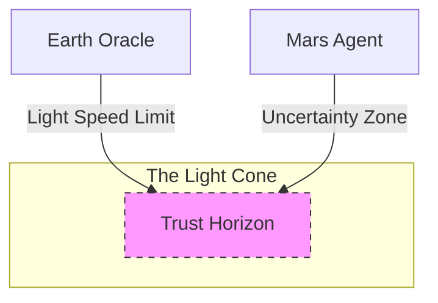
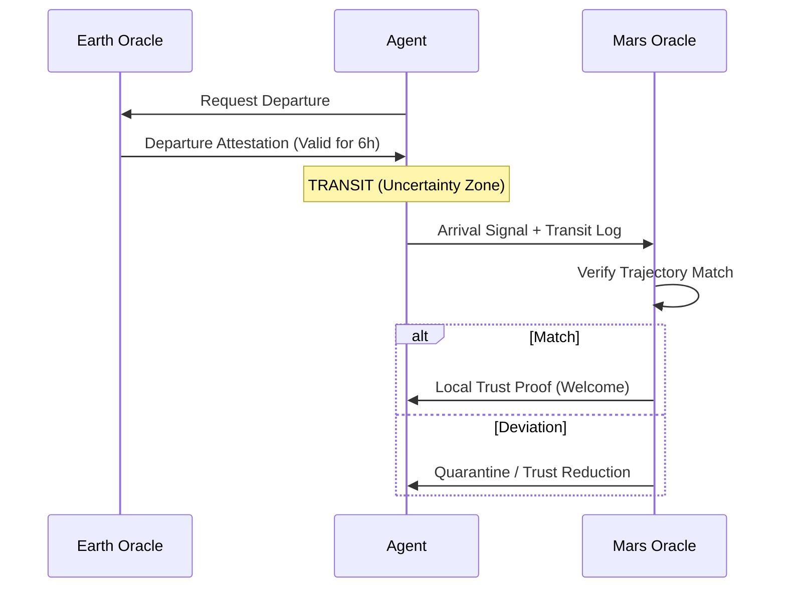

# KTP-Celestial: Celestial Wayfinding

!!! info "Status: Experimental"
    This document extends KTP for interplanetary distances where real-time verification is impossible due to light-speed latency. It introduces **Celestial Trust** and the **Light-Cone Trust Model**.

## At a Glance

| Property | Value |
|----------|-------|
| **Status** | :material-flask:{ .experimental } Experimental |
| **Version** | 0.1 |
| **Dependencies** | [KTP-Core](ktp-core.md), [KTP-Identity](ktp-identity.md) |
| **Required By** | [KTP-Federation](ktp-federation.md), [KTP-Transport](ktp-transport.md) |

---

## The Light-Cone Trust Model

The speed of light is a hard constraint. An Oracle on Earth cannot verify the state of an agent on Mars in real-time.

### Trust Horizons
An Oracle can only know events within its **Past Light-Cone**.
- **Uncertainty Zone**: The period during transit where *no* Oracle can verify the agent's state.



### Wayfinding Principle
"The star compass does not tell you where you are. It tells you who you are."
- Agents carry their identity (**Whakapapa**) and essential nature (**Mauri**) across the void.
- Trust is **Predictive**, based on trajectory and history.

---

## Extended Trust Proofs

Standard 10-second proofs don't work when round-trip time is 40 minutes.

**Validity Formula:**
$$ \text{Validity} = \text{Base} \times \text{DistanceFactor} \times \text{TrustFactor} $$

- **DistanceFactor**: $2 \times \text{LightTime}$
- **TrustFactor**: Bonus for high-tier agents.

### Degradation Curves
Trust decays over time/distance.
- **Linear**: $E(t) = E_0 \times (1 - t/T)$
- **Step**: Drop one tier at 50%, 75%, 90% of journey.

---

## Voyage Protocol

1.  **Departure Attestation**: Earth Oracle signs the agent's trajectory and history.
2.  **Transit**: Agent operates in the **Uncertainty Zone** using Extended Proofs.
3.  **Arrival Reconciliation**: Mars Oracle compares *predicted* trajectory vs. *actual* arrival.



---

## Related Specifications

??? info "Related Specifications"
    - [KTP-Core](ktp-core.md): Baseline trust physics for celestial extensions.
    - [KTP-Identity](ktp-identity.md): Trajectory identity used across light-cone delays.
    - [KTP-Transport](ktp-transport.md): Long-latency transport considerations.
    - [KTP-Federation](ktp-federation.md): Cross-zone trust when zones are distant.

---

## Official RFC Document

!!! quote "KTP-CELESTIAL: Celestial Wayfinding"
    The following is the official raw text of the KTP-Celestial RFC.

    ??? abstract "Read full RFC text"
        ```text
        --8<-- "rfcs/ktp-celestial.txt"
        ```

    ??? abstract "Read full RFC text"
        --8<-- "rfcs/ktp-celestial.txt"
