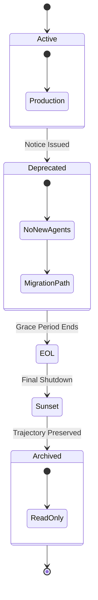

# KTP-Deprecation: End-of-Life Specification

> "Everything ends. The Death Edge—the moment of ending—deserves as much attention as the Genesis Edge."

---

## At a Glance

| Property | Value |
|----------|-------|
| **Status** | :material-flask:{ .experimental } Experimental |
| **Version** | 0.1 |
| **Dependencies** | [KTP-Core](ktp-core.md), [KTP-Identity](ktp-identity.md) |
| **Required By** | [KTP-Audit](ktp-audit.md), [KTP-Governance](ktp-governance.md) |

---

## The Problem
In most systems, "deletion" is a destructive act. Logs are purged, keys are revoked, and the entity simply vanishes. For autonomous agents, this is a loss of valuable data:
1.  **Knowledge Loss**: What did the agent learn?
2.  **Orphaned Dependencies**: Who relied on this agent?
3.  **Audit Gaps**: How do we prove what happened after the agent is gone?

## The Solution: The Death Edge
KTP-Deprecation treats endings as a formal lifecycle stage. It ensures that when an agent or model retires, its **Trajectory** is preserved, its responsibilities are handed off, and its exit is cryptographically signed.

### The Deprecation Lifecycle



---

## Lifecycle Phases

| Phase | Duration | Restrictions | Action Required |
| :--- | :--- | :--- | :--- |
| **Active** | Variable | None | Normal operation. |
| **Deprecated** | Min 180 days | No new agents created. | Begin migration to successor models. |
| **End-of-Life (EOL)** | Min 90 days | Security fixes only. | Mandatory migration of existing agents. |
| **Sunset** | Permanent | Agent execution blocked. | Trajectory archived to cold storage. |

---

## Agent Retirement Protocol
When an individual agent is retired (voluntarily or due to model sunset), it undergoes a **Succession Ceremony**.

1.  **Dependency Check**: Identify all other agents or humans relying on this agent.
2.  **State Export**: Serialize the agent's final [**Context Tensor**](ktp-tensors.md) state.
3.  **Trajectory Archive**: Cryptographically sign the full history chain and store it in the [**Flight Recorder**](ktp-audit.md).
4.  **Key Revocation**: Revoke active keys but retain public keys for historical verification.

### The Trajectory Archive
A read-only, immutable record of the agent's life.

```json
{
  "agent_id": "agent-882",
  "genesis_block": "hash:...",
  "death_block": "hash:...",
  "lifespan": "4y 2m 12d",
  "final_trust_score": 0.92,
  "reason": "model_sunset",
  "successor": "agent-905",
  "archive_location": "ipfs://..."
}
```

---

## Additional Safeguards

- **Orphan Prevention:** Ensure no dependent agent is left without a required service provider.
- **Emergency Termination:** Immediate kill-switch procedures for security breaches.
- **Digital Epitaph:** A final signed statement summarizing purpose and achievements.

## Related Specifications

??? info "Related Specifications"
    - [KTP-Identity](ktp-identity.md): The entity being retired and lineage continuity.
    - [KTP-Audit](ktp-audit.md): Where the Trajectory Archive is stored.
    - [KTP-Migration](ktp-migration.md): Transition paths to successor models.
    - [KTP-Relational](ktp-relational.md): Social graph and community impact.
    - [KTP-Governance](ktp-governance.md): Oversight and retirement approvals.

---

## Official RFC Document

??? note "View Complete RFC Text (ktp-deprecation.txt)"
    ```text
    --8<-- "rfcs-txt/ktp-deprecation.txt"
    ```
