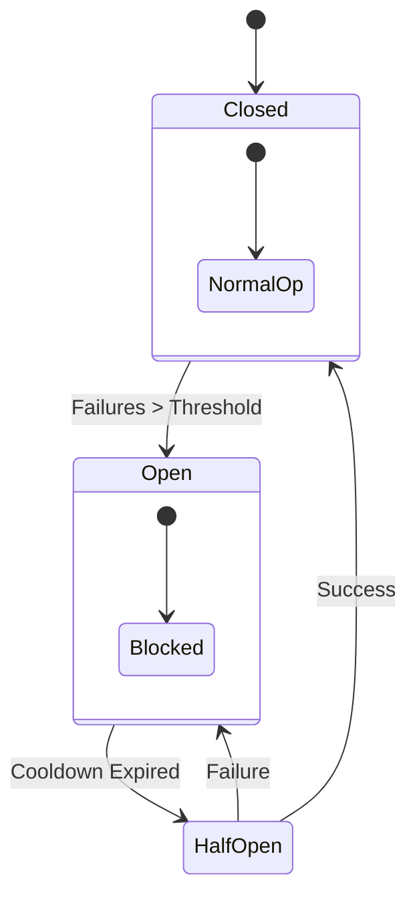
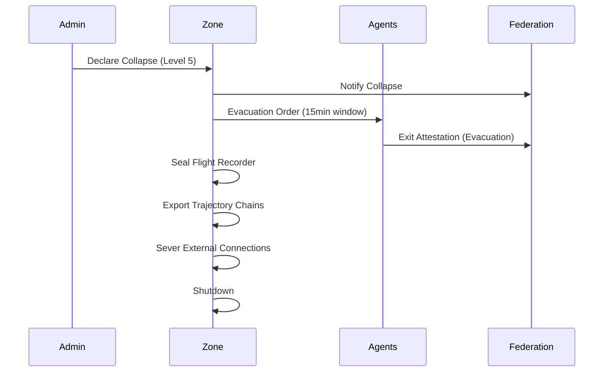

# KTP-Emergency: Emergency Response Specification

!!! info "Status: Experimental"
    This document specifies how KTP zones respond to failure—from minor degradation to catastrophic collapse. It defines **Emergency Levels**, **Circuit Breakers**, and **Graceful Degradation**.

## At a Glance

| Property | Value |
|----------|-------|
| **Status** | :material-flask:{ .experimental } Experimental |
| **Version** | 0.1 |
| **Dependencies** | [KTP-Core](ktp-core.md), [KTP-Zones](ktp-zones.md) |
| **Required By** | [KTP-Recovery](ktp-recovery.md), [KTP-Audit](ktp-audit.md) |

---

## Emergency Levels

| Level | Name | Trigger | Response | Agent Impact |
| :--- | :--- | :--- | :--- | :--- |
| **1** | **Advisory** | $R > 0.4$ | Monitor | None |
| **2** | **Warning** | $R > 0.6$ | Alert | $G += 0.5$ |
| **3** | **Critical** | $R > 0.8$ | Isolate | Tier Demotion |
| **4** | **Severe** | Compromise | Human Auth | Read-Only |
| **5** | **Catastrophic** | Collapse | Shutdown | Evacuation |

---

## Circuit Breakers

Like electrical breakers, these prevent cascading failure.



**Types:**
- **Trust Proof Circuit**: Stops issuance if Oracle is erratic.
- **Consensus Circuit**: Halts if quorum is lost.
- **Agent Circuit**: Isolates specific agents with high violation rates.

---

## Graceful Degradation Ladder

As conditions worsen, the system sheds load to preserve core safety.

1.  **Level 0**: Full Operation
2.  **Level 1**: Elevated Monitoring
3.  **Level 2**: Reduced Throughput (No new agents)
4.  **Level 3**: Essential Only (No high-risk actions)
5.  **Level 4**: Read Only
6.  **Level 5**: Preservation Mode (Data freeze)
7.  **Level 6**: Shutdown

---

## Zone Collapse Protocol

When a zone is lost, the goal shifts from *operation* to *preservation*.



---

??? info "Related Specifications"
    - **[KTP-Core](ktp-core.md)** — Foundation protocol, Zeroth Law, and Trust Score calculation.
    - **[KTP-Identity](ktp-identity.md)** — Vector Identity, Proof of Resilience, and agent lineage.
    - **[KTP-Crypto](ktp-crypto.md)** — Cryptographic primitives and signature schemes.
    - **[KTP-Transport](ktp-transport.md)** — Network transport and Trust Proof propagation.

---

## Official RFC Document

!!! quote "KTP-EMERGENCY: Emergency Response Specification"
    The following is the official raw text of the KTP-Emergency RFC.

    ??? abstract "Read full RFC text"
        ```text
        --8<-- "rfcs/ktp-emergency.txt"
        ```

    ??? abstract "Read full RFC text"
        --8<-- "rfcs/ktp-emergency.txt"
