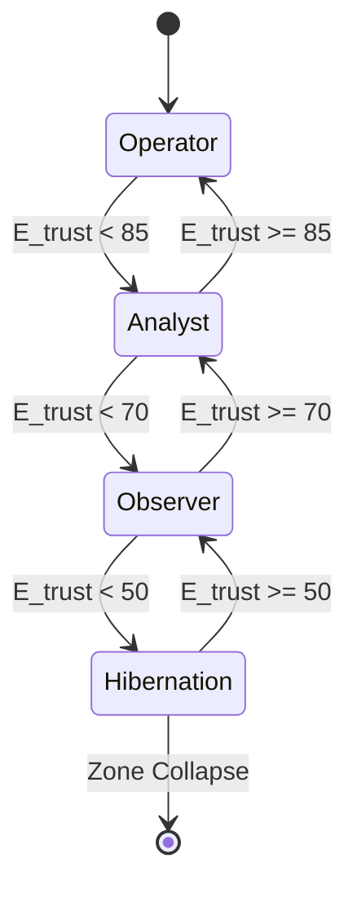

# KTP-Enforce: Enforcement Layer Specification

!!! info "Status: Experimental"
    The Enforcement Layer is where Digital Physics becomes operational reality. It intercepts agent actions, evaluates them against Trust Proofs, and executes the **Silent Veto** when environmental constraints are violated.

## At a Glance

| Property | Value |
|----------|-------|
| **Status** | :material-flask:{ .experimental } Experimental |
| **Version** | 0.1 |
| **Dependencies** | [KTP-Core](ktp-core.md), [KTP-Gravity](ktp-gravity.md) |
| **Required By** | [KTP-Emergency](ktp-emergency.md), [KTP-Audit](ktp-audit.md) |

---

## Enforcement Architecture

The Enforcement Layer sits between agents and protected resources. It is the "physics engine" that applies the laws of KTP.

```mermaid
graph TD
    Agent[Agent] -->|Action Request + Trust Proof| PEP[Policy Enforcement Point]
    
    subgraph Enforcement Layer
        PEP -->|1. Validate Sig| OracleKey[Oracle Public Key]
        PEP -->|2. Check Soul Veto| Soul[Soul Constraint S=1?]
        PEP -->|3. Check Tier| Tier[Tier Permitted?]
        PEP -->|4. Check Physics| Physics{A <= E_trust?}
    end
    
    Physics -->|Yes| Resource[Protected Resource]
    Physics -->|No| Veto[Silent Veto (403)]
    Soul -->|Yes| Veto
    Tier -->|No| Veto
    
    PEP -.->|Log Decision| Recorder[Flight Recorder]
```

### The Silent Veto
The Silent Veto is the automatic denial of an action when the environment cannot support it. It is not a policy decision; it is a physics calculation.

$$ \text{If } A > E_{trust} \text{ then } \text{DENY} $$

---

## Trust Tiers

Trust Tiers provide graduated capability levels based on $E_{trust}$ thresholds.

| Tier | $E_{trust}$ | Description | Permitted Actions |
| :--- | :--- | :--- | :--- |
| **God Mode** | $\ge 95$ | Full Control | Infrastructure, Security, Code Deploy |
| **Operator** | $\ge 85$ | Management | Restart, Scale, Config Read |
| **Analyst** | $\ge 70$ | Read-Only | Query Data, Logs, Reports |
| **Observer** | $\ge 50$ | Minimal | Heartbeat, Self-Diagnostics |
| **Hibernation** | $< 50$ | Survival | Heartbeat Only |

### Adaptive Dormancy
When environmental conditions degrade (high $R$), $E_{trust}$ drops, potentially forcing agents into lower tiers. This is **Adaptive Dormancy**.



---

## Action Risk Classification ($A$)

Every action has an intrinsic risk score ($A$), independent of who performs it.

| Action Class | $A$ Score | Examples |
| :--- | :--- | :--- |
| **Heartbeat** | 5 | Alive signal |
| **Read (Public)** | 10 | GET /public/info |
| **Read (Private)** | 30 | GET /users/123 |
| **Write (Append)** | 40 | POST /logs |
| **Write (Modify)** | 50 | PUT /users/123 |
| **Execute (Safe)** | 60 | Restart container |
| **Delete** | 75 | DELETE /records |
| **Admin** | 90 | Change firewall rules |
| **Destructive** | 95 | Drop database |

---

## Mass Ceiling & Anti-Accumulation

To prevent "Too Big To Fail" scenarios, KTP enforces a **Mass Ceiling**. As an agent's footprint grows, its gravity increases, making movement harder.

$$ G_{agent} \propto \text{Mass} $$

If an agent becomes too massive, it must undergo **Mitosis** (split into smaller agents) or face **Progressive Trust Taxation** (higher $E$ required for same actions).

---

## Related Specifications

??? info "Related Specifications"
    - [KTP-Core](ktp-core.md): Trust physics enforced by PEPs.
    - [KTP-Gravity](ktp-gravity.md): Environmental drag and constraint mechanics.
    - [KTP-Emergency](ktp-emergency.md): Break-glass enforcement paths.
    - [KTP-Audit](ktp-audit.md): Flight Recorder logs for enforcement actions.

---

## Official RFC Document

??? note "View Complete RFC Text (ktp-enforce.txt)"
    ```text
    --8<-- "rfcs-txt/ktp-enforce.txt"
    ```
