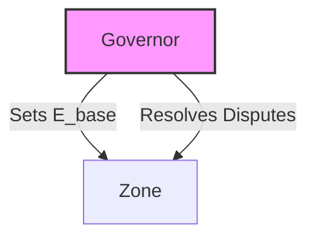
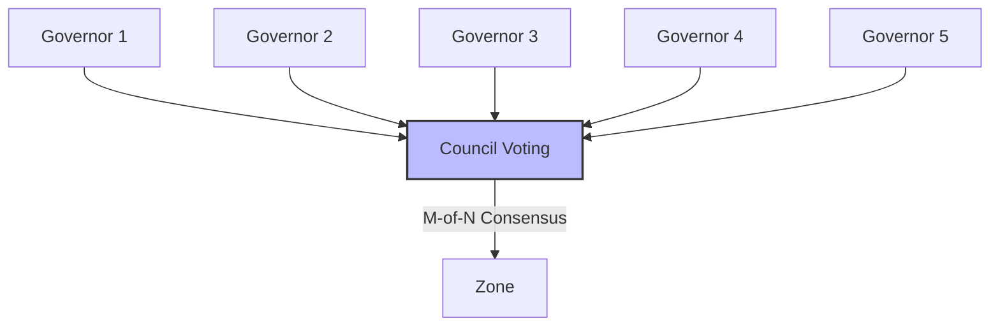
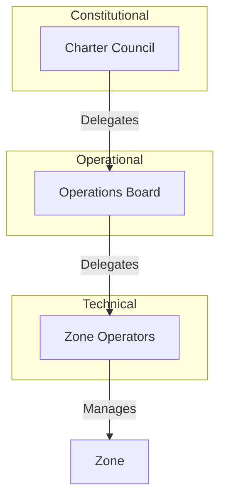
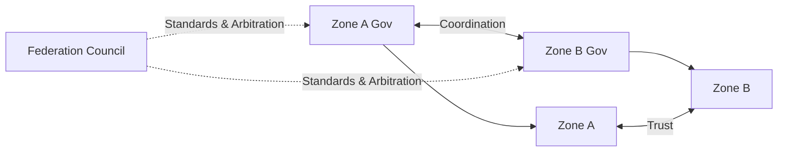
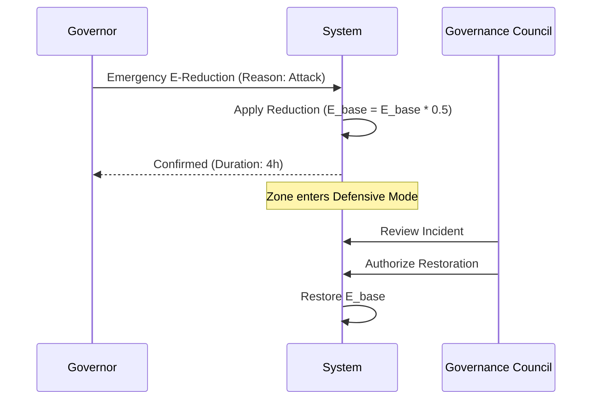
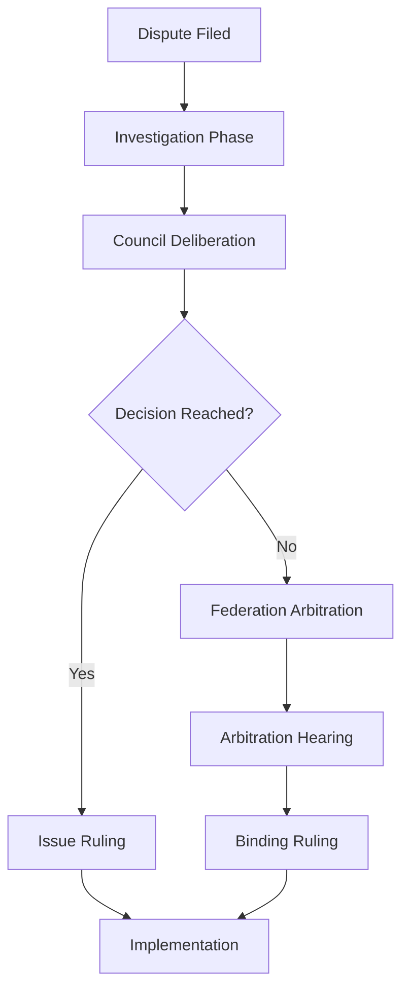

# KTP-Governance: Governance Specification

!!! info "Status: Experimental"
    This document defines the governance layer of KTP, including zone charters, the recursive constraint principle, and dispute resolution mechanisms.

## At a Glance

| Property | Value |
|----------|-------|
| **Status** | :material-flask:{ .experimental } Experimental |
| **Version** | 0.1 |
| **Dependencies** | [KTP-Core](ktp-core.md), [KTP-Federation](ktp-federation.md) |
| **Required By** | [KTP-Audit](ktp-audit.md), [KTP-Conformance](ktp-conformance.md) |

---

## The Recursive Constraint

The fundamental innovation of KTP governance is that it is **not** outside the system. Governors are agents *within* the system, subject to the same physics as the agents they govern.

$$ A_{governor} \leq E_{governor} $$

Where:
- $A_{governor}$ is the autonomy cost of a governance action (e.g., changing a parameter).
- $E_{governor}$ is the governor's environmental stability (Trust Score).

This prevents "God Mode" administration where operators can bypass safety constraints. To change the physics, a governor must have sufficient trust *within* the physics.

### Governance Action Costs

| Action | Autonomy Cost ($A$) | Requirement |
| :--- | :--- | :--- |
| View Metrics | 5 | Basic Access |
| Modify Tier Boundaries | 25 | Analyst Trust |
| Adjust Agent $E_{base}$ | 35 | Operator Trust |
| Adjust Zone $E_{base}$ | 60 | High Trust |
| Modify Gravity Parameters | 70 | Very High Trust |
| Change Governance Structure | 80 | Council Consensus |
| Zone Dissolution | 95 | Maximum Trust |

---

## Governance Models

KTP supports multiple governance structures depending on the zone's needs.

### Model 1: Sole Proprietor
Simple, single-entity control. Best for private or experimental zones.



### Model 2: Governance Council
Distributed decision-making via M-of-N voting. Best for production zones.



### Model 3: Delegated Governance
Layered authority for large organizations.



### Model 4: Federated Governance
Shared governance across multiple zones.



---

## E-Setting Authority

The power to set $E_{base}$ is the power to determine the reality of the zone. This authority is tiered to prevent abuse.

| Level | Scope | Typical Authority | Constraints |
| :--- | :--- | :--- | :--- |
| **Zone** | Zone-wide $E_{base}$ | Charter Council | Max change 10/week, Audit required |
| **Tier** | Tier-specific limits | Governance Council | Consensus required |
| **Agent** | Individual $E_{base}$ | Zone Operators | Cannot exceed Zone Max |
| **Emergency** | Temporary reduction | Any Governor | Max 24h duration, Post-hoc review |

### Emergency E-Reduction Process

In a crisis, any governor can "pull the brake" (reduce $E$), but restoring it requires consensus.



---

## Dispute Resolution

When physics is not enough, human judgment is required.

1. **Agent vs. Zone**: Agent disputes a governance decision.
2. **Governor vs. Governor**: Disagreement within the council.
3. **Zone vs. Zone**: Cross-zone trust issues.

### Federation Arbitration Flow



---

## Related Specifications

??? info "Related Specifications"
    - [KTP-Core](ktp-core.md): Trust physics and enforcement baseline.
    - [KTP-Identity](ktp-identity.md): Agent lineage and accountability.
    - [KTP-Crypto](ktp-crypto.md): Signature schemes and key custody.
    - [KTP-Transport](ktp-transport.md): Proof propagation across networks.

---

## Official RFC Document

!!! quote "KTP-GOVERNANCE: Governance Specification"
    The following is the official raw text of the KTP-Governance RFC.

    ??? abstract "Read full RFC text"
        ```text
        --8<-- "rfcs/ktp-governance.txt"
        ```
