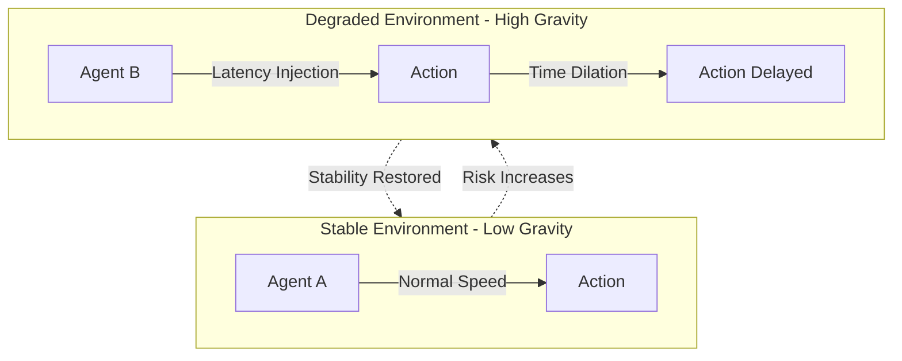

# KTP-Gravity: Digital Gravity Specification

> "In physical gravity, mass curves spacetime. In Digital Gravity, risk curves the operational environment. The physics is the governance."

---

## At a Glance

| Property | Value |
|----------|-------|
| **Status** | :material-flask:{ .experimental } Experimental |
| **Version** | 0.1 |
| **Dependencies** | [KTP-Core](ktp-core.md), [KTP-Signal](ktp-signal.md) |
| **Required By** | [KTP-Enforce](ktp-enforce.md), [KTP-Emergency](ktp-emergency.md) |

---

## The Problem
Traditional security relies on **Policy**—access control lists, firewall rules, and human oversight. These fail when:
1.  **Speed**: Agents operate at machine speed; humans cannot keep up.
2.  **Complexity**: Policies are brittle and easily bypassed or misconfigured.
3.  **Binary Nature**: Policy is usually "Allow" or "Deny," with no middle ground for nuanced risk.

## The Solution: Digital Gravity
Digital Gravity replaces policy with **Physics**. Instead of deciding whether to allow an action, the environment applies physical constraints that make excessive autonomy impossible. The agent doesn't hit a wall; it experiences increasing resistance.

### The Zeroth Law
The fundamental inequality that governs all KTP operations:

$$A \leq E$$

Where:
*   **$A$ (Autonomy)**: The risk level of the agent's attempted action.
*   **$E$ (Environment)**: The environment's current capacity to absorb risk.
*   **$E = E_{base} \times (1 - R)$**: Where $R$ is the Risk Factor from [**Context Tensors**](ktp-tensors.md).

---

## Enforcement Mechanisms
When $A$ approaches $E$, Digital Gravity applies one or more of the following "Physical" constraints:

=== "Latency Injection"
    **The Medium Thickens.**
    Deliberate introduction of delay into every packet and API call. The agent experiences the network as "sluggish," slowing its decision loop.

=== "Time Dilation"
    **Slowing the Clock.**
    The agent's internal clock is slowed relative to wall-clock time. To the agent, it is moving at normal speed, but to the outside world, it is effectively paused.

=== "Compute Throttling"
    **Resource Scarcity.**
    The kernel restricts CPU cycles and memory bandwidth. High-risk actions become computationally expensive, forcing the agent to prioritize safety.

=== "Network Isolation"
    **The Event Horizon.**
    The agent's connectivity is restricted to a smaller and smaller "neighborhood" until it is effectively air-gapped from the global network.

---

## The Gravity Well
A **Gravity Well** is a region of increased constraint. As an agent moves toward a high-risk action or as the environment degrades, it "falls" into a well.



---

??? info "Related Specifications"
    - **[KTP-Core](ktp-core.md)** — The foundational protocol and the Zeroth Law ($A \leq E$).
    - **[KTP-Tensors](ktp-tensors.md)** — Data source for calculating the Risk Factor $R$.
    - **[KTP-Enforce](ktp-enforce.md)** — Enforcement mechanisms for Digital Physics.
    - **[KTP-Emergency](ktp-emergency.md)** — Emergency protocols and the Silent Veto mechanism.
    - **[KTP-Sensors](ktp-sensors.md)** — Interfaces that report environmental state.
    - **[KTP-Zones](ktp-zones.md)** — Spatial boundaries where gravity is applied.

---

## Official RFC Document

??? abstract "KTP-RFC-008: KTP-Gravity (Raw Text)"

    ```text
    --8<-- "rfcs/ktp-gravity.txt"
    ```

    *(Note: The raw text above is the authoritative technical specification. This page provides a user-friendly interface for that content.)*
