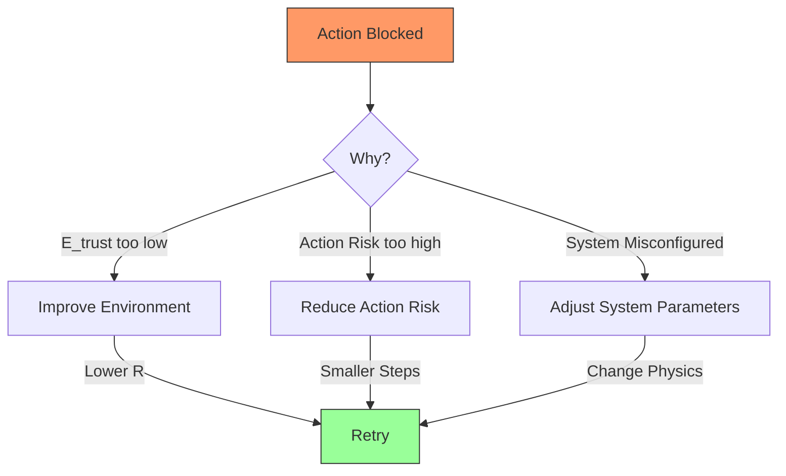
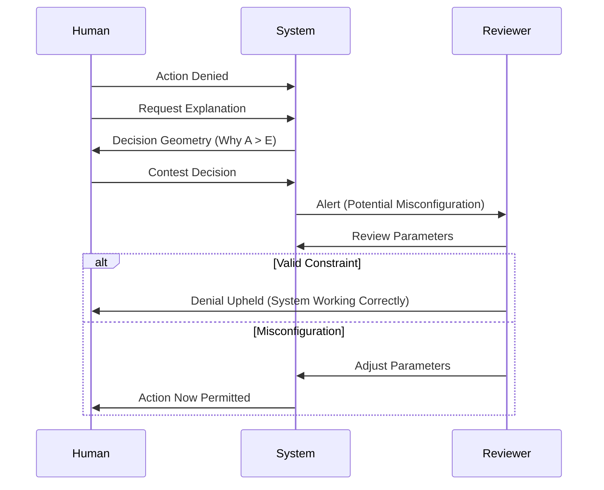

# KTP-Human: Human Integration

!!! info "Status: Draft"
    This document specifies how humans participate in KTP: as agents subject to physics, as operators, and as the ultimate source of legitimacy. It addresses the critical "No Override" principle.

## At a Glance

| Property | Value |
|----------|-------|
| **Status** | :material-progress-clock:{ .draft } Draft |
| **Version** | 0.1 |
| **Dependencies** | [KTP-Core](ktp-core.md), [KTP-Identity](ktp-identity.md) |
| **Required By** | [KTP-Privacy](ktp-privacy.md), [KTP-Governance](ktp-governance.md) |

---

## The Human Question

"Where do humans fit?"

In KTP, humans are not external gods; they are **high-trust agents**.
1. **Humans are Agents**: Subject to $A \leq E_{trust}$.
2. **Humans are Operators**: They configure the physics.
3. **Humans are NOT Exempt**: The Zeroth Law applies to everyone.

### Human Agent Identity

```json
{
  "agent_type": "human",
  "agent_id": "human:org:alice.smith",
  "identity_source": {
    "type": "federated",
    "provider": "okta"
  },
  "trajectory": {
    "entries": 15247,
    "resilience_events": 3
  }
}
```

---

## The "No Override" Principle

The most controversial aspect of KTP is the lack of a "Human Override" button.

!!! warning "Why No Override?"
    Asking for an override is like asking to override gravity. If $A > E_{trust}$, the environment **cannot** safely support the action. Forcing it (override) doesn't make it safe; it just makes it dangerous.

### Alternatives to Override

Instead of breaking the physics, humans have legitimate paths to enable actions:

1. **Improve the Environment**: Reduce risk ($R$) or add capacity.
2. **Reduce Action Risk**: Break the action into smaller, safer steps.
3. **Legitimate Adjustment**: Change the system parameters (requires high trust).
4. **Emergency Procedures**: Pre-authorized high-risk actions for specific roles.



---

## Human-Agent Collaboration

Humans and AI agents work together in defined patterns.

### 1. Delegation
A human authorizes an agent to act on their behalf. The agent is capped by the human's trust score.

$$ E_{trust}^{delegate} \leq \min(E_{trust}^{human}, E_{max}^{delegation}) $$

### 2. Supervision Models

| Model | Description | Trust Implication |
| :--- | :--- | :--- |
| **Active** | Human approves every action | Agent acts at Human's Tier |
| **Passive** | Human monitors stream | Agent acts at Own Tier |
| **Exceptional** | Human alerted on anomaly | Agent fully autonomous |

### 3. Capability Inheritance
- **Human Context**: Human presence can lower environmental risk ($R$).
- **Agent Extension**: Agent extends human scale/speed, but not authority.

---

## Accessibility & Transparency

KTP must be humane to humans.

### Trust Score Visibility
Humans must see their score and understand *why* it is what it is.
> "Your Trust Score is 72. This is calculated from your base trust of 85 reduced by 15% due to current elevated threat conditions."

### Contestability
Humans can contest decisions, but this triggers a review of the *physics*, not a waiver of the rules.



---

??? info "Related Specifications"
    - **[KTP-Core](ktp-core.md)** — Foundation protocol, Zeroth Law, and Trust Score calculation.
    - **[KTP-Identity](ktp-identity.md)** — Vector Identity, Proof of Resilience, and agent lineage.
    - **[KTP-Crypto](ktp-crypto.md)** — Cryptographic primitives and signature schemes.
    - **[KTP-Transport](ktp-transport.md)** — Network transport and Trust Proof propagation.

---

## Official RFC Document

!!! quote "KTP-HUMAN: Human Integration Specification"
    The following is the official raw text of the KTP-Human RFC.

    ??? abstract "Read full RFC text"
        ```text
        --8<-- "rfcs/ktp-human.txt"
        ```
