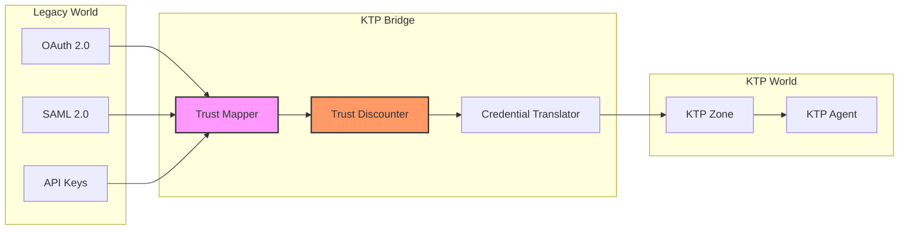

# KTP-Legacy — Legacy Integration

*Bridging the gap between static credentials and kinetic trust*

---

> **The Bridge Principle**: Trust must flow across boundaries, but it must be measured by the receiver's physics, not the sender's promise.

Legacy integration is not just about compatibility; it is about translation. We translate static promises (tokens, keys) into kinetic realities (trust scores, tensors), applying necessary discounts for the loss of fidelity.

---

## At a Glance

| Property | Value |
|----------|-------|
| **Status** | :material-flask: Experimental |
| **Version** | 0.1 |
| **Dependencies** | [KTP-Core](ktp-core.md), [KTP-Identity](ktp-identity.md) |
| **Key Concept** | Trust Mapping & Discounting |

---

## The Bridge Architecture

!!! info "Translating Trust"
    KTP does not reject legacy systems; it contextualizes them. A legacy credential is just another signal input, albeit one with lower fidelity than a native KTP proof.



### Key Components

1.  **Trust Mapper**: Identifies the type of legacy credential and extracts relevant claims.
2.  **Trust Discounter**: Applies a "fidelity penalty" to the trust score because legacy credentials lack real-time context.
3.  **Credential Translator**: Minting a short-lived KTP Trust Proof based on the discounted legacy signal.

---

## Related Specifications

??? info "Related Specifications"
    - [KTP-Core](ktp-core.md): Baseline trust physics and $A \leq E$.
    - [KTP-Identity](ktp-identity.md): Vector identity and lineage mapping.
    - [KTP-Crypto](ktp-crypto.md): Proof signing and legacy credential validation.
    - [KTP-Transport](ktp-transport.md): Delivery of translated trust proofs.

---

## Official RFC Document

??? note "View Complete RFC Text (ktp-legacy.txt)"
    ```text
    --8<-- "rfcs-txt/ktp-legacy.txt"
    ```
