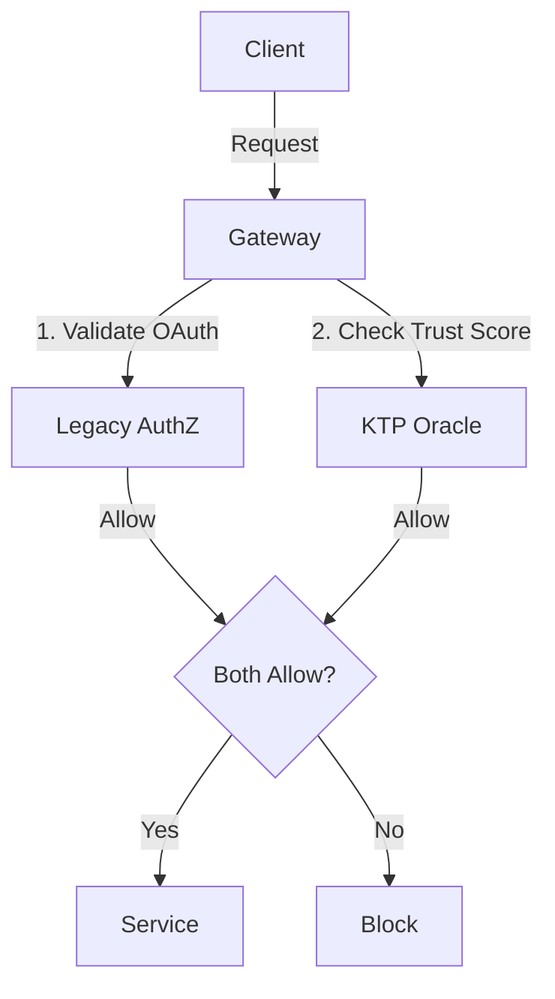

# KTP-Migration: Migration Guide

> "The best protocol is worthless if no one can adopt it. Migration must be incremental, reversible, and demonstrably valuable at each stage."

---

## At a Glance

| Property | Value |
|----------|-------|
| **Status** | :material-progress-clock:{ .draft } Draft |
| **Version** | 0.1 |
| **Dependencies** | [KTP-Core](ktp-core.md), [KTP-Legacy](ktp-legacy.md) |
| **Required By** | [KTP-Federation](ktp-federation.md), [KTP-Governance](ktp-governance.md) |

---

## The Problem
Organizations have massive investments in existing identity infrastructure (OAuth 2.0, SAML, API Keys). Ripping and replacing these systems is impossible. KTP must offer a path that allows for **coexistence** and **gradual adoption**.

## The Solution: Progressive Enforcement
KTP-Migration defines a 5-stage process that moves from passive observation to full enforcement, ensuring that business operations are never disrupted by the transition.

### The 5-Stage Path

=== "Stage 0: Observation"
    **Passive Telemetry.**
    Deploy KTP sensors and Oracles, but do not enforce any rules.
    
    *   **Goal**: Establish baselines for $E_{base}$ and $R$.
    *   **Action**: Log all trust scores; no blocking.

=== "Stage 1: Shadow Mode"
    **Virtual Enforcement.**
    KTP evaluates every request and logs the decision it *would* have made.
    
    *   **Goal**: Identify false positives and tune policy.
    *   **Action**: Compare KTP decisions vs. Legacy decisions.

=== "Stage 2: Advisory Mode"
    **Hybrid Operation.**
    KTP adds "risk headers" to requests, but the legacy system makes the final call.
    
    *   **Goal**: Give applications visibility into trust levels.
    *   **Action**: `X-KTP-Risk: High` header added to requests.

=== "Stage 3: Canary Enforcement"
    **Selective Blocking.**
    Enforce KTP rules on a small subset of traffic (e.g., 1% of users or specific non-critical endpoints).
    
    *   **Goal**: Validate enforcement logic in production.
    *   **Action**: Real blocking for test groups.

=== "Stage 4: Full Enforcement"
    **Physics-Based Auth.**
    KTP becomes the primary authorization engine. Legacy systems are relegated to identity provision only.
    
    *   **Goal**: Complete transition.
    *   **Action**: $A \leq E$ enforced for all traffic.

---

## Legacy Integration Patterns

### OAuth 2.0 Token Enrichment
KTP claims can be embedded directly into JWTs, allowing existing Resource Servers to consume trust data without code changes.

```json
{
  "sub": "user-123",
  "scope": "read write",
  "exp": 1732550400,
  "ktp": {
    "e_base": 72,
    "e_trust": 68,
    "tier": "analyst",
    "trajectory_hash": "sha256:abc...",
    "oracle": "https://oracle.example.com"
  }
}
```

### Dual-Stack Architecture
Running KTP alongside legacy auth allows for a "belt and suspenders" approach during transition.



---

## Core Components

???+ note "Trust Bootstrapping"
    Assigning initial trust scores to existing users based on historical logs and role tenure.

???+ note "Shadow Mode Logging"
    A standardized log format for comparing Legacy vs. KTP decisions to detect anomalies.

???+ note "Rollback Procedures"
    "Emergency Fallback" protocols to instantly disable KTP enforcement if a critical business process is blocked.

???+ note "Success Metrics"
    KPIs for migration health: False Positive Rate, Latency Impact, and Trust Score Stability.

---

??? info "Related Specifications"
    - **[KTP-Core](ktp-core.md)** — The foundational protocol and the Zeroth Law ($A \leq E$).
    - **[KTP-Legacy](ktp-legacy.md)** — Bridging the gap between static credentials and kinetic trust.
    - **[KTP-Federation](ktp-federation.md)** — Cross-zone cryptographic trust establishment.
    - **[KTP-Governance](ktp-governance.md)** — The human-in-the-loop and algorithmic governance framework.

---

## Official RFC Document

??? note "View Complete RFC Text (ktp-migration.txt)"
    ```text
    --8<-- "rfcs-txt/ktp-migration.txt"
    ```
