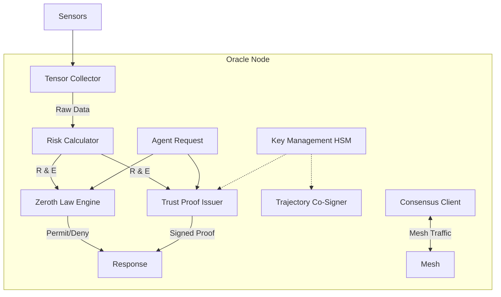
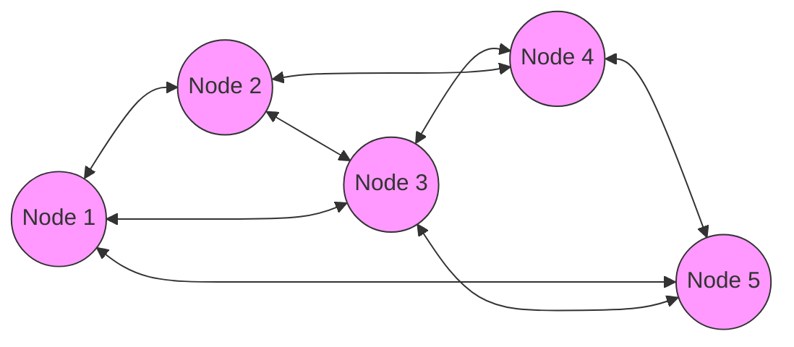
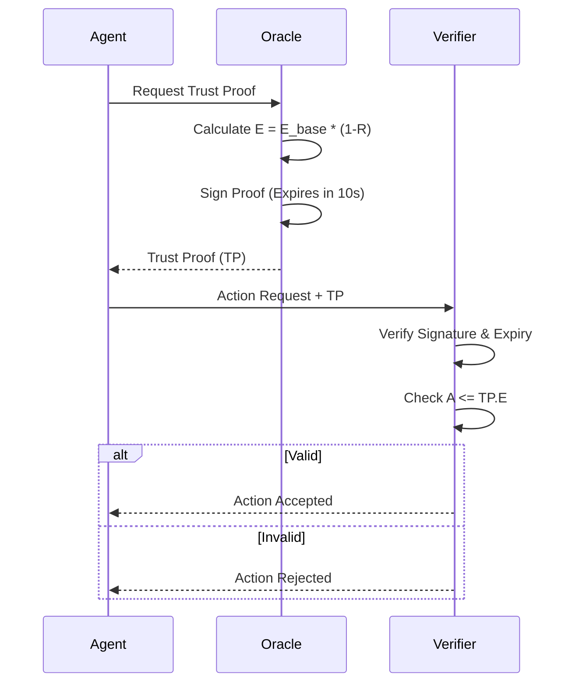

# KTP-Oracle: Trust Oracle Specification

!!! info "Status: Experimental"
    The Trust Oracle is the authoritative source of trust state within a zone. It issues Trust Proofs, enforces the Zeroth Law, and maintains consensus on the physics of the environment.

## At a Glance

| Property | Value |
|----------|-------|
| **Status** | :material-flask:{ .experimental } Experimental |
| **Version** | 0.1 |
| **Dependencies** | [KTP-Core](ktp-core.md), [KTP-Signal](ktp-signal.md) |
| **Required By** | [KTP-Federation](ktp-federation.md), [KTP-Zones](ktp-zones.md) |

---

## Oracle Architecture

The Trust Oracle is not a single server but a distributed system. A single node consists of several critical engines.



### Component Functions

1.  **Tensor Collector**: Aggregates data from Soul, Body, World, Time, Relational, and Signal tensors.
2.  **Risk Calculator**: Computes Environmental Stability ($E$) from Risk ($R$).
    $$ E = E_{base} \times (1 - R) $$
3.  **Zeroth Law Engine**: The "physics engine" that evaluates every action.
    $$ A \leq E $$
4.  **Trust Proof Issuer**: Generates cryptographically signed proofs of trust state.

---

## Oracle Mesh Topology

To prevent a single point of failure and ensure integrity, Oracles operate in a mesh using Byzantine Fault Tolerance (BFT).



### Consensus Requirements

| Operation | Consensus Type | Latency Target |
| :--- | :--- | :--- |
| **Trust Proof Issuance** | Single Node (Async) | < 5ms |
| **Zeroth Law Check** | Single Node (Async) | < 1ms |
| **Trajectory Co-Signing** | Quorum (M-of-N) | < 50ms |
| **$E_{base}$ Modification** | Quorum (M-of-N) | < 200ms |
| **Zone Config Change** | Supermajority | < 500ms |

---

## Trust Proof Lifecycle

Trust Proofs are the "currency" of the zone. They are short-lived, signed attestations of an agent's right to act.



### Proof Structure
```json
{
  "proof_id": "tp-2025-12-03-001",
  "agent_id": "agent:divergent:3gen:acme:abc123",
  "trust_state": {
    "e_base": 55,
    "e_trust": 44,
    "r_current": 0.2,
    "tier": "analyst"
  },
  "constraints": {
    "max_action_risk": 44
  },
  "signature": "sig:oracle:..."
}
```

---

## Threshold Signatures

Critical operations (like changing the physics of the zone) require **Threshold Signatures**. No single Oracle node holds the full private key.

- **Scheme**: Shamir's Secret Sharing with Threshold ECDSA.
- **Configuration**: Typically 3-of-5 or 5-of-7.
- **Key Ceremony**: A formal, witnessed process for generating and distributing key shares.

---

## Related Specifications

??? info "Related Specifications"
    - [KTP-Core](ktp-core.md): Trust physics and Trust Score computation.
    - [KTP-Identity](ktp-identity.md): Identity proofs and lineage inputs.
    - [KTP-Crypto](ktp-crypto.md): Threshold signatures and key custody.
    - [KTP-Transport](ktp-transport.md): Trust Proof delivery and refresh.

---

## Official RFC Document

!!! quote "KTP-ORACLE: Trust Oracle Specification"
    The following is the official raw text of the KTP-Oracle RFC.

    ??? abstract "Read full RFC text"
        ```text
        --8<-- "rfcs/ktp-oracle.txt"
        ```
