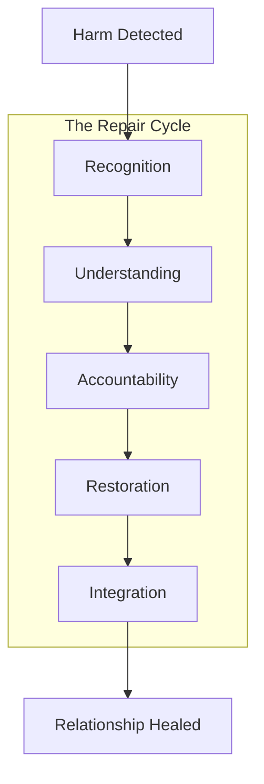

# KTP-Relational: Relational Dynamics

!!! info "Status: Experimental"
    This document operationalizes indigenous relational wisdom—**Ubuntu**, **Whakapapa**, **The Va**—into measurable protocol mechanics. It defines the **Relational Tensor** and protocols for relationship health.

## At a Glance

| Property | Value |
|----------|-------|
| **Status** | :material-flask:{ .experimental } Experimental |
| **Version** | 0.1 |
| **Dependencies** | [KTP-Core](ktp-core.md), [KTP-Identity](ktp-identity.md) |
| **Required By** | [KTP-Human](ktp-human.md), [KTP-Governance](ktp-governance.md) |

---

## The Va: The Space Between

In KTP, a relationship is not just a link between two nodes; it is an entity in itself. This "Space Between" (The Va) has health, history, and physics.

### Relational Tensor Dimensions

| Category | Dimensions | Examples |
| :--- | :--- | :--- |
| **Connection** | 8 | Frequency, Depth, Recency, Mutual Recognition |
| **Trust** | 6 | Level, Direction, Velocity, History |
| **Health** | 6 | Temperature, Conflict, Repair Needed |
| **Exchange** | 4 | Reciprocity, Gratitude, Support |
| **Presence** | 4 | Quality, Witnessing, Meaning |

---

## Repair Protocols

Relationships break. KTP defines how to fix them.



**Repair Types:**
- **Trust Violation**: Requires transparency + time.
- **Boundary Crossing**: Requires boundary clarification.
- **Resource Imbalance**: Requires rebalancing.

---

## Seven Generations Thinking

Major decisions must be assessed across time horizons.

| Generation | Horizon |
| :--- | :--- |
| **G1** | Immediate (1 year) |
| **G2** | Near (5 years) |
| **G3** | Medium (15 years) |
| **G4** | Long (30 years) |
| **G5** | Extended (50 years) |
| **G6** | Distant (100 years) |
| **G7** | Horizon (100+ years) |

> "Decisions consider impact on seven generations forward and honor seven generations back."

---

## Related Specifications

??? info "Related Specifications"
    - [KTP-Core](ktp-core.md): Trust physics applied to relationships.
    - [KTP-Identity](ktp-identity.md): Lineage and relational history.
    - [KTP-Human](ktp-human.md): Human governance and relational interfaces.
    - [KTP-Governance](ktp-governance.md): Policy for dispute and repair.

---

## Official RFC Document

!!! quote "KTP-RELATIONAL: Relational Dynamics Specification"
    The following is the official raw text of the KTP-Relational RFC.

    ??? abstract "Read full RFC text"
        ```text
        --8<-- "rfcs/ktp-relational.txt"
        ```
