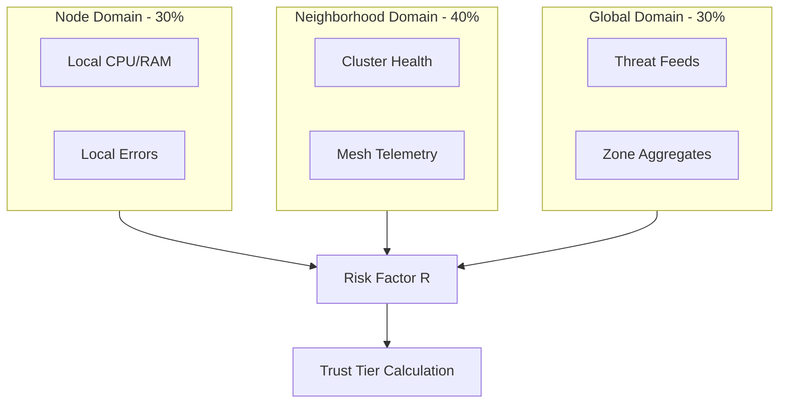

# KTP-Sensors: Context Tensor Sensor Specification

> "The Context Tensor is the sensory nervous system of the Kinetic Trust Protocol. It measures environmental reality to calculate the Risk Factor."

---

## At a Glance

| Property | Value |
|----------|-------|
| **Status** | :material-progress-clock:{ .draft } Draft |
| **Version** | 0.1 |
| **Dependencies** | [KTP-Core](ktp-core.md), [KTP-Tensors](ktp-tensors.md) |
| **Required By** | [KTP-Signal](ktp-signal.md), [KTP-Gravity](ktp-gravity.md) |

---

## The Problem
Environmental sensing is noisy. A single CPU spike or a transient network blip can cause a "Trust Oscillation," where an agent rapidly flips between trust tiers (e.g., Operator → Analyst → Operator). This creates operational instability and audit noise.

## The Solution: Hierarchical Sensing
KTP-Sensors implements a three-level hierarchy to smooth out noise while remaining responsive to genuine threats.

### The Three Risk Domains



---

## Domain Breakdown

| Domain | Scope | Update Freq | Weight | Purpose |
| :--- | :--- | :--- | :--- | :--- |
| **Node** | Single resource/endpoint | 1-5s | 30% | Immediate local conditions. |
| **Neighborhood** | Local cluster/subnet | 10-30s | 40% | Smoothing local noise via peer consensus. |
| **Global** | Zone-wide/Federation | 30-120s | 30% | Broad trends and external threat intelligence. |

---

## Sensor Feed Architecture
Each dimension in the [**Context Tensor**](ktp-tensors.md) aggregates multiple sensor feeds.

### Feed Aggregation Logic
For most dimensions, feeds are combined using a weighted average:

$$D = \frac{\sum (w_i \cdot v_i)}{\sum w_i}$$

Where $v_i$ is the normalized value (0.0 to 1.0) from feed $i$.

### The Soul Veto
The **Soul Dimension** is unique. It does not use weighted averages. Instead, it acts as a **Logical OR** (Veto):

*   If **ANY** enabled Soul feed returns a "Veto" signal...
*   The entire Soul dimension becomes **1.0 (Critical Risk)**.
*   This triggers an immediate **Silent Veto** or **Emergency Shutdown**.

---

## Related Specifications

<div class="grid cards" markdown>

-   :material-book-open-variant:{ .lg .middle } **[KTP-Core](ktp-core.md)**

    ---

    The foundational protocol and the Zeroth Law ($A \leq E$).

-   :material-cube-outline:{ .lg .middle } **[KTP-Tensors](ktp-tensors.md)**

    ---

    Complete Context Tensor specification (1,707 dimensions).

-   :material-wifi:{ .lg .middle } **[KTP-Signal](ktp-signal.md)**

    ---

    Measuring the epistemic health of the information environment.

-   :material-gavel:{ .lg .middle } **[KTP-Enforce](ktp-enforce.md)**

    ---

    The enforcement mechanisms for Digital Physics.

</div>

---

## Implementation Example: Sensor Config

```json
{
  "dimension": "body.hardware",
  "feeds": [
    {
      "id": "tee-attestation",
      "type": "security",
      "source": "local://kernel/tee",
      "weight": 2.0,
      "refresh_interval_ms": 5000
    },
    {
      "id": "temp-sensor",
      "type": "physical",
      "source": "mqtt://sensors.local/temp",
      "normalization": { "min": 20, "max": 80 },
      "refresh_interval_ms": 30000
    }
  ]
}
```

---

## Official RFC Document

??? abstract "KTP-RFC-007: KTP-Sensors (Raw Text)"

    ```text
    --8<-- "rfcs/ktp-sensors.txt"
    ```

    *(Note: The raw text above is the authoritative technical specification. This page provides a user-friendly interface for that content.)*
