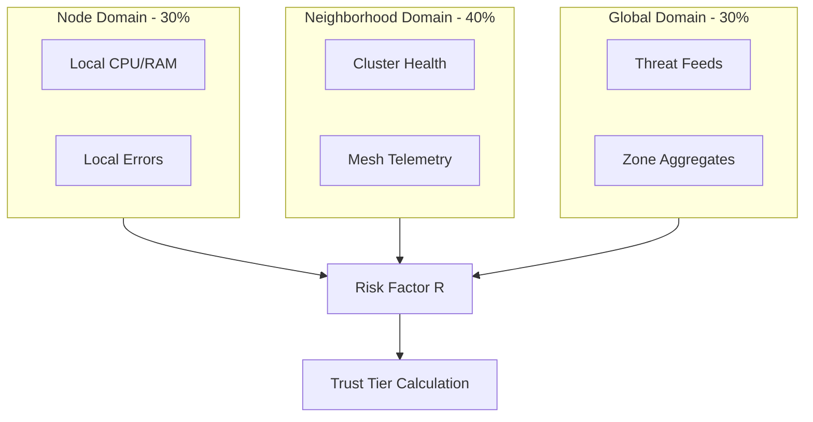

# KTP-Sensors: Context Signal Sensor Specification

> "Context Signals are the sensory nervous system of the Kinetic Trust Protocol. They measure environmental reality to calculate the Risk Factor."

---

## At a Glance

| Property | Value |
|----------|-------|
| **Status** | :material-progress-clock:{ .draft } Draft |
| **Version** | 0.1 |
| **Dependencies** | [KTP-Core](ktp-core.md), [KTP-Signals](ktp-signals.md) |
| **Required By** | [KTP-Information](ktp-information.md), [KTP-Attenuation](ktp-attenuation.md) |

---

## The Problem
Environmental sensing is noisy. A single CPU spike or a transient network blip can cause a "Trust Oscillation," where an agent rapidly flips between trust tiers (e.g., Operator → Analyst → Operator). This creates operational instability and audit noise.

## The Solution: Hierarchical Sensing
KTP-Sensors implements a three-level hierarchy to smooth out noise while remaining responsive to genuine threats.

### The Three Risk Domains


```mermaid
graph TD
    subgraph Global [Global Domain - 30%]
        G1[Threat Feeds]
        G2[Zone Aggregates]
    end
    
    subgraph Neighborhood [Neighborhood Domain - 40%]
        N1[Cluster Health]
        N2[Mesh Telemetry]
    end
    
    subgraph Node [Node Domain - 30%]
        L1[Local CPU/RAM]
        L2[Local Errors]
    end

    Node --> R[Risk Factor R]
    Neighborhood --> R
    Global --> R
    
    R --> T[Trust Tier Calculation]
```

---

## Domain Breakdown

| Domain | Scope | Update Freq | Weight | Purpose |
| :--- | :--- | :--- | :--- | :--- |
| **Node** | Single resource/endpoint | 1-5s | 30% | Immediate local conditions. |
| **Neighborhood** | Local cluster/subnet | 10-30s | 40% | Smoothing local noise via peer consensus. |
| **Global** | Zone-wide/Federation | 30-120s | 30% | Broad trends and external threat intelligence. |

---

## Sensor Feed Architecture
Each input in the [**Risk Factors**](ktp-signals.md) aggregates multiple sensor feeds.

### Feed Aggregation Logic
For most dimensions, feeds are combined using a weighted average:

$$D = \frac{\sum (w_i \cdot v_i)}{\sum w_i}$$

Where $v_i$ is the normalized value (0.0 to 1.0) from feed $i$.

### The Soul Veto
The **Soul Veto** is unique. It does not use weighted averages. Instead, it acts as a **Logical OR** (Veto):

*   If **ANY** enabled Soul feed returns a "Veto" signal...
*   The entire Soul input becomes **1.0 (Critical Risk)**.
*   This triggers an immediate **Silent Veto** or **Emergency Shutdown**.
*   An **unanswered** sovereignty query is not a clearance. A registry that is unreachable, errors, times out, or returns nothing resolves to the veto (§4.3, under KTP-Core §6.7), and no cached clearance substitutes for a current answer. Silence reads as the veto, never as consent.

---

## Related Specifications

??? info "Related Specifications"
    - [KTP-Core](ktp-core.md): The trust mechanics that sensor data feeds.
    - [KTP-Signals](ktp-signals.md): Context Signals catalogue for sensor inputs.
    - [KTP-Information](ktp-information.md): Epistemic health signals from telemetry.
    - [KTP-Enforce](ktp-enforce.md): Enforcement decisions driven by sensor data.

---

## Implementation Example: Sensor Config

```json
{
  "dimension": "body.hardware",
  "feeds": [
    {
      "id": "tee-attestation",
      "type": "security",
      "source": "local://kernel/tee",
      "weight": 2.0,
      "refresh_interval_ms": 5000
    },
    {
      "id": "temp-sensor",
      "type": "physical",
      "source": "mqtt://sensors.local/temp",
      "normalization": { "min": 20, "max": 80 },
      "refresh_interval_ms": 30000
    }
  ]
}
```

---

## Official RFC Document

??? note "View Complete RFC Text (ktp-sensors.txt)"
    ```text
    --8<-- "rfcs-txt/ktp-sensors.txt"
    ```
