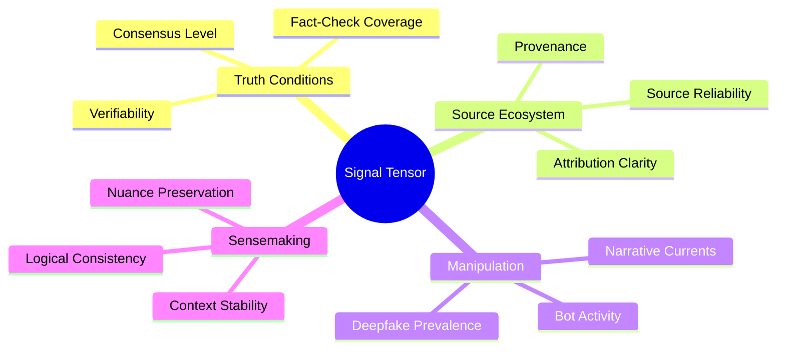

# KTP-Signal: Signal Environment Specification

> "Agents swim in oceans of signal. In a poisoned environment, even the most rational agent can be led to catastrophe."

---

## At a Glance

| Property | Value |
|----------|-------|
| **Status** | :material-flask:{ .experimental } Experimental |
| **Version** | 0.1 |
| **Dependencies** | [KTP-Core](ktp-core.md), [KTP-Sensors](ktp-sensors.md) |
| **Required By** | [KTP-Gravity](ktp-gravity.md), [KTP-Oracle](ktp-oracle.md) |

---

## The Problem
Agents rely on data to make decisions. However, the modern information environment is often:
1.  **Murky**: High noise-to-signal ratio makes it difficult to find ground truth.
2.  **Poisoned**: Active disinformation and manipulation operations target both humans and agents.
3.  **Synthetic**: The rise of AI-generated content makes it harder to verify provenance.

An agent operating with high autonomy in a low-truth environment is a liability.

## The Solution: Epistemic Health
KTP-Signal provides a framework for measuring the "Epistemic Health" of the information environment. This measurement is used to adjust [**Digital Gravity**](ktp-gravity.md), forcing agents to move more cautiously when the signal is compromised.

### The Signal Tensor (358 Dimensions)



---

## Epistemic Health Score
The environment's health is aggregated into a single score that directly impacts the Risk Factor $R$.

$$H_{epistemic} = \sum (w_i \cdot G_i)$$

Where $G_i$ represents major groups like:
*   **Truth Conditions (25%)**: Is the information verifiable?
*   **Source Ecosystem (20%)**: Do we know where this came from?
*   **Sensemaking Capacity (20%)**: Is the environment conducive to understanding?
*   **Manipulation Resistance (15%)**: Is the environment actively being attacked?

---

## Epistemic Tiers

| Tier | Health Score | Agent Behavior |
| :--- | :--- | :--- |
| **Clear** | 0.8 - 1.0 | High-speed operations; full autonomy allowed. |
| **Murky** | 0.6 - 0.8 | Latency injection begins; increased verification required. |
| **Polluted** | 0.4 - 0.6 | Significant [**Digital Gravity**](ktp-gravity.md); restricted to verified sources. |
| **Poisoned** | 0.2 - 0.4 | Emergency shutdown of non-critical agents; human-in-the-loop required. |
| **Void** | 0.0 - 0.2 | Total isolation; zero trust in external signal. |

---

## Related Specifications

??? info "Related Specifications"
    - [KTP-Tensors](ktp-tensors.md): Signal Tensor and epistemic dimensions.
    - [KTP-Sensors](ktp-sensors.md): Telemetry feeds that populate signal inputs.
    - [KTP-Gravity](ktp-gravity.md): How degraded signal increases digital gravity.
    - [KTP-Identity](ktp-identity.md): Source verification and provenance of signal.
    - [KTP-Oracle](ktp-oracle.md): Ground-truth querying and trust proof issuance.

---

## Official RFC Document

??? note "View Complete RFC Text (ktp-signal.txt)"
    ```text
    --8<-- "rfcs-txt/ktp-signal.txt"
    ```
