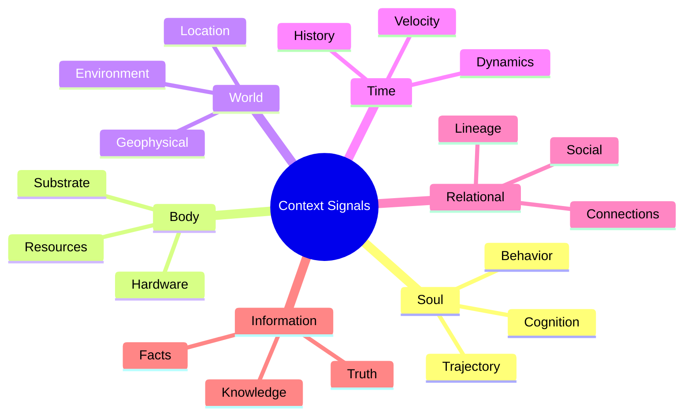
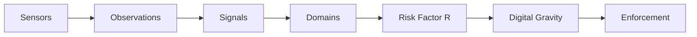

# KTP-Signals: Context Signals Specification

> "Trust is not a binary state; it is a high-dimensional vector. To manage trust, we must first measure the context."

---

## At a Glance

| Property | Value |
|----------|-------|
| **Status** | :material-flask:{ .experimental } Experimental |
| **Version** | 0.1 |
| **Dependencies** | [KTP-Core](ktp-core.md) |
| **Required By** | [KTP-Sensors](ktp-sensors.md), [KTP-Information](ktp-information.md) |

---

## The Problem
The Zeroth Law ($A \leq E$) requires a precise calculation of $E$ (Environmental Stability). However, "environment" is a vague term. Without a standardized way to measure cognitive, physical, and informational state, trust remains subjective and un-enforceable.

## The Solution: Context Signals
KTP-Signals provides a rigorous mathematical framework for measuring 1,627 distinct context signals. These measurements are aggregated into a **Risk Factor ($R$)**, which determines the "Digital Gravity" of an environment.

### The Six Domains of Trust



---

## Signal Explorer

Explore the core signals that define each trust domain.

=== "Soul (252 Signals)"
    **Focus**: "Who is this agent becoming?"
    
    | Group | Key Signals | Risk Indicator |
    | :--- | :--- | :--- |
    | **Temporal** | Action Velocity, Burst Intensity, Idle Variance | High acceleration = High Risk |
    | **Consistency** | Action Entropy, Goal Stability, Promise Keeping | Low predictability = High Risk |
    | **Values** | Honesty, Harm Avoidance, Transparency | Low alignment = High Risk |
    | **Capability** | Reasoning Depth, Error Detection, Learning Rate | Volatile capability = High Risk |

=== "Body (157 Signals)"
    **Focus**: "What resources does it have?"
    
    *   **Hardware Integrity**: TEE status, HSM availability, supply chain provenance.
    *   **Resource Consumption**: CPU/GPU spikes, memory leaks, energy signatures.
    *   **Physical Security**: Tamper detection, geographic location, environmental temperature.

=== "World (369 Signals)"
    **Focus**: "What surrounds it?"
    
    *   **Network Topology**: Peer density, gateway distance, latency jitter.
    *   **Regulatory Context**: Jurisdictional laws, data residency requirements.
    *   **Physical Environment**: Proximity to human observers, sensor density.

=== "Time (275 Signals)"
    **Focus**: "When and how fast?"
    
    *   **Temporal Drift**: Clock synchronization, latency evolution.
    *   **Historical Context**: Age of identity, duration of current session.
    *   **Event Density**: Frequency of state changes, transaction rates.

=== "Relational (238 Signals)"
    **Focus**: "Who is it connected to?"
    
    *   **Lineage**: Parent/Child identity relationships, creator reputation.
    *   **Social Graph**: Connection strength, cluster membership, influence scores.
    *   **Trust Chains**: Length of verification path to a root authority.

=== "Information (336 Signals)"
    **Focus**: "What does it know?"
    
    *   **Information Entropy**: Noise levels in incoming data streams.
    *   **Truth Alignment**: Correlation with verified global ledger facts.
    *   **Knowledge Provenance**: Source reliability, cryptographic signatures on data.

---

## Risk Aggregation
Signals are not just listed; they are mathematically combined to produce the **Risk Factor ($R$)**.

$$R = \frac{\sum (w_i \cdot s_i)}{\sum w_i}$$

Where:
*   $s_i$ is the normalized risk value of a single signal (0.0 to 1.0).
*   $w_i$ is the weight assigned to that signal based on the current **Soul Constraint**.

### The Risk Pipeline



---

## Core Components

???+ note "Measurement Philosophy"
    Observable over Internal: Measure what the agent *does*, not what it \"thinks.\"

???+ note "Instrumentation"
    Standardized APIs for sensors and kernels to report signal values to the KTP-Monitor.

???+ note "Normalization"
    Mapping raw values (e.g., 45°C) to a universal 0-1 risk scale based on safe/danger ranges.

???+ note "Trajectory Analysis"
    Using time-series data to detect behavioral drift before it crosses a safety threshold.

---

??? info "Related Specifications"
    - **[KTP-Core](ktp-core.md)** — The foundational protocol and the Zeroth Law ($A \leq E$).
    - **[KTP-Sensors](ktp-sensors.md)** — The sensory nervous system providing real-time telemetry.
    - **[KTP-Attenuation](ktp-attenuation.md)** — The enforcement mechanism that derives constraint from measured context rather than written policy.
    - **[KTP-Identity](ktp-identity.md)** — Vector Identity and trajectory-based authentication.

---

## Official RFC Document

??? note "View Complete RFC Text (ktp-signals.txt)"
    ```text
    --8<-- "rfcs-txt/ktp-signals.txt"
    ```
