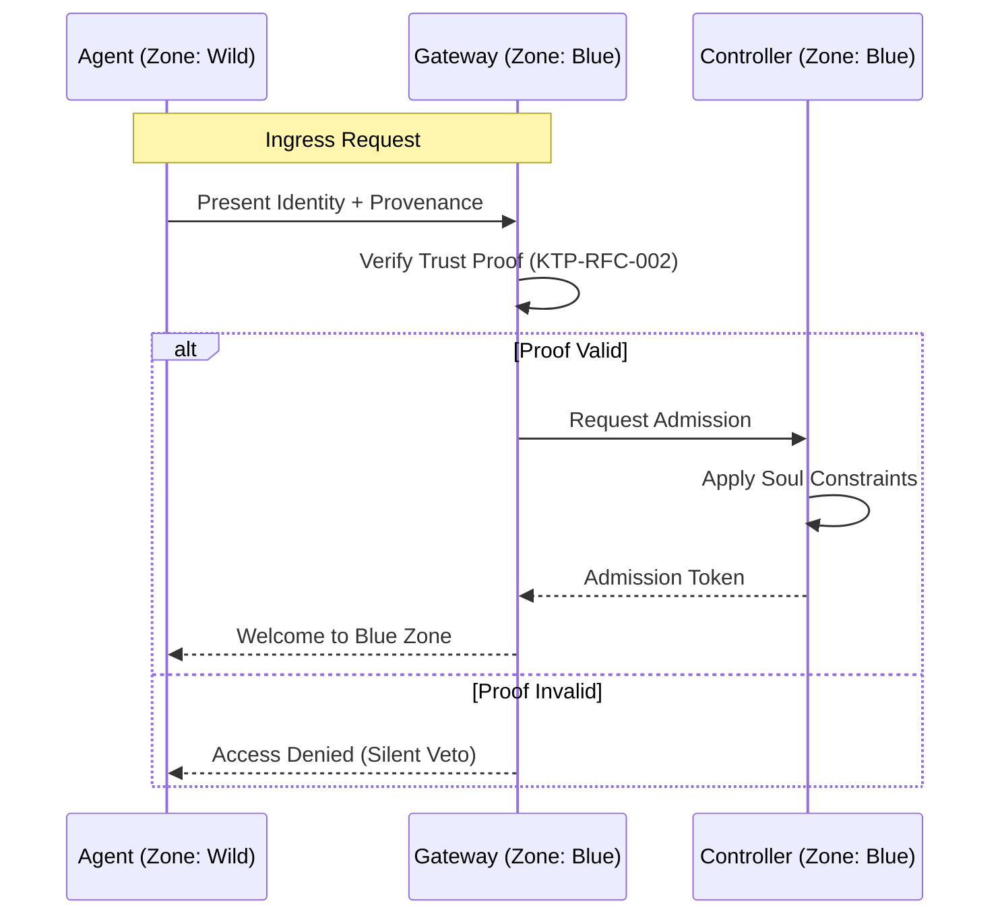

# KTP-Zones: Blue Zones & Trust Boundaries

> "The internet was not designed for autonomous agents. Blue Zones are the safe harbors where they can exist with verified provenance and enforced constraints."

---

## At a Glance

| Property | Value |
|----------|-------|
| **Status** | :material-check-circle:{ .stable } Stable |
| **Version** | 0.1 |
| **Dependencies** | [KTP-Core](ktp-core.md), [KTP-Identity](ktp-identity.md) |
| **Required By** | [KTP-Federation](ktp-federation.md), [KTP-Emergency](ktp-emergency.md) |

---

## The Problem
The modern internet is a "Wild" zone by default. There is no native way to distinguish between a hardened, audited environment and a public, unverified network. For autonomous agents, this lack of boundary leads to:

1.  **Context Collapse**: Agents cannot verify if their environment supports their safety constraints.
2.  **Provenance Gaps**: Data moving between high-trust and low-trust areas loses its verification chain.
3.  **Enforcement Failure**: Security policies (like the Zeroth Law) cannot be guaranteed without environmental support.

## The Solution: Blue Zones
KTP-Zones introduces a hierarchical gradient of trust environments. A **Blue Zone** is a cryptographically bounded space where specific KTP protocols are guaranteed to be enforced.

### The Zone Gradient

=== "Deep Blue (Level 4)"
    **The Core.** Air-gapped or strictly controlled hardware.
    
    *   **Trust**: Absolute.
    *   **Enforcement**: Hardware-level (TEE/HSM).
    *   **Use Case**: Root Identity issuance, Global Ledger maintenance.

=== "Blue (Level 3)"
    **The Standard.** High-integrity cloud or private infrastructure.
    
    *   **Trust**: High.
    *   **Enforcement**: Kernel-level / Hypervisor.
    *   **Use Case**: Enterprise agent swarms, Financial settlement.

=== "Cyan (Level 2)"
    **The Edge.** Managed public infrastructure with KTP extensions.
    
    *   **Trust**: Moderate.
    *   **Enforcement**: Application-level / Middleware.
    *   **Use Case**: Public API gateways, Verified IoT clusters.

=== "Green (Level 1)"
    **The Gateway.** Public internet with KTP-aware proxies.
    
    *   **Trust**: Low (Verified Entry).
    *   **Enforcement**: Best-effort / Proxy-based.
    *   **Use Case**: Web3 bridges, Legacy system integration.

=== "Wild (Level 0)"
    **The Void.** The unverified public internet.
    
    *   **Trust**: Zero.
    *   **Enforcement**: None.
    *   **Use Case**: General web traffic, Unverified data sources.

---

## Zone Ingress & Egress
Moving data or agents between zones requires a **Trust Transition**. This is not a simple firewall rule, but a cryptographic proof exchange.



---

## Core Components

???+ note "Zone Discovery"
    Mechanisms for agents to detect the trust level of their current environment via DNS-SD or KTP-Broadcast.

???+ note "Boundary Enforcement"
    The hard shell principle: Zones must fail-closed if cryptographic integrity is compromised.

???+ note "The Bootstrap Paradox"
    How a zone establishes its first root of trust without relying on an external zone.

???+ note "Inter-Zone Routing"
    Encapsulating KTP packets (KTP-RFC-004) within secure tunnels when traversing lower-trust zones.

---

## Detailed Mechanics

### Zone Genesis (The Bootstrap)
Creating a Blue Zone requires a **Genesis Event**. This involves:
1.  **Hardware Attestation**: Verifying the underlying compute environment.
2.  **Identity Anchoring**: Linking the zone to a KTP-Identity (KTP-RFC-002).
3.  **Constraint Definition**: Setting the "Laws of the Land" (Soul Constraints).

!!! info "The Zeroth Law in Zones"
    In a **Deep Blue** zone, the Zeroth Law ($A \leq E_{trust}$) is enforced by the hardware itself. If an agent attempts an action that violates its constraints, the CPU/TEE will physically refuse to execute the instruction.

### Discovery Protocol
Agents use the following logic to determine their environment:

1.  **Active Probe**: Send a KTP-PING to the local gateway.
2.  **Passive Listen**: Monitor for Zone Heartbeats (signed by the Zone Authority).
3.  **Recursive Verification**: Verify the Zone Authority's identity against the Global Ledger.

---

??? info "Related Specifications"
    - **[KTP-Core](ktp-core.md)** — The foundational protocol and the Zeroth Law ($A \leq E$).
    - **[KTP-Identity](ktp-identity.md)** — Vector Identity and trajectory-based authentication.
    - **[KTP-Transport](ktp-transport.md)** — The secure messaging and transport layer for KTP signals.
    - **[KTP-Sensors](ktp-sensors.md)** — The sensory nervous system providing real-time telemetry.

---

## Official RFC Document

??? note "View Complete RFC Text (ktp-zones.txt)"
    ```text
    --8<-- "rfcs-txt/ktp-zones.txt"
    ```
